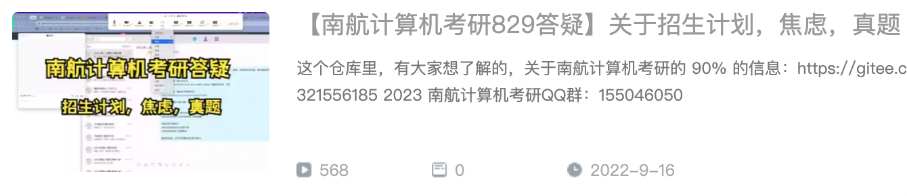
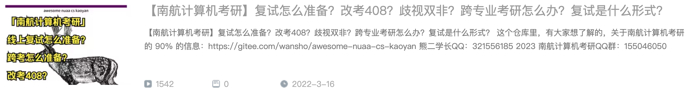
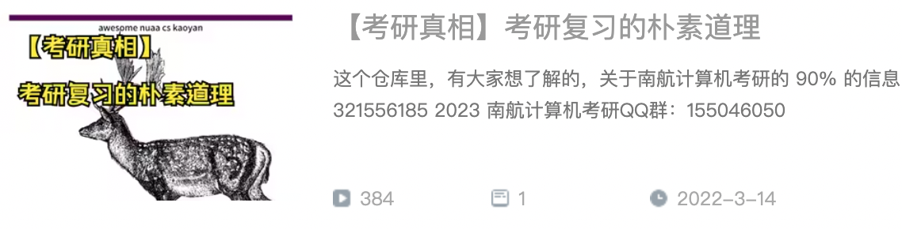
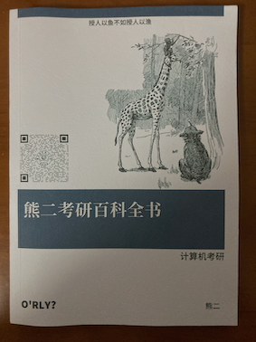
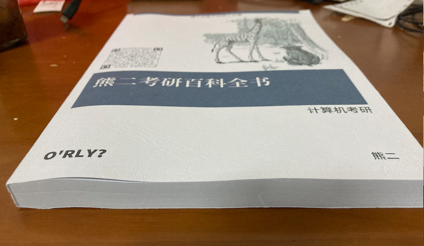
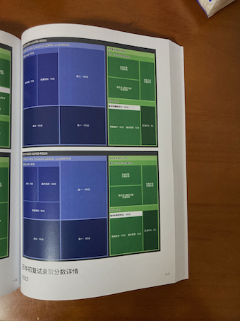
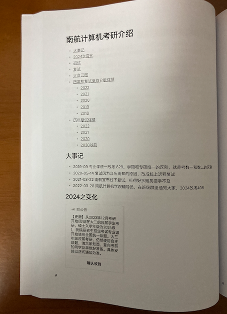

5. 


### 2021-统考-最终录取-单科分数统计

|                  | 专业课 | 专业课      | 专业课      | 专业课 | 专业课 | 专业课 | 专业课 | 专业课 | 总分  | 总分        | 总分        | 总分 | 总分   | 总分 | 总分   | 总分 | 政治  | 政治        | 政治        | 政治 | 政治  | 政治 | 政治 | 政治 | 数学  | 数学        | 数学        | 数学 | 数学  | 数学 | 数学  | 数学 | 英语  | 英语        | 英语        | 英语 | 英语  | 英语 | 英语 | 英语 |
| ---------------- | ------ | ----------- | ----------- | ------ | ------ | ------ | ------ | ------ | ----- | ----------- | ----------- | ---- | ------ | ---- | ------ | ---- | ----- | ----------- | ----------- | ---- | ----- | ---- | ---- | ---- | ----- | ----------- | ----------- | ---- | ----- | ---- | ----- | ---- | ----- | ----------- | ----------- | ---- | ----- | ---- | ---- | ---- |
|                  | count  | mean        | std         | min    | 25%    | 50%    | 75%    | max    | count | mean        | std         | min  | 25%    | 50%  | 75%    | max  | count | mean        | std         | min  | 25%   | 50%  | 75%  | max  | count | mean        | std         | min  | 25%   | 50%  | 75%   | max  | count | mean        | std         | min  | 25%   | 50%  | 75%  | max  |
| 专业             |        |             |             |        |        |        |        |        |       |             |             |      |        |      |        |      |       |             |             |      |       |      |      |      |       |             |             |      |       |      |       |      |       |             |             |      |       |      |      |      |
| 电子信息         | 107    | 111.6448598 | 10.7530183  | 83     | 103    | 112    | 120    | 132    | 107   | 373.3925234 | 16.9682039  | 337  | 360    | 373  | 386    | 414  | 107   | 69.77570093 | 4.185122823 | 57   | 67    | 70   | 72.5 | 82   | 107   | 127.4485981 | 11.48521087 | 100  | 119.5 | 129  | 135   | 150  | 107   | 64.52336449 | 7.995689634 | 43   | 60    | 65   | 70.5 | 84   |
| 网络空间安全     | 24     | 113.4166667 | 9.380445279 | 95     | 107.75 | 114    | 120.25 | 131    | 24    | 355.75      | 16.56147967 | 327  | 344.75 | 356  | 364.25 | 399  | 24    | 70.125      | 5.870430693 | 55   | 67.75 | 71   | 73   | 83   | 24    | 109         | 16.15145706 | 73   | 102   | 108  | 118.5 | 139  | 24    | 63.20833333 | 8.767425712 | 44   | 58.75 | 64.5 | 69   | 76   |
| 计算机科学与技术 | 23     | 109.8695652 | 12.53832071 | 87     | 100.5  | 112    | 118    | 133    | 23    | 356.7391304 | 18.83955556 | 329  | 347    | 355  | 365.5  | 416  | 23    | 71.13043478 | 4.235181093 | 63   | 68.5  | 72   | 74   | 78   | 23    | 108.5217391 | 14.57541381 | 84   | 100.5 | 106  | 114   | 136  | 23    | 67.2173913  | 7.446515486 | 50   | 64    | 67   | 73.5 | 78   |
| 软件工程         | 19     | 113.0526316 | 8.521043782 | 95     | 107    | 114    | 120    | 127    | 19    | 355         | 18.9179515  | 327  | 339.5  | 357  | 365    | 394  | 19    | 70.68421053 | 3.902316001 | 65   | 67    | 71   | 73.5 | 77   | 19    | 106.1052632 | 13.92796841 | 77   | 95.5  | 107  | 114.5 | 129  | 19    | 65.15789474 | 8.001827277 | 51   | 59    | 67   | 69.5 | 78   |

简单分析：

* 政治平均分和中位数都是 70 分左右
* 专业课平均分和中位数在 110-114 之间
* 英语平均分和中位数是 65 左右
* 数一平均分和中位数在 107 左右，数二平均分和中位数在 128 左右


### 2020 届统考数据

| 专业          | 录取人数 | 进入复试人数 / 最低分 / 最高分 | 复录比  |
| ------------- | -------- | ------------------------------ | ------- |
| 学硕-计算机   | 36       | 52（318 / 387）                | 1.44: 1 |
| 学硕-软工     | 24       | 29（294 / 381）                | 1.2: 1  |
| 学硕-网安     | 24       | 32（292 / 368）                | 1.3: 1  |
| 专硕-电子信息 | 136      | 160 （290 / 414）              | 1.18: 1 |
| 汇总          | 220      | 273 （294 / 423）              | 1.24: 1 |

### 2019 届统考数据

| 专业        | 录取人数 | 进入复试人数 / 最低分 / 最高分 | 复录比 |
| ----------- | -------- | ------------------------------ | ------ |
| 学硕-计算机 | 31       | 43（324 / 393）                | 1.4: 1 |
| 学硕-软工   | 15       | 23（300 / 394）                | 1.5: 1 |
| 学硕-网安   | 15       | 18（294 / 357）                | 1.2: 1 |
| 专硕-计算机 | 41       | 70 （322 / 396）               | 1.7: 1 |
| 专硕-软工   | 37       | 75（346 / 423）                | 2: 1   |
| 汇总        | 139      | 229 （294 / 423）              | 1.6: 1 |

### 2018 届统考数据

| 专业        | 录取人数 | 进入复试人数 / 最低分 / 最高分 | 复录比  |
| ----------- | -------- | ------------------------------ | ------- |
| 学硕-计算机 | 27       | 37（301 / 367）                | 1.4: 1  |
| 学硕-软工   | 12       | 14（290 / 341）                | 1.2: 1  |
| 学硕-网安   | 12       | 9（260 / 340）                 | 1：1    |
| 专硕-计算机 | 18       | 28 （345 / 409）               | 1.56: 1 |
| 专硕-软工   | 33       | 48（303 / 380）                | 1.45: 1 |
| 汇总        | 102      | 143 （260 / 409）              | 1.4: 1  |

### 2017 届统考数据

| 专业        | 录取人数 | 进入复试人数 / 最低分 / 最高分 | 复录比 |
| ----------- | -------- | ------------------------------ | ------ |
| 学硕-计算机 | 25       | 缺失                           |        |
| 学硕-软工   | 12       |                                |        |
| 学硕-网安   | 4        |                                |        |
| 专硕-计算机 | 31       |                                |        |
| 专硕-软工   | 18       |                                |        |
| 汇总        | 90       |                                |        |

### 统考录取人数与985调剂人数对比

|      | 统考录取人数 | 985调剂录取人数 |
| ---- | ------------ | --------------- |
| 2017 | 90           | 18              |
| 2018 | 102          | 46+             |
| 2019 | 139          | 39              |
| 2020 | 220          | 0               |


## 2022最新复试规则

线上复试。总成绩 = 初试成绩 * 70% + 复试成绩 * 30%。复试没有机试。

持续25-30分钟以上，我们组是上来先抽一段英文短文，读出来，并翻译，大概150多个词左右，都是计算机相关论文的摘要中节选出来的。接着就是笔试内容抽题作答，每一科给几十个题号，你选两个数字，就会显示出这两个数字所代表的题目，从这两道里面选一道题作答即可，编译原理离散数学都是这样。笔试抽题问答完毕后专业课问答也是这样，抽题方法相同，也是抽二答一，一共答三道题。答完题以后进行自我介绍（中文），然后自由问答，就结束了。— 取自王道论坛一位同学的回答

注意，有的同学，还碰到了老师用英文提问，例如问做过什么项目，有没有科研经历


## 2021复试规则

2021 是现场面试，复试 300 分，100 分笔试，考离散数学+编译原理，200 分面试，其中 50 分考察英语能力。

50 分的英语能力，主要考察口语和翻译。

150 分面试中，有自我介绍，还有抽题目问答，还有老师提问等环节。抽题目是 8 选 5。有三个袋子，前两个袋子抽 3 答 2，最后一个袋子，抽 2 答 1。袋子题目中的难度依次递增。也有的同学遇到抽 5 答 3 的情况，较为灵活。

和很多考上的同学聊过以后，他们都觉得复试面试，抽题目答题，如果发挥得不太好，影响不会很大。我说的是只是面试题发挥得不好影响不大，如果面试全程都发挥得不好，那就是自己得问题了，不能怪自己运气不好了。面试答题答得好，那是锦上添花的东西，答得不好影响也不会很大。

今年复试笔试考得比较难，很多人没有好好复习，然后栽了。离散的环和域貌似都涉及到了

以下是大家对复试笔试和面试的评价：


## 专业课复习需要用到的书

408 并没有指定指定官方教材。这篇文章里有推荐的书：[408需要买的书和看的视频](https://zhuanlan.zhihu.com/p/594517572)


## B站视频

- [2024考研答疑&熊二考研百科全书介绍](https://www.bilibili.com/video/BV1vb411X7fw/?spm_id_from=333.999.0.0)

  <div align="left">
      <a href="https://www.bilibili.com/video/BV1vb411X7fw/?spm_id_from=333.999.0.0">
      	
      </a>
  </div>

- [2023初试结束总结和答疑 （2024答疑）](https://www.bilibili.com/video/BV1rA411S78U)

  <div align="left">
      <a href="https://www.bilibili.com/video/BV1rA411S78U">
      	
      </a>
  </div>

* [【南航计算机考研829答疑】关于招生计划，焦虑，真题](https://www.bilibili.com/video/BV1CP4y1d7Bt) 

  <div align="left">
      <a href="https://www.bilibili.com/video/BV1CP4y1d7Bt">
      	
      </a>
  </div>

* [复试怎么准备？改考408？歧视双非？跨专业考研怎么办？复试是什么形式？](https://www.bilibili.com/video/BV1r3411W7ft) 

  <div align="left">
      <a href="https://www.bilibili.com/video/BV1r3411W7ft">
      	
      </a>
  </div>

* [【考研zhen-xiang】考研复习的朴素道理](https://www.bilibili.com/video/BV1vq4y1e793) 

  <div align="left">
      <a href="https://www.bilibili.com/video/BV1vq4y1e793">
      	
      </a>
  </div>

* [考研，很多人一开始就已经输了](https://www.bilibili.com/video/BV1gT4y1D76H) 

  <div align="left">
      <a href="https://www.bilibili.com/video/BV1gT4y1D76H">
      	
      </a>
  </div>

* [【南航计算机考研】全面了解南航计算机考研](https://www.bilibili.com/video/BV1zV411f7oc/) 

  <div align="left">
      <a href="https://www.bilibili.com/video/BV1zV411f7oc/">
      	
      </a>
  </div>

* [【南航计算机考研】答疑-录取结果分析](https://www.bilibili.com/video/BV1MK4y1N7Er) 

  <div align="left">
      <a href="https://www.bilibili.com/video/BV1MK4y1N7Er">
      	
      </a>
  </div>

* [【南航计算机考研】2022-南航计算机考研-答疑](https://www.bilibili.com/video/BV1VK4y1U7Gz)

  <div align="left">
      <a href="https://www.bilibili.com/video/BV1VK4y1U7Gz/">
      	
      </a>
  </div>

* [【考研zhen-xiang】考研到底难不难？要不要报班？全程干货无尿点](https://www.bilibili.com/video/av91210812)

  <div align="left">
      <a href="https://www.bilibili.com/video/av91210812">
      	
      </a>
  </div>
  
  


## 熊二考研百科全书


|  |  |
| ------------------------------------------------------------ | ------------------------------------------------------------ |
|  |  |

微店购买链接：https://k.youshop10.com/nDeEbPpP

拼多多购买链接：https://mobile.yangkeduo.com/goods2.html?pdd_bapp_share_channel=copy_link&goods_id=453190296714


### 介绍

考高分的zhen-xiang是什么？怎么择校？学硕还是专硕？复试歧视普通本科吗？没有竞赛获奖论文怎么办？数学英语要怎么复习？专业课要怎么复习？

所有问题一本书解决。不仅告诉你应该怎么做，还告诉你为什么是这么做。

【熊二考研百科全书】已上架，14万字全书，公共课专业课全科提分，冲刺400分。该资料是全科的复习指导，涉及到公共课和专业课的方方面面。会告诉大家，什么是真正的考研，怎样才能踏踏实实上岸。这本书会成为大家考研过程中的伴侣，伴随大家走过整个考研。

不到一顿饭的钱，掌握考研zhen-xiang。公共课专业课全科提分，冲刺400。


### 适用对象

本书主要适用于南航计算机考研的同学，资料不仅有助于专业课，是所有科目包括公共课的复习资料。

问：考计算机但不考南航的同学能不能看？

答：能看，这本书的重点，是讲解考研的基本道理，按道理是适用于所有科目的复习的，帮助大家全科提分。

问：不考计算机的同学能不能看？

答：能看，但是不建议看了，因为书的内容还是偏向于计算机方向的。


### 目录

- 前言 —— 1
- 关于熊二 —— 3
- 付费专享 —— 5
- 熊二考研哲学 —— 7
	- 像准备高考一样准备考研
	- 复习只有两轮
	- 一个好的开始
	- 导学和掌握全貌
	- 高估考研难度，低估习惯和积累的力量
	- 择校
	- 有目标和没目标
	- 英语要怎么复习
	- 政治复习建议
	- 数学要怎么复习
	- 真题的重要性
	- 笔记的重要性
	- 本科出身重要吗
	- 会做的题目能不丢分吗
	- 快与慢
	- 正反馈
	- 隐蔽的角落，隐藏的懒惰
	- 考研zhen-xiang
	- 每门多考5分
	- 远离考研PUA
	- 没时间复习咋办
	- 警惕考研简单化和考研爽文
	- 不要急，不要走捷径，多思考
	- 暑假复习重点和提醒
	- 及时回顾，抵抗遗忘
	- 关于模拟试卷、押题
	- 考研是复习不完的
	- 高效功利地学习
	- 选择公共课老师
	- 科目重要性排序
	- 科学复习的一天
	- 装睡
	- Tips
- 南航计算机考研相关信息 —— 111
	- 南航计算机考研介绍
	- 2023考研结果分析
	- 南航计算机改考408分析
	- 今年会不会缩招
	- 关于南航计算机考研的谣言
	- 常见问题答疑
	- 学硕还是专硕
	- 关于夏令营
	- 非全日制信息汇总
	- 南航计算机研究生的就业
- 心态和整体规划 —— 155
	- 天地不仁以万物为刍狗
	- 六祖坛经
	- 请不要给自己留退路
	- 疫情和考研
	- 考研过程中会忽视的细节
	- 放松娱乐&打鸡血
	- 劳逸结合
	- 暑假的心态
	- 中秋国庆
	- 考前提醒-答题规范-模拟考试
	- 最后两个月注意事项
	- 最后一个月注意事项
	- 11月心态
	- 12月心态
	- 考试之前和考试那两天的建议
	- 考场注意事项
	- 408跨考上岸失败-熊二分析
	- 记考研初试那天
- 408专业课 —— 199
	- 408需要买的书和要看的视频
	- 408资源整理
	- 万字长文：跨考408
	- 考场上的好代码
	- 数据结构编程题
	- Leetcode题目推荐
- 复试 —— 225
	- 复试详解
	- 提前准备南航计算机复试
	- 初试后该干什么
	- 简历模板
	- 项目比赛经历重要吗
	- 关于找导师
	- 南航计算机复试有没有黑幕
	- 复试考纲
	- 编译原理和离散数学如何复习
	- 19南航计算机复试总结
	- 复试面试题举例
	- 面试其他同学遇到的情况
	- 读研zhen-xiang
- 不止考研 —— 267
	- 为什么不止考研
	- 锻炼身体
	- 看点闲书
	- 考前食宿交通
	- 南航考点吃饭和休息
	- 那些上岸的同学


### 写书目的

笑傲江湖中，令狐冲习得独孤九剑，无招胜有招，但内功尽失，在面对强敌时仍然力不从心；待练成易筋经恢复内力后，才真正独孤求败。

重剑无锋，大巧不工。重剑是神雕侠侣中剑魔独孤求败的第三把武器，四十岁前恃之横行天下。杨过习得重剑后，单臂持剑，后发先至，一招制胜，大败全真教。

现代社会充满各种钻营，各种极端，讲究术，以期达到最快最好的效果。重剑无锋，看似愚笨，貌似吃亏，实则顺势顺力，心之所向，剑之所指，落到实处。不淫巧，不焦躁，不锋芒。同样，考研没有那么复杂，大道至简，没有什么奇技淫巧，没有什么 90 天速成。考研上岸就是八个字，种瓜得瓜，种豆得豆。考研人数五六年时间翻了一倍，随之而来的是考研圈越来越浮躁，戾气越来越重，大家都急于求成。加之考研圈已经被资本所把控，很少有人讲真话，能感觉到大家面对考研的焦虑和迷茫，比五六年前多了很多。而且很多同学大学躺平三年，学习能力已经退化了，忘记了学习本来的模样。

当下考研圈，名师越来越多，优秀的教辅也越来越多，但是大家的焦虑却有增无减。教授大家做题的优秀教辅很多，但是能够和大家真心聊聊考研的却很少。所以熊二想写一本书，想和大家聊聊，什么才是真正的考研，怎样才能踏踏实实上岸。

熊二计算机考研「百科全书」，这是一本讲真话的书，是一本能缓解大家焦虑的书，是一本涉及到考研方方面面的考研百科全书。书中内容不止是和专业课相关，也不止是和南航计算机相关，这本书涉及到所有科目的复习。包括熊二考研复习哲学、考研心态、复习规划、常见问题答疑、408复习等多个章节，甚至包含初试订宾馆、交通饮食、考前注意事项、考场注意事项、考上研后的规划、工作咨询等，涵盖了我做考研辅导这些年的经验总结。诚意之作，是一本考研的百科全书，涉及到考研的方方面面。

这本书不是在教大家怎么学习，学习之道存乎于每一位经历过高考的大学生的心中。熊二会尝试唤醒大家内心深处的学习基因，带大家重回高中，重回巅峰，冲刺 400 分。

这本书会成为大家考研过程中的伴侣，伴随大家走过整个考研。


### 资料口碑

[资料口碑](资料口碑)


## 复试相关资料共享

[复试相关资料共享](复试相关资料共享)

复试的考核（300 分）：

* 离散数学 + 编译原理：100 分
* 英语听力：50 分
* 面试：150 分

包括：

* 收集到的复试真题
* 和南航本科生要到的期末考试例题
* 英语听力如何复习
* 编译原理和离散数学视频推荐
* 部分复试答疑，和经验贴有耦合


## 文件目录树

```
├── 408
│   ├── 2023大纲对比.xlsx
│   ├── 408同学的评价.JPG
│   └── 历年真题考频统计.xlsx
├── LICENSE
├── README.md
├── Surprise
│   ├── 宇哥：还不起床？.mp3
│   └── 汤家凤：在你这个年纪，你怎么睡得着？.mp3
├── _config.yml
├── 经验贴
│   ├── 20届第er次考研讲座手稿.md
│   ├── 20届后南航计算机考研变化.md
│   ├── 关于 Github 的说明.jpg
│   ├── 经验贴-18级辅导总结.pdf
│   ├── 经验贴-3.png
│   ├── 经验贴-英语免修分数.png
│   ├── 经验贴-考研后期的建议.png
│   ├── 公共课-公共课报班的利弊.png
│   ├── 公共课-公共课初试老师推荐.pdf
│   ├── 公共课必买，张宇18讲强烈推荐.jpg
│   ├── 复试相关.jpg
│   ├── 神秘代码.md
│   ├── 专业课答疑-不会写代码怎么办.jpg
│   ├── 专业课复习建议.jpg
│   ├── 科学的复习方法.jpg
│   ├── 公共课复习建议.md
│   ├── 考研预报名答疑.md
│   ├── 非全日制相关信息.md
│   ├── 怎样才能考上南航？细节有多重要.jpg
│   ├── 报考网络安全的同学，只能跟网安的老师.png
│   └── 报考了什么专业，就只能从相应专业的老师中选导师.png
├── 推荐书籍
│   ├── B-Tree-Wiki.pdf
│   ├── Modern Operating Systems - 4th Edition.pdf
│   ├── PV操作深入讲解.pdf
│   ├── 数学之美.pdf
│   └── 南航本科计组课后习题答案
│       ├── 第1、2章习题答案-2021.pdf
│       ├── 第3章习题答案-2021.pdf
│       ├── 第4章习题答案-2021.pdf
│       ├── 第5章习题答案-2021.pdf
│       ├── 第6章习题答案-2021.pdf
│       ├── 第7章习题答案-2021.pdf
│       ├── 第8章习题答案-2021.pdf
│       └── 第六章流水线课件-2021.pdf
├── 资料口碑
│   ├── 2022以前
│   │   ├── 130+同学感谢.jpg
│   │   ├── 19同学考研群中安利.jpg
│   │   ├── 19计算机专硕第yi名感谢.jpg
│   │   ├── 20 届专硕前三名评价-1.png
│   │   ├── 20 届专硕前三名同学评价-2.jpg
│   │   ├── 2020届同学对学长的认可.jpg
│   │   ├── 2020考研专业课压中真题.png
│   │   ├── 2020届同学对于专业课必背考点的认可.jpg
│   │   ├── 2020届专硕第er名和学硕第yi名都是跨考.jpg
│   │   ├── 2021 感谢
│   │   │   ├── vip 群感谢.png
│   │   │   ├── 综合成绩 80+.png
│   │   │   ├── 资料质量.png
│   │   │   ├── 拟录取感谢.png
│   │   │   ├── 上岸同学感谢-2.png
│   │   │   ├── 上岸同学感谢.png
│   │   │   └── 群里上岸同学的感谢.png
│   │   ├── 2021 同学感谢.png
│   │   ├── 2021-高分学长-2.png
│   │   ├── 2021-高分学长.png
│   │   ├── 2022 400 分同学.png
│   │   ├── 2022 同学的肯定.png
│   │   ├── 2022届 400 分同学.png
│   │   ├── 408同学的评价.JPG
│   │   ├── awe-10.jpg
│   │   ├── awesome-1.jpg
│   │   ├── awesome-2.jpg
│   │   ├── awesome-3.jpg
│   │   ├── awesome-4.jpg
│   │   ├── awesome-5.jpg
│   │   ├── awesome-6.jpg
│   │   ├── awesome-7.jpg
│   │   ├── awesome-8.jpg
│   │   ├── awesome-9.jpg
│   │   ├── 压中真题-1.jpg
│   │   ├── 压中真题-2.jpg
│   │   ├── 压中真题-3.JPG
│   │   ├── 压中真题-4.jpg
│   │   ├── 压中真题-5.jpg
│   │   ├── 压中真题-6.jpg
│   │   ├── 压中真题-7.jpg
│   │   ├── 软工专硕第yi名.jpg
│   │   ├── 专业课资料评价.png
│   │   └── 计算机专硕第yi名.jpg
│   └── 2023
│       ├── 2022考研群人数.png
│       ├── 2023考研vip群人数.png
│       ├── 2023群人数.png
│       ├── 2023专硕第yi名.png
│       ├── 23-网安第yi名.png
│       ├── 23-软工专硕第yi名.png
│       ├── 23学弟.png
│       ├── 23一位高分学弟.png
│       └── 计科学硕第三名.png
├── 专业课真题
│   ├── 2024以前829真题
│   │   ├── 2010.pdf
│   │   ├── 2011.pdf
│   │   ├── 2012-922.pdf
│   │   ├── 2013-829.pdf
│   │   ├── 2013-922.pdf
│   │   ├── 2014-829.pdf
│   │   ├── 2014-922.pdf
│   │   ├── 2015-829.pdf
│   │   ├── 2015-922.pdf
│   │   ├── 2016-829.pdf
│   │   ├── 2016-922.pdf
│   │   ├── 2017-829.pdf
│   │   ├── 2017-922.pdf
│   │   ├── 2018-829.pdf
│   │   ├── 2018-922.pdf
│   │   ├── 2019 真题回忆版.txt
│   │   ├── 2020 真题.pdf
│   │   ├── 2020 最新考纲.txt
│   │   ├── 2020 南航计算机 829 真题.pdf
│   │   ├── 2021真题回忆版.pdf
│   │   ├── 2022 南航 829考研回忆版.pdf
│   │   ├── 2022 真题回忆版.md
│   │   ├── 考纲-最新-2022南航计算机-829-考纲.txt
│   │   ├── 操作系统 汤小丹 .pdf
│   │   ├── 复试考纲.txt
│   │   └── 计算机组成与系统结构课后答案全(清华大学出版社_袁春风主编).doc
│   └── 408真题
│       └── 408历年真题无水印版
│           └── [公众号蓝蓝考研]计算机408真题+解析
│               ├── [公众号蓝蓝考研]2009-2021计算机408真题解析
│               │   ├── [公众号蓝蓝考研]2009年计算机408统考真题解析.pdf
│               │   ├── [公众号蓝蓝考研]2010年计算机408统考真题解析.pdf
│               │   ├── [公众号蓝蓝考研]2011年计算机408统考真题解析.pdf
│               │   ├── [公众号蓝蓝考研]2012年计算机408统考真题解析.pdf
│               │   ├── [公众号蓝蓝考研]2013年计算机408统考真题解析.pdf
│               │   ├── [公众号蓝蓝考研]2014年计算机408统考真题解析.pdf
│               │   ├── [公众号蓝蓝考研]2015年计算机408统考真题解析.pdf
│               │   ├── [公众号蓝蓝考研]2016年计算机408统考真题解析.pdf
│               │   ├── [公众号蓝蓝考研]2017年计算机408统考真题解析.pdf
│               │   ├── [公众号蓝蓝考研]2018年计算机408统考真题解析.pdf
│               │   ├── [公众号蓝蓝考研]2019年计算机408统考真题解析.pdf
│               │   ├── [公众号蓝蓝考研]2020年计算机408统考真题解析.pdf
│               │   └── [公众号蓝蓝考研]2021年计算机408统考真题解析.pdf
│               └── [公众号蓝蓝考研]2009-2021计算机408统考真题
│                   ├── [公众号蓝蓝考研]2009年计算机408统考真题.pdf
│                   ├── [公众号蓝蓝考研]2010年计算机408统考真题.pdf
│                   ├── [公众号蓝蓝考研]2011年计算机408统考真题.pdf
│                   ├── [公众号蓝蓝考研]2012年计算机408统考真题.pdf
│                   ├── [公众号蓝蓝考研]2013年计算机408统考真题.pdf
│                   ├── [公众号蓝蓝考研]2014年计算机408统考真题.pdf
│                   ├── [公众号蓝蓝考研]2015年计算机408统考真题.pdf
│                   ├── [公众号蓝蓝考研]2016年计算机408统考真题.pdf
│                   ├── [公众号蓝蓝考研]2017年计算机408统考真题.pdf
│                   ├── [公众号蓝蓝考研]2018年计算机408统考真题.pdf
│                   ├── [公众号蓝蓝考研]2019年计算机408统考真题.pdf
│                   ├── [公众号蓝蓝考研]2020年计算机408统考真题.pdf
│                   └── [公众号蓝蓝考研]2021年计算机408统考真题.pdf
├── 辅导资料样本
│   └── 2024以前的样本
│       ├── 2012-操作系统-真题解析.pdf
│       ├── 2012-数据结构-真题解析.pdf
│       ├── 打印-1.jpg
│       ├── 打印-2.jpg
│       ├── 打印-3.jpg
│       ├── 资料样本 - 13 年计组真题解析.pdf
│       └── 资料发货和到手说明.md
├── 复试相关资料共享
│   ├── 19南航计算机复试总结和面试题汇总.pdf
│   ├── 2009 南航复试真题.pdf
│   ├── 2010 南航复试真题.pdf
│   ├── 2014 南航复试真题.pdf
│   ├── assets
│   │   ├── image-20201222183149355.png
│   │   └── image-20201222184335175.png
│   ├── 培养读论文能力-临时抱佛脚推荐看的论文
│   │   ├── Mining and Summarizing Customer Reviews.pdf
│   │   ├── Opinion extraction, summarization and tracking in news and blog  corpora.pdf
│   │   ├── README.md
│   │   ├── Spatio temporal sentiment analysis of us election what  twitter says.pdf
│   │   └── Thumbs up? Sentiment Classification using Machine Learning Techniques.pdf
│   ├── 南航编译原理期末考试例题-ppt.pdf
│   ├── 南航离散数学期末考试试卷.pdf
│   ├── 南航编译原理期末考试例题.pdf
│   ├── 南航编译原理期末考试样卷.pdf
│   ├── 南航编译原理期末考试例题答案1.pdf
│   └── 南航编译原理期末考试例题答案2.pdf
├── 南航计算机考研讲座
│   ├── README.md
│   ├── 四：2020 届同学考研结果分析汇总.md
│   ├── 十四：2020届复试分析.md
│   ├── 十九：2021 复试名单分析.md
│   ├── 十八：2021 计算机真题分析.pdf
│   ├── 二十：2021 南航计算机考研录取结果分析.md
│   ├── 十六：2021届招生计划.md
│   ├── 十七：2022 南航计算机考研分析.md
│   ├── 三十：2022初试专业课总结.md
│   ├── 五十：2022上岸名单成绩分析.md
│   ├── 聊聊就业.dps
│   ├── 四十三：2022 复试情况.md
│   ├── 四十七：2022录取结果分析.md
│   ├── 四十一：2022复试招生录取办法（校级）.md
│   ├── 四十四：2022各个学校计算机复试线参考.md
│   ├── 四十六：2024开始改考408.md
│   ├── 五：考研zhen-xiang-关于考研的朴素道理.md
│   ├── 九：直播备稿.md
│   ├── 二：考研zhen-xiang.md
│   ├── 三十五：报录比.md
│   ├── 三：跨专业考研.md
│   ├── 十二：读研zhen-xiang.md
│   ├── 三十九：复试面试.md
│   ├── 三十八：授人以渔.md
│   ├── 三十六：关于找导师.md
│   ├── 十五：准研究生建议.md
│   ├── 四十：南航计算机考研-B站视频.md
│   ├── 一：考研之前该干什么.md
│   ├── 三十七：关于第yi学历.md
│   ├── 二十五：真题的重要性.md
│   ├── 十一：疫情期间的考研.md
│   ├── 十：那些考上的同学们.md
│   ├── 四十二：复试名单分析.md
│   ├── 三十一：疫情期间的复试.md
│   ├── 二十九：初试后该干什么.md
│   ├── 四十八：疫情期间的考研.md
│   ├── 三十四：今年到底招多少人.md
│   ├── 六：用经济学原理分析考研.md
│   ├── 十三：考研之外的一些事情.pdf
│   ├── 八：关于南航计算机考研的谣言.md
│   ├── 四十五：南航计算机考研的骗子.md
│   ├── 七：为什么现在就要开始准备考研.md
│   ├── 三十二：复试怎么补充专业课知识.md
│   ├── 二十八：招生计划与实际录取人数.md
│   ├── 二十六：为什么建议买专业复习资料.md
│   └── 二十七：有竞赛和项目才能考南航计算机？.md
└── 南航计算机考研官方信息汇总
    ├── 17年录取学校统计.png
    ├── 17年南航全校录取情况.PNG
    ├── 2017年综合考核选拔优秀应届本科毕业生攻读硕士学位研究生办法.pdf
    ├── 2018 年硕士生招生调剂录取细则.pdf
    ├── 2018 年全日制硕士研究生招生接收优秀生源调剂工作方案.pdf
    ├── 2018 年硕士研究生招生接收优秀生源调剂复试及录取细则.pdf
    ├── 2018级校外调剂录取名单.pdf
    ├── 2018年校外优秀生源调剂拟录取名单（第yi批）.pdf
    ├── 2019 年 拟录取名单.pdf
    ├── 2019 年硕士生招生复试及录取细则.pdf
    ├── 2019 年硕士研究生招生接收优秀生源调剂复试及录取细则.pdf
    ├── 2019年全日制校外调剂拟录取名单.pdf
    ├── 2019年计算机科学与技术学院复试名单.pdf
    ├── 2019年招收攻读硕士学位研究生招生专业目录.pdf
    ├── 2020年 硕士研究生复试名单.pdf
    ├── 2020届拟录取名单.pdf
    ├── 2020南航研究生招生目录.pdf
    ├── 2020南航研究生新生大数据出炉！.pdf
    ├── 2020年硕士研究生招生复试及录取细则.pdf
    ├── 2020年非全日制专业学位调剂复试考生须知.doc
    ├── 2020年硕士研究生招生拟录取名单公示（第er批）.pdf
    ├── 2021 推免名单.pdf
    ├── 2021 拟录取名单.pdf
    ├── 2021 补录第yi批.pdf
    ├── 2021 补录第er批.pdf
    ├── 2021 南航计算机复试名单.pdf
    ├── 2021年硕士生招生复试安排.pdf
    ├── 2021年硕士研究生招生简章.pdf
    ├── 2021南航计算机学院招生计划.pdf
    ├── 2021年硕士生招生复试及录取细则.pdf
    ├── 2021年硕士研究生调剂复试拟录取名单（非全日制第yi批）.pdf
    ├── 2022 复试名单.pdf
    ├── 2022 考生诚信复试承诺书.docx
    ├── 2022线上复试流程-官方.pdf
    ├── 2022南航计算机考研-招生目录.pdf
    ├── 2022南航计算机招生宣讲会.txt
    ├── 2022硕士研究生调剂复试拟录取名单.pdf
    ├── 2022年硕士研究生招生复试及录取办法.pdf
    ├── 2022年硕士研究生招生复试及录取细则.pdf
    ├── 2022年综合考核选拔优秀应届本科毕业生办法.pdf
    ├── 2022年硕士研究生拟录取名单公示（补充录取）.pdf
    ├── 2022年硕士研究生拟录取名单公示（不含推荐免试生）.pdf
    ├── 2023招生目录.pdf
    ├── 考纲-最新-2022南航计算机-829-考纲.txt
    ├── 《南京航空航天大学2018年硕士研究生招生校内调剂复试申请表》（附1），.doc
    ├── 计算机科学与技术学院 2018年硕士研究生招生接收优秀生源调剂复试及录取细则.pdf
    ├── 计算机科学与技术学院2016年硕士研究生复试名单公示1.pdf
    ├── 计算机科学与技术学院2017年全日制硕士研究生招生拟录取名单-.xls
    ├── 计算机科学与技术学院2018年硕士生招生复试名单.pdf
    ├── 计算机科学与技术学院2018年非全日制调剂拟录取名单2.pdf
    ├── 计算机科学与技术学院2018年硕士生招生复试及录取细则.pdf
    ├── 计算机科学与技术学院2018年招收硕士研究生拟录取名单6.pdf
    ├── 计算机科学与技术学院2019年综合考核选拔优秀应届本科毕业生攻读硕士学位研究生办法1.pdf
    ├── 关注！南京航空航天大学2022年硕士研究生招生简章发布！.pdf
    └── 南京航空航天大学研究生院-2018年拟录取推荐免试研究生名单公示.pdf
```


## [为什么建议大家买专业课复习资料](南航计算机考研讲座/二十六：为什么建议买专业复习资料.md)


## Surprise

[Surprise](Surprise/汤家凤：在你这个年纪，你怎么睡得着？.mp3)


## LICENSE

[GPL v3.0](https://github.com/wansho/awesome-nuaa-cs-postgraduate-exam/blob/master/LICENSE)

## Organization

<div align="left">
    <a href="https://github.com/nuaa-cs-kaoyan">
    	
    </a>
</div>
