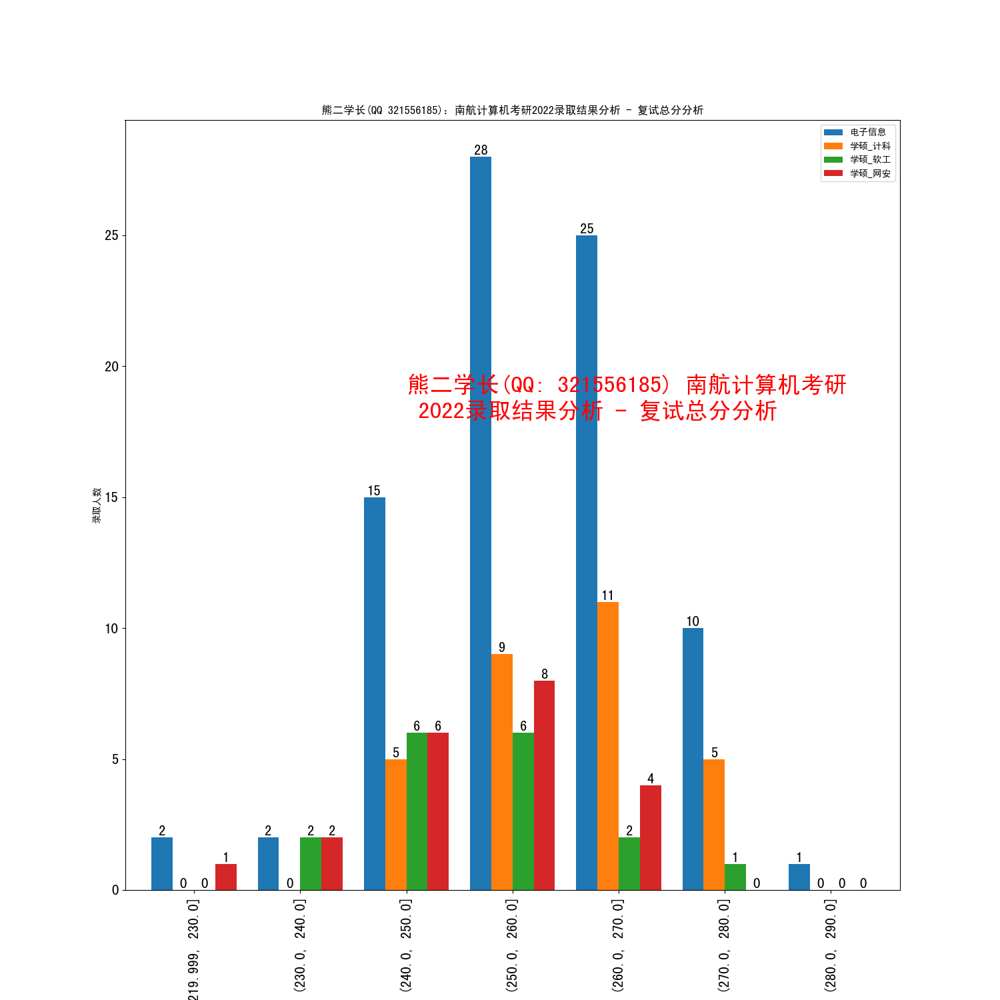

## 历史分析

### 2023 复试名单分析

南航计算机出成绩的时间：2023-02-21

看群里同学的反馈，今年高分的同学（390+）还是很多。应该是2023特殊（考试之前口罩放开了），所以试卷改的松。有一位同学说，他考完专业课估分83，结果实际是109。

这次试卷改得松，给我们的一个经验是，不管是难还是简单，考试的时候，心态都应该放平。考的难，不要摆烂，空在那里，像今年，情况特殊，那么就会有步骤分，写了就有分，空着就没分。考的简单，也不能轻敌，可能计算出错阴沟翻船。

2023 的专硕依然竞争激烈，看群里说，专硕 395 排名 7，394 排名 14，360 排名 102。其实专硕还是太卷了，冲专硕还是不太理智，学硕竞争就比较轻松了。虽然学硕录取的人数少，但是分数也是真的低。而且学硕和专硕的唯一区别，就是数一和数二的区别，多花点时间和精力，和主流错开车道错位竞争，还是值得的。

### 2022 录取结果统计和分析

| 专业          | 统考录取人数 | 初试最低分 | 初试中位数分数 / 2021中位数 | 初试平均分 / 2021平均分 | 初试最高分 |
| ------------- | ------------ | ---------- | --------------------------- | ----------------------- | ---------- |
| 学硕-计科     | 30           | 341        | 356 / 355                   | 361 / 357               | 393        |
| 学硕-软工     | 17           | 327        | 352 / 357                   | 350 / 355               | 382        |
| 学硕-网安     | 21           | 326        | 343 / 356                   | 348/ 356                | 391        |
| 专硕-电子信息 | 83           | 346        | 375 / 373                   | 376 / 373               | 412        |
| 汇总          | 151          | 326        |                             |                         | 412        |

| 专业          | 最终录取人数 | 复试招生指标 | 进入复试人数 / 最低分 / 最高分 | 最终录取初试最低/高分 | 复录比   |
| ------------- | ------------ | ------------ | ------------------------------ | --------------------- | -------- |
| 学硕-计科     | 30           | 30           | 37（341 / 393）                | 341 / 393             | 1.23 : 1 |
| 学硕-软工     | 17           | 17           | 21（326 / 382）                | 327 / 382             | 1.24 : 1 |
| 学硕-网安     | 21           | 18           | 22（326/ 391）                 | 326 / 391             | 1.05 : 1 |
| 专硕-电子信息 | 83           | 80           | 150（345/ 412）                | 346 / 412             | 1.8 : 1  |
| 汇总          | 151          | 145          | 231（326/ 412）                |                       |          |

|               | 初试  | 初试        | 初试        | 初试 | 初试  | 初试 | 初试   | 初试 | 复试  | 复试        | 复试        | 复试   | 复试     | 复试   | 复试    | 复试   | 总分  | 总分        | 总分        | 总分  | 总分    | 总分   | 总分    | 总分  |
| ------------- | ----- | ----------- | ----------- | ---- | ----- | ---- | ------ | ---- | ----- | ----------- | ----------- | ------ | -------- | ------ | ------- | ------ | ----- | ----------- | ----------- | ----- | ------- | ------ | ------- | ----- |
|               | count | mean        | std         | min  | 25%   | 50%  | 75%    | max  | count | mean        | std         | min    | 25%      | 50%    | 75%     | max    | count | mean        | std         | min   | 25%     | 50%    | 75%     | max   |
| 专业          |       |             |             |      |       |      |        |      |       |             |             |        |          |        |         |        |       |             |             |       |         |        |         |       |
| 专硕-电子信息 | 83    | 376.3975904 | 15.45010834 | 346  | 364   | 375  | 386    | 412  | 83    | 258.1003614 | 10.79748429 | 228.09 | 251.265  | 258.67 | 265.235 | 288.66 | 83    | 78.51433735 | 2.542343931 | 75    | 76.615  | 77.93  | 80.155  | 84.83 |
| 学硕-网安     | 21    | 348         | 19.08664455 | 326  | 336   | 343  | 351    | 391  | 21    | 250.5338095 | 10.82258679 | 226.56 | 245.23   | 252.38 | 259.4   | 269.25 | 21    | 73.77428571 | 3.076507064 | 68.72 | 72      | 73.21  | 74.31   | 81.11 |
| 学硕-计科     | 30    | 361.2666667 | 15.64902406 | 341  | 348.5 | 356  | 373.75 | 393  | 30    | 260.1683333 | 8.835140685 | 243.31 | 254.0125 | 261.75 | 266.195 | 274.92 | 30    | 76.59433333 | 2.616906153 | 73.49 | 74.6975 | 75.815 | 78.0575 | 82.23 |
| 学硕-软工     | 17    | 350.8823529 | 15.14877203 | 327  | 343   | 352  | 358    | 382  | 17    | 251.1617647 | 8.66811992  | 236.74 | 247.38   | 250.27 | 255.8   | 271.67 | 17    | 74.24       | 2.755172408 | 69.91 | 72.55   | 74.03  | 75.23   | 80.23 |

**熊二 分析**

* 南航计算机没有炸，分数仍然稳定增长，符合预期（计算机考研越来越火，考研人数越来越多，竞争越来越激烈）
* 今年复试的招生指标，和最终录取的人数，一模一样，没有像往年一样，最终录取名单的人数比复试的招生指标多一点
* 2022 相对 2021 年，统考录取人数少了 25 人，主要少在了专硕上
* 与 2021 比较的话，专硕平均分涨了 2 分，学硕-计科的平均分涨了 4 分，学硕-软工的平均分降了 5 分，学硕-网安的平均分降了 8 分
* 初试没考好，仍然是可以逆袭的，每一个专业，都存在进入复试倒数的同学，最终上岸
* 专硕复录比高，是为了招非全日制，从往年来看，只要进了复试，并且过了复试的及格分，就可以读南航计算机的非全，不需要再二次面试
* 个人觉得复录比高没什么，没什么可惊讶的，没有必要单纯为了黑而黑。进复试的人多了，也给初试没考好的同学带来逆袭的机会（上面说了，能逆袭），对调剂的影响也有限，现在国家调剂系统还没开呢

### 2021 统考-初复试总分-统计

|                  | 初试  | 初试     | 初试     | 初试 | 初试   | 初试 | 初试   | 初试 | 复试  | 复试     | 复试     | 复试   | 复试    | 复试   | 复试    | 复试   | 总分  | 总分     | 总分     | 总分  | 总分   | 总分  | 总分   | 总分  |
| ---------------- | ----- | -------- | -------- | ---- | ------ | ---- | ------ | ---- | ----- | -------- | -------- | ------ | ------- | ------ | ------- | ------ | ----- | -------- | -------- | ----- | ------ | ----- | ------ | ----- |
|                  | count | mean     | std      | min  | 25%    | 50%  | 75%    | max  | count | mean     | std      | min    | 25%     | 50%    | 75%     | max    | count | mean     | std      | min   | 25%    | 50%   | 75%    | max   |
| 专业             |       |          |          |      |        |      |        |      |       |          |          |        |         |        |         |        |       |          |          |       |        |       |        |       |
| 电子信息         | 107   | 373.3925 | 16.9682  | 337  | 360    | 373  | 386    | 414  | 107   | 229.7911 | 16.84624 | 190.1  | 218.92  | 228.03 | 240.895 | 278.66 | 107   | 75.63925 | 3.519658 | 70.78 | 73.005 | 74.87 | 78.25  | 86.26 |
| 网络空间安全     | 24    | 355.75   | 16.56148 | 327  | 344.75 | 356  | 364.25 | 399  | 24    | 225.9725 | 13.25421 | 204.56 | 216.06  | 225.2  | 235.445 | 256.07 | 24    | 73.2375  | 2.845286 | 69.26 | 71.18  | 72.47 | 75.295 | 78.92 |
| 计算机科学与技术 | 23    | 356.7391 | 18.83956 | 329  | 347    | 355  | 365.5  | 416  | 23    | 227.2009 | 12.84039 | 204.74 | 217.23  | 227.94 | 232.62  | 251.02 | 23    | 73.5413  | 2.904325 | 69.62 | 71.66  | 73.54 | 74.595 | 83.44 |
| 软件工程         | 19    | 355      | 18.91795 | 327  | 339.5  | 357  | 365    | 394  | 19    | 237.8958 | 15.38778 | 203.34 | 229.345 | 241.48 | 245.035 | 264.38 | 19    | 75.15053 | 3.61027  | 69.64 | 73.065 | 74.59 | 77.34  | 81.85 |

| 专业          | 录取人数 | 进入复试人数 / 最低分 / 最高分 | 录取初试最低/高分 | 中位数分数 | 复录比  |
| ------------- | -------- | ------------------------------ | ----------------- | ---------- | ------- |
| 学硕-计算机   | 25       | 32（329 / 416）                | 329 / 416         | 355        | 1.28: 1 |
| 学硕-软工     | 19       | 25（327 / 394）                | 327 / 394         | 357        | 1.32: 1 |
| 学硕-网安     | 25       | 27（327/ 399）                 | 327 / 399         | 356        | 1.08: 1 |
| 专硕-电子信息 | 107      | 174（337/ 414）                | 337 / 414         | 373        | 1.63: 1 |
| 汇总          | 176      | 258（327/ 416）                | 327 / 416         |            | 1.47: 1 |

注意：以上分数统计不包含退役大学生录取计划。以上数据包含了两次补录的数据。

有意思的几个现象：

1. 上面表格中，进入复试名单的最高分和最低分，和录取名单上每个专业的最低分和最高分是一样了，说明了复试名单最后一名是可以逆袭的，初试能考第yi名，也是很稳的
2. 专硕的中位数分数偏高，基本上比学硕高 20 分，学硕的中位数都不到 360，学硕考 360 就比较稳了，专硕考 375 也比较稳了，没有之前谣传得那么可怕。专硕的报录比是 1.63：1，没有之前 2：1那么夸张
3. 复试逆袭的很多，这很正常，现在计算机是香饽饽，而且南航又是热门学校。不是初试分高就万事大吉了。这次面试，给我最大的感触是，考研并不只有应试。如果一开始就寄希望于应试，不去注重其他能力和知识的积累，那么可能一开始就走错了路
4. 2021 和 2020 一样，依然没有 985 调剂，985 调剂名额很多都直接抽给保研了，所以 2021 保研的名额特别多
5. 复试是比初试还重要的，复试的 1 分顶初试的 1.5 分，但是很多人并不重视复试，出现很多初试分高，复试分很低的情况，我觉得这不能完全怪老师歧视本科出身（歧视是客观存在的，不用玻璃心），主要矛盾还是在自己身上

