# 熊二考研百科全书&南航计算机考研

  

<!-- START doctoc generated TOC please keep comment here to allow auto update -->
<!-- DON'T EDIT THIS SECTION, INSTEAD RE-RUN doctoc TO UPDATE -->
**Table of Content**

- [授人以渔](#%E6%8E%88%E4%BA%BA%E4%BB%A5%E6%B8%94)
- [2024南航计算机考研最新通知](#2024%E5%8D%97%E8%88%AA%E8%AE%A1%E7%AE%97%E6%9C%BA%E8%80%83%E7%A0%94%E6%9C%80%E6%96%B0%E9%80%9A%E7%9F%A5)
- [南航计算机考研简介](#%E5%8D%97%E8%88%AA%E8%AE%A1%E7%AE%97%E6%9C%BA%E8%80%83%E7%A0%94%E7%AE%80%E4%BB%8B)
- [来段rap](#%E6%9D%A5%E6%AE%B5rap)
- [关于熊二](#%E5%85%B3%E4%BA%8E%E7%86%8A%E4%BA%8C)
- [熊二考研百科全书购买](#%E7%86%8A%E4%BA%8C%E8%80%83%E7%A0%94%E7%99%BE%E7%A7%91%E5%85%A8%E4%B9%A6%E8%B4%AD%E4%B9%B0)
- [南航计算机历年统考录取人数统计](#%E5%8D%97%E8%88%AA%E8%AE%A1%E7%AE%97%E6%9C%BA%E5%8E%86%E5%B9%B4%E7%BB%9F%E8%80%83%E5%BD%95%E5%8F%96%E4%BA%BA%E6%95%B0%E7%BB%9F%E8%AE%A1)
- [2023录取结果统计和分析](#2023%E5%BD%95%E5%8F%96%E7%BB%93%E6%9E%9C%E7%BB%9F%E8%AE%A1%E5%92%8C%E5%88%86%E6%9E%90)
- [2023复试的重要性](#2023%E5%A4%8D%E8%AF%95%E7%9A%84%E9%87%8D%E8%A6%81%E6%80%A7)
- [历史分析](#%E5%8E%86%E5%8F%B2%E5%88%86%E6%9E%90)
  - [2023 复试名单分析](#2023-%E5%A4%8D%E8%AF%95%E5%90%8D%E5%8D%95%E5%88%86%E6%9E%90)
  - [2022 录取结果统计和分析](#2022-%E5%BD%95%E5%8F%96%E7%BB%93%E6%9E%9C%E7%BB%9F%E8%AE%A1%E5%92%8C%E5%88%86%E6%9E%90)
  - [2021 统考-初复试总分-统计](#2021-%E7%BB%9F%E8%80%83-%E5%88%9D%E5%A4%8D%E8%AF%95%E6%80%BB%E5%88%86-%E7%BB%9F%E8%AE%A1)
  - [2021-统考-最终录取-单科分数统计](#2021-%E7%BB%9F%E8%80%83-%E6%9C%80%E7%BB%88%E5%BD%95%E5%8F%96-%E5%8D%95%E7%A7%91%E5%88%86%E6%95%B0%E7%BB%9F%E8%AE%A1)
  - [2020 届统考数据](#2020-%E5%B1%8A%E7%BB%9F%E8%80%83%E6%95%B0%E6%8D%AE)
  - [2019 届统考数据](#2019-%E5%B1%8A%E7%BB%9F%E8%80%83%E6%95%B0%E6%8D%AE)
  - [2018 届统考数据](#2018-%E5%B1%8A%E7%BB%9F%E8%80%83%E6%95%B0%E6%8D%AE)
  - [2017 届统考数据](#2017-%E5%B1%8A%E7%BB%9F%E8%80%83%E6%95%B0%E6%8D%AE)
  - [统考录取人数与985调剂人数对比](#%E7%BB%9F%E8%80%83%E5%BD%95%E5%8F%96%E4%BA%BA%E6%95%B0%E4%B8%8E985%E8%B0%83%E5%89%82%E4%BA%BA%E6%95%B0%E5%AF%B9%E6%AF%94)
- [2022最新复试规则](#2022%E6%9C%80%E6%96%B0%E5%A4%8D%E8%AF%95%E8%A7%84%E5%88%99)
- [2021复试规则](#2021%E5%A4%8D%E8%AF%95%E8%A7%84%E5%88%99)
- [专业课复习需要用到的书](#%E4%B8%93%E4%B8%9A%E8%AF%BE%E5%A4%8D%E4%B9%A0%E9%9C%80%E8%A6%81%E7%94%A8%E5%88%B0%E7%9A%84%E4%B9%A6)
- [B站视频](#b%E7%AB%99%E8%A7%86%E9%A2%91)
- [熊二考研百科全书](#%E7%86%8A%E4%BA%8C%E8%80%83%E7%A0%94%E7%99%BE%E7%A7%91%E5%85%A8%E4%B9%A6)
  - [介绍](#%E4%BB%8B%E7%BB%8D)
  - [适用对象](#%E9%80%82%E7%94%A8%E5%AF%B9%E8%B1%A1)
  - [目录](#%E7%9B%AE%E5%BD%95)
  - [写书目的](#%E5%86%99%E4%B9%A6%E7%9B%AE%E7%9A%84)
  - [资料口碑](#%E8%B5%84%E6%96%99%E5%8F%A3%E7%A2%91)
- [复试相关资料共享](#%E5%A4%8D%E8%AF%95%E7%9B%B8%E5%85%B3%E8%B5%84%E6%96%99%E5%85%B1%E4%BA%AB)
- [文件目录树](#%E6%96%87%E4%BB%B6%E7%9B%AE%E5%BD%95%E6%A0%91)
- [为什么建议大家买专业课复习资料](#%E4%B8%BA%E4%BB%80%E4%B9%88%E5%BB%BA%E8%AE%AE%E5%A4%A7%E5%AE%B6%E4%B9%B0%E4%B8%93%E4%B8%9A%E8%AF%BE%E5%A4%8D%E4%B9%A0%E8%B5%84%E6%96%99)
- [Surprise](#surprise)
- [LICENSE](#license)
- [Organization](#organization)

<!-- END doctoc generated TOC please keep comment here to allow auto update -->

南航计算机考研百科全书

Gitee 备份：https://gitee.com/wansho/awesome-nuaa-cs-kaoyan

## 授人以渔

## 2024南航计算机考研最新通知

* **2024 改考 408 ！！！**

* **2024考研百科全书已上架：https://k.youshop10.com/nDeEbPpP**

* **2024 南航计算机考研 qq 群：717645993**

* **2024南航计算机考研答疑网站：http://www.nuaa-cs-kaoyan.top**

  

改考 408 的通知是 2022 年 3 月通知的，提前一年通知。

----

## 南航计算机考研简介

总分 = (初试成绩 * 100)/500 `*` 50% + (复试成绩 * 100)/300 `*` 50% （复试的 1 分换算成初试的 1.67 分）

- 2024 专业课改考 408，公共课改不改，未知，大概率不会改

- 初试

  - 2024 以前：

    学硕：数一，英一，政治，829
    专硕：数二，英一，政治，829

  - 2024：专业课408，公共课等待官方通知，预计还是和往年保持一致。

    学硕：数一，英一，政治，408（学硕分为三个方向，计科、软工、网安）
    专硕：未知(大概率保持不变)，未知(大概率保持不变)，政治，408

- 复试（线下）

  复试 300 分 = 100 分笔试（离散数学和编译原理）+ 200 分面试（150 分综合能力考察 + 50 分英语水平考察）

  注意：
  - 上述 200 分面试，每年可能都不太一样，19年之前还有英语听力的笔试，直接在离散数学和编译原理后面考，占 50 分，口罩三年主要是考察翻译和口语。
  - 南航计算机复试往年无**上机考试**，至于以后有没有，不好说
  - 2024 专业课改考 408，复试会不会大变，也不好说，做好准备即可，以不变应万变

2024南航计算机专硕还考数⼆吗？熊⼆觉得专硕⼤概率还是考数⼆。
为什么？
⾸先，南航所有的专硕，都考英⼀。所以南航计算机专硕不管怎么改，英语肯定还是考ying-yi。那么问题来了，如果专硕也考数⼀，那学硕和专硕有什么区别？
所以，专硕还是考数⼆！

## 来段rap

## 关于熊二

| 学长初试分数                                                 | 微信公众号：熊二学长                                         |
| ------------------------------------------------------------ | ------------------------------------------------------------ |
|  |  |

|  QQ: 321556185 |  2023 南航计算机考研 QQ 群：155046050 |  Github |
| ------------------------------------------------------------ | ------------------------------------------------------------ | ------------------------------------------------------------ |
| 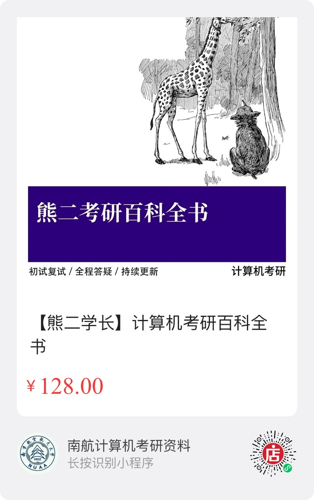 **微店购买链接** |  **拼多多资料购买链接** |  **哔哩哔哩 求关注** |
|  南航计算机考研问答网站 http://www.nuaa-cs-kaoyan.top |  知乎专栏：南航计算机考研 |  微信公众号：熊二学长 |

## 熊二考研百科全书购买

微店购买链接：https://k.youshop10.com/nDeEbPpP

拼多多购买链接：https://mobile.yangkeduo.com/goods2.html?pdd_bapp_share_channel=copy_link&goods_id=453190296714

* **熊二学长(个人经营) / 南航计算机高分学长(417分) / QQ: 321556185** 

* **Bilibili 专栏 Up 主**：[【大大卷点点心】](https://www.bilibili.com/read/cv4606513 )

* **知乎专栏**：[【南航计算机考研】](https://zhuanlan.zhihu.com/c_1226188578315042816)

* **VIP增值服务**
  
  * 全程答疑和咨询，包括心理咨询，复习规划
  - 初试模拟考试卷面分析和建议
  - 复试指导和咨询，包括简历评价，自我介绍评价，面试指导，导师推荐
  - 职业生涯规划咨询和指导
  - 可加熊二个人微信，交个朋友(熊二就在南京)，后续上岸后，找工作，科研的问题，都可以聊
  

## 南航计算机历年统考录取人数统计

2023 及以前，考 829，2024 及以后，专业课考 408。

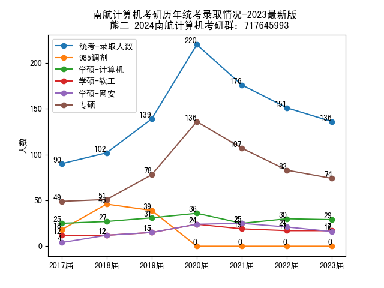

**历年录取成绩中位数统计**

|      | 学硕-计算机 | 学硕-软工 | 学硕-网安 | 专硕  |
| ---- | ----------- | --------- | --------- | ----- |
| 2023 | 368         | 363       | 363       | 376.5 |
| 2022 | 356         | 352       | 343       | 375   |
| 2021 | 355         | 357       | 356       | 373   |

## 2023录取结果统计和分析

注意：下面统计数据已排除shibing计划和非全日制。2023 考的是 829，2024 要改考 408 了。

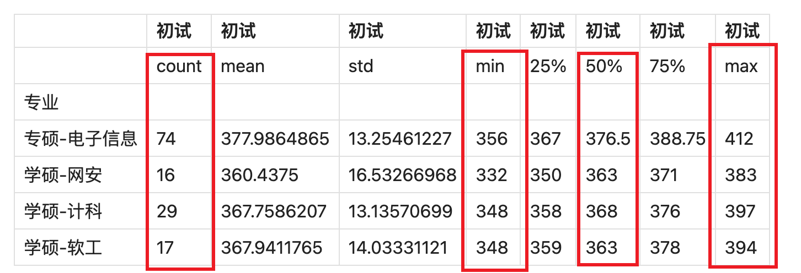

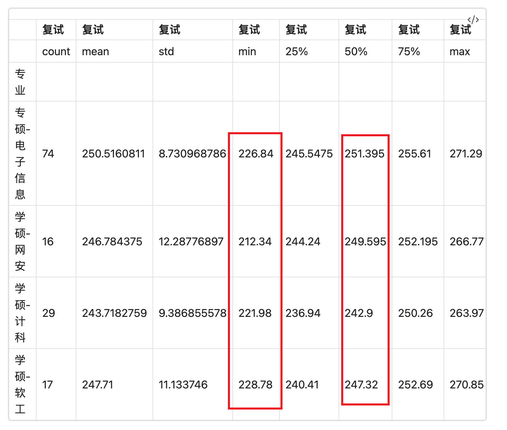

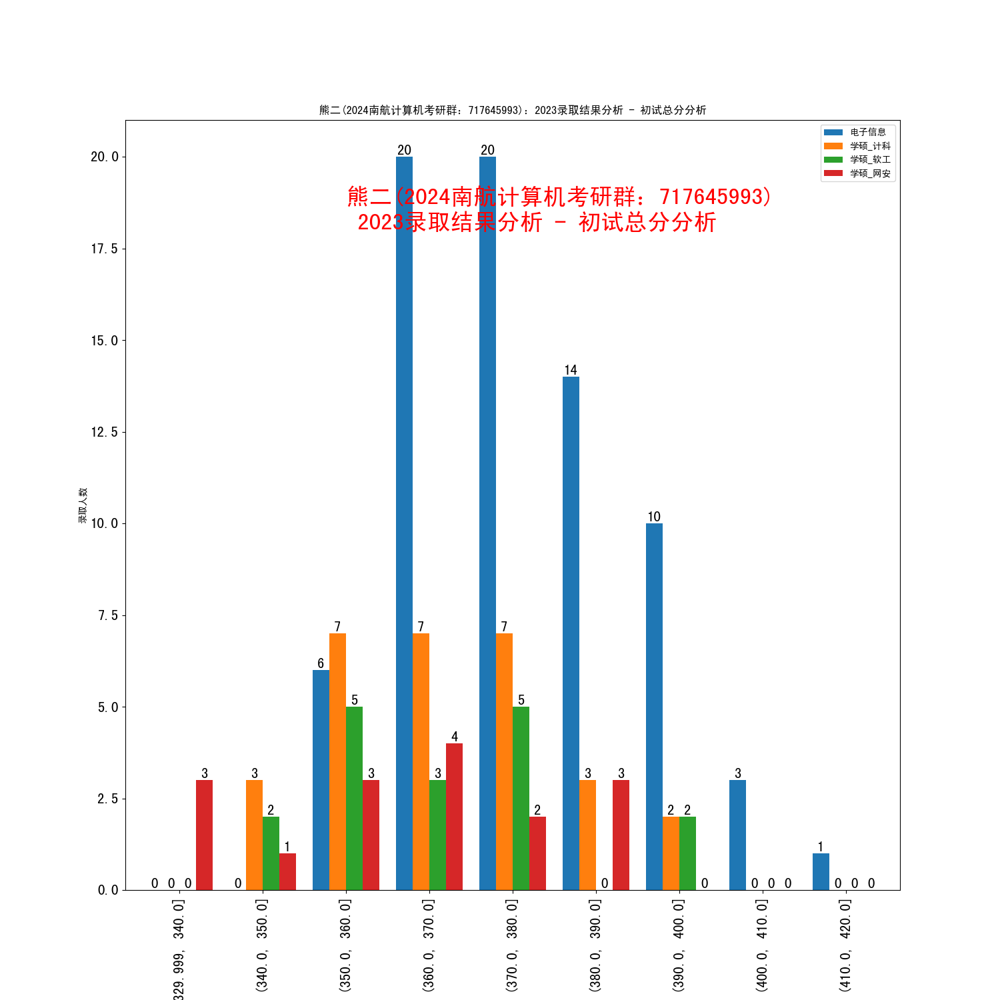

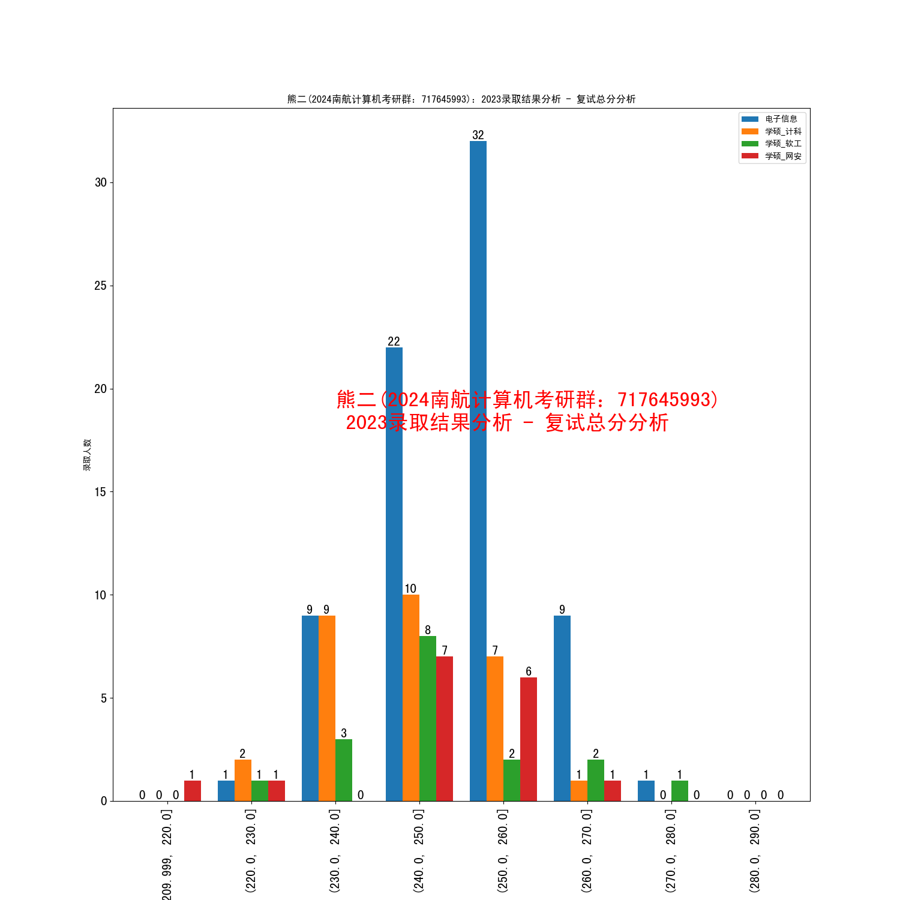

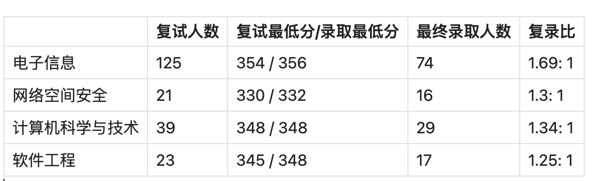

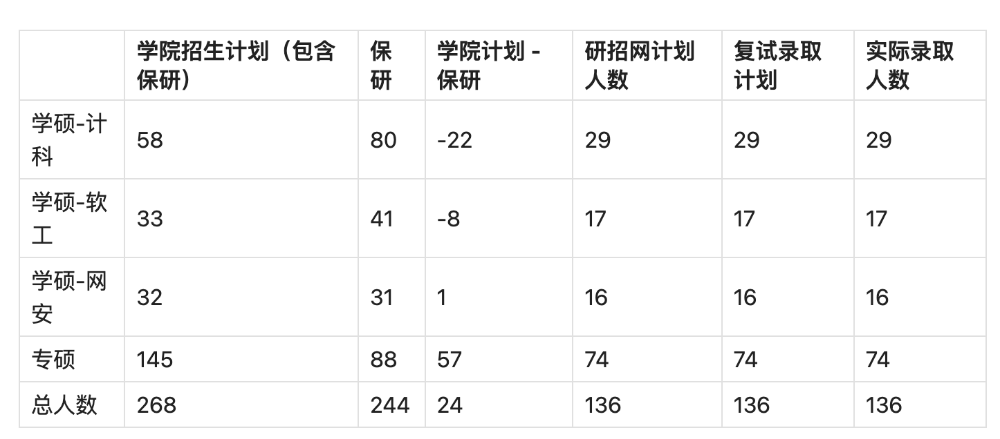

研招网招生计划最靠谱。学院的招生计划不靠谱。

## 2023复试的重要性

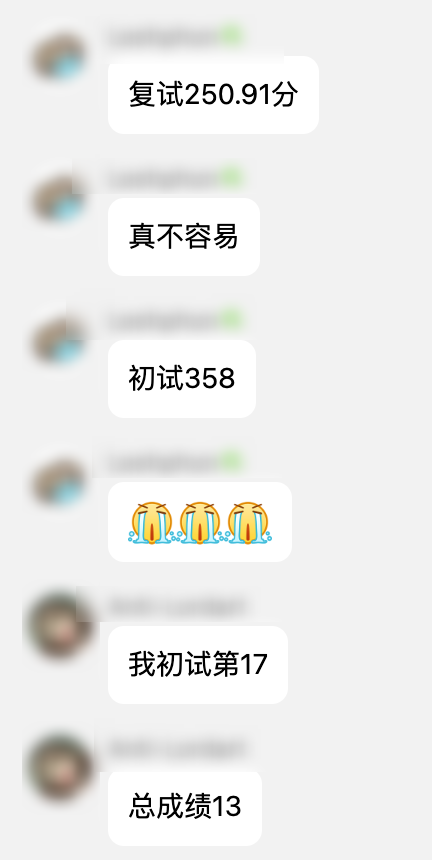

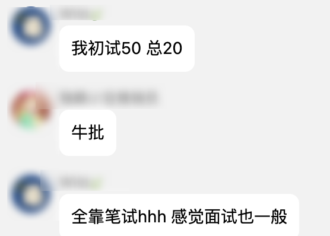

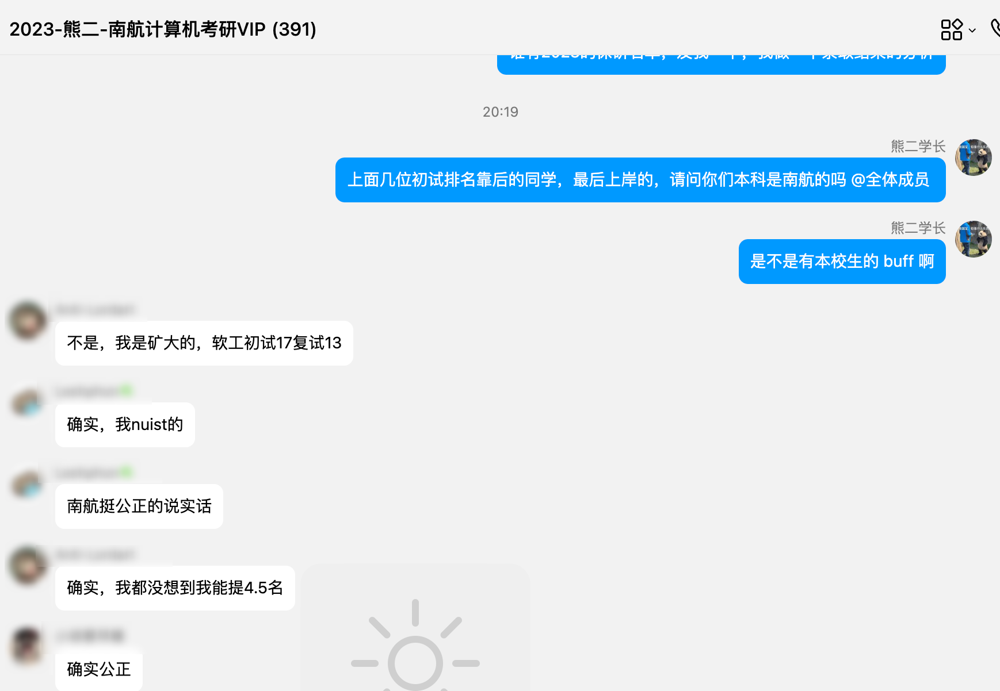

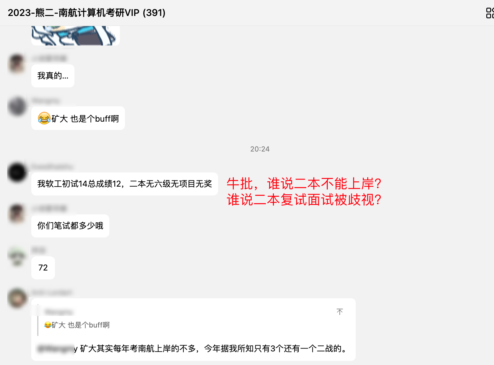

复试笔试有多么重要，不用我再多说了吧？初试考 370，380 有什么用？浪了，复试笔试两个大题不会做，丢分，和考 350+ 有啥区别？所以不要说复试有什么黑幕？自己复试浪了能怪谁呢？所以考了 370,380 千万别沾沾自喜，复试比初试还重要！！！尤其是复试的笔试，100 分，有的人考 70 分，有的人考 90 分，那能一样吗？

同样，我也遇到很多人卡着录取线，没有被录取的，有的同学离最后一名差 0.1 分， 0.2 分， 0.3 分，真的可惜。

看到很多同学在群里分享自己 ni xi 经历，熊二很开心。说明没有什么网上说的其他路子。初试和复试，给了两次机会，初试考得好，复试还得继续努力，初试考得差，还能通过复试来ni-xi,没有因为初试成绩形成 gu-hua，有上有下挺好的。

相当于给了大家两次机会，这不挺好的吗？总比高考的时候，只考一次要好很多吧？

