熊二学长-南航计算机考研 829 - 从入门到精通
=================

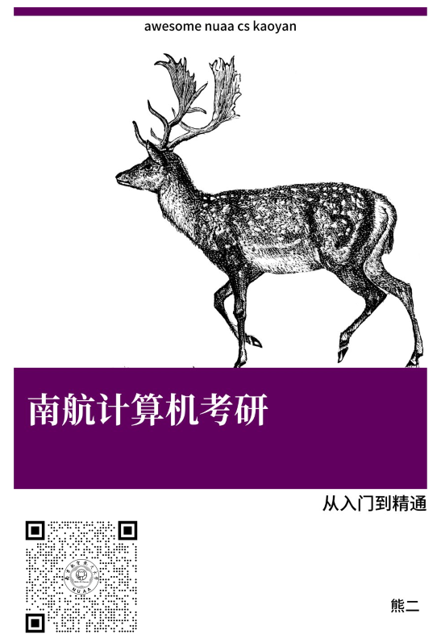

 [](https://github.com/nuaa-cs-kaoyan/awesome-nuaa-cs-kaoyan) 

<!-- START doctoc generated TOC please keep comment here to allow auto update -->
<!-- DON'T EDIT THIS SECTION, INSTEAD RE-RUN doctoc TO UPDATE -->
**Table of Content**

- [2023 南航计算机考研](#2023-%E5%8D%97%E8%88%AA%E8%AE%A1%E7%AE%97%E6%9C%BA%E8%80%83%E7%A0%94)
- [2022 届计算机考研最新通知](#2022-%E5%B1%8A%E8%AE%A1%E7%AE%97%E6%9C%BA%E8%80%83%E7%A0%94%E6%9C%80%E6%96%B0%E9%80%9A%E7%9F%A5)
- [<font color="red">21 届计算机考研最新通知 </font>](#font-colorred21-%E5%B1%8A%E8%AE%A1%E7%AE%97%E6%9C%BA%E8%80%83%E7%A0%94%E6%9C%80%E6%96%B0%E9%80%9A%E7%9F%A5-font)
- [Inspiration](#inspiration)
- [About me](#about-me)
- [南航计算机招生情况/复录比](#%E5%8D%97%E8%88%AA%E8%AE%A1%E7%AE%97%E6%9C%BA%E6%8B%9B%E7%94%9F%E6%83%85%E5%86%B5%E5%A4%8D%E5%BD%95%E6%AF%94)
- [2021 最新复试规则](#2021-%E6%9C%80%E6%96%B0%E5%A4%8D%E8%AF%95%E8%A7%84%E5%88%99)
- [专业课复习需要用到的书](#%E4%B8%93%E4%B8%9A%E8%AF%BE%E5%A4%8D%E4%B9%A0%E9%9C%80%E8%A6%81%E7%94%A8%E5%88%B0%E7%9A%84%E4%B9%A6)
- [B站南航计算机考研讲座视频](#b%E7%AB%99%E5%8D%97%E8%88%AA%E8%AE%A1%E7%AE%97%E6%9C%BA%E8%80%83%E7%A0%94%E8%AE%B2%E5%BA%A7%E8%A7%86%E9%A2%91)
- [专业课真题和考纲](#%E4%B8%93%E4%B8%9A%E8%AF%BE%E7%9C%9F%E9%A2%98%E5%92%8C%E8%80%83%E7%BA%B2)
- [专业课资料](#%E4%B8%93%E4%B8%9A%E8%AF%BE%E8%B5%84%E6%96%99)
  - [目录](#%E7%9B%AE%E5%BD%95)
  - [资料样本](#%E8%B5%84%E6%96%99%E6%A0%B7%E6%9C%AC)
  - [资料适用对象](#%E8%B5%84%E6%96%99%E9%80%82%E7%94%A8%E5%AF%B9%E8%B1%A1)
  - [资料质量证明](#%E8%B5%84%E6%96%99%E8%B4%A8%E9%87%8F%E8%AF%81%E6%98%8E)
- [历届学长学姐考研笔记分享计划](#%E5%8E%86%E5%B1%8A%E5%AD%A6%E9%95%BF%E5%AD%A6%E5%A7%90%E8%80%83%E7%A0%94%E7%AC%94%E8%AE%B0%E5%88%86%E4%BA%AB%E8%AE%A1%E5%88%92)
- [信息汇总](#%E4%BF%A1%E6%81%AF%E6%B1%87%E6%80%BB)
- [经验贴](#%E7%BB%8F%E9%AA%8C%E8%B4%B4)
- [复试相关资料共享](#%E5%A4%8D%E8%AF%95%E7%9B%B8%E5%85%B3%E8%B5%84%E6%96%99%E5%85%B1%E4%BA%AB)
- [文件目录树](#%E6%96%87%E4%BB%B6%E7%9B%AE%E5%BD%95%E6%A0%91)
- [为什么建议大家买专业课复习资料](#%E4%B8%BA%E4%BB%80%E4%B9%88%E5%BB%BA%E8%AE%AE%E5%A4%A7%E5%AE%B6%E4%B9%B0%E4%B8%93%E4%B8%9A%E8%AF%BE%E5%A4%8D%E4%B9%A0%E8%B5%84%E6%96%99)
- [Surprise](#surprise)
- [LICENSE](#license)
- [Organization](#organization)

<!-- END doctoc generated TOC please keep comment here to allow auto update -->


南航计算机考研 **专业课资料** 和 **信息汇总**。**授人以鱼，也授人以渔。**

Gitee 备份：https://gitee.com/wansho/awesome-nuaa-cs-kaoyan


## 2023 南航计算机考研

* **熊二学长会继续做 2023 届的南航计算机考研辅导**
* **2023 南航计算机考研 qq 群：155046050**
* 学长的微信公众号：熊二学长 hello-xiong2
* 2022 初试 829 真题分析：[2022初试专业课分析](南航计算机考研讲座/三十：2022初试专业课总结.md)

## 2022 届计算机考研最新通知

* 2022 南航计算机预计招生 400+ 人，包含保研名额，其中专硕招150左右，计算机学硕80-90，网安和软件40-50；去年保研了 140 人，2022 保研人数应该会增长，保守估计 2022 保研 200 名额，统考 200

* **2022 南航计算机仍然考 829，招生目录已出 http://yzsbm.nuaa.edu.cn/sszsml/index.html**
* **熊二学长会继续做 2022 届的南航计算机考研辅导**
* **2022 届的 qq 群号为：1097698796**
* **2022 届的专业课资料大更新，从 2021 届的（202+179=381页）增加到 2022 届的（224+197=421页），增加了 40 页新内容**

## <font color="red">21 届计算机考研最新通知 </font>

* [**20 届后南航计算机考研变化分析**](经验贴/20届后南航计算机考研变化.md)
* 2021 南航计算机继续考 829
* 2022 南航计算机考研 QQ 群：1097698796
* [2021 届是否缩招？](https://zhuanlan.zhihu.com/p/137749800)
* **2020 届南航计算机拟扩招 80 人**
* **熊二学长会继续做 2021届的南航计算机考研辅导！2021届的群号为：915819571**
* **829 计算机组成原理的解析已经编写完成，2021 届考研的同学，能从我这里买到 829 的资料了**

## Inspiration

* 提供南航计算机考研，top one 的专业课复习资料
* 提供南航计算机考研，最详尽的信息

## About me

| 学长初试分数                                                 | 微信公众号：熊二学长                                         |
| ------------------------------------------------------------ | ------------------------------------------------------------ |
| 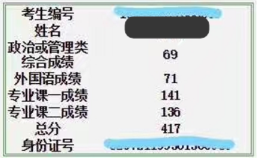 |  |


| <br />QQ: 321556185 | <br />2023 南航计算机考研 QQ 群：155046050 | <br />Github |
| ------------------------------------------------------------ | ------------------------------------------------------------ | ------------------------------------------------------------ |
| <br />**微店购买链接** | <br />**拼多多资料购买链接** | <br />**哔哩哔哩 求关注** |

**如果需要专业课资料快速提分，可以直接加我微信，转账给我，然后告知我快递信息**：

| 微信加好友                                                   | 支付宝转账                                                   |
| ------------------------------------------------------------ | ------------------------------------------------------------ |
|  |  |


* **熊二学长(个人经营) / 17级南航计算机高分学长(417分) / QQ: 321556185** 
* **Bilibili 专栏 Up 主**：[【大大卷点点心】](https://www.bilibili.com/read/cv4606513 )
* **知乎专栏**：[【南航计算机考研】](https://zhuanlan.zhihu.com/c_1226188578315042816)
* **王道论坛博主：熊二**
  * [2017南航计算机考研经验贴](http://www.cskaoyan.com/thread-642848-1-1.html)
  * [南航计算机考研相关信息整理！免费公开！！](http://www.cskaoyan.com/thread-643825-1-1.html)
  * [南航18级计算机复试面试题和面试问答](http://www.cskaoyan.com/thread-649395-1-1.html)
  * [南航计算机考研真题答案!没错!是答案!答案!答案!](http://www.cskaoyan.com/thread-643443-1-1.html) 
  * Others
* **2022 考研专业课资料地址**
  * 微店：https://k.koudai.com/d320yHBl
  * 拼多多: https://mobile.yangkeduo.com/goods.html?goods_id=273557458581
* **增值服务**
  * 免费提供从初试到复试的全程专业课答疑
  * 免费提供复试相关资料
  * 免费提供从初试到研究生毕业的全程咨询，包括如何科研(熊二学长的毕业论文是2020校优秀论文)
  * 考上研后，可以加学长微信，提供科研咨询，找工作的咨询，条件允许可以内推互联网大厂
* **南航计算机考研辅导历史**
  * 2017-02 考研出分，总分 400+，专业课成绩 135+
  * 2017-04 在[王道论坛](http://www.cskaoyan.com/thread-642848-1-1.html)分享考研经验，并开始编写南航计算机考研资料
  * 2017-05 [18级南航计算机考研辅导资料](https://weidian.com/item.html?itemID=2105222705&ifr=itemdetail&wfr=c) 编写完成，开始辅导 18 级南航计算机考研
  * 2017-12 18 考研学生反馈，专业课资料的必备考点，几乎全部命中了真题的简单题，好评如潮
  * 2018-03 [19级南航计算机考研辅导资料](https://weidian.com/item.html?itemID=2242029324&ifr=itemdetail&wfr=c) 编写完成，开始辅导 19 级南航计算机考研
  * 2018-12 19 考研学生反馈，专业课资料的必备考点，再次命中多道真题的简单题，再次好评如潮
  * 2019-02 [20级南航计算机考研辅导资料](https://k.weidian.com/a0lQclaM) 编写完成，开始辅导 20级南航计算机考研
  * 2019-10 开始编写 829 计算机组成原理的解析
  * 2020-02 面向 2021 届的 829 专业课资料编写完成，加入计算机组成原理解析
  * 2020-12 资料全面改版，面向 2022 考生

## 南航计算机招生情况/复录比

南航计算机自主命题，学硕和专硕都考 829，三门科目：

* 数据结构
* 操作系统
* 计算机组成原理

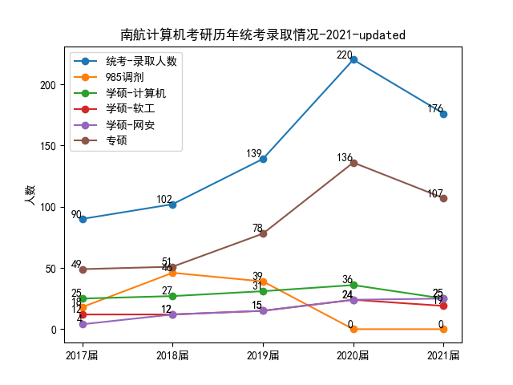


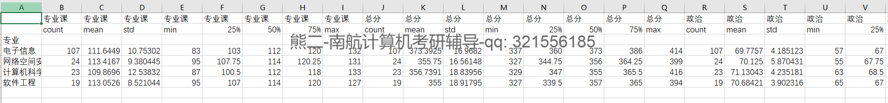


**2021 统考-初复试总分-统计**

|                  | 初试  | 初试     | 初试     | 初试 | 初试   | 初试 | 初试   | 初试 | 复试  | 复试     | 复试     | 复试   | 复试    | 复试   | 复试    | 复试   | 总分  | 总分     | 总分     | 总分  | 总分   | 总分  | 总分   | 总分  |
| ---------------- | ----- | -------- | -------- | ---- | ------ | ---- | ------ | ---- | ----- | -------- | -------- | ------ | ------- | ------ | ------- | ------ | ----- | -------- | -------- | ----- | ------ | ----- | ------ | ----- |
|                  | count | mean     | std      | min  | 25%    | 50%  | 75%    | max  | count | mean     | std      | min    | 25%     | 50%    | 75%     | max    | count | mean     | std      | min   | 25%    | 50%   | 75%    | max   |
| 专业             |       |          |          |      |        |      |        |      |       |          |          |        |         |        |         |        |       |          |          |       |        |       |        |       |
| 电子信息         | 107   | 373.3925 | 16.9682  | 337  | 360    | 373  | 386    | 414  | 107   | 229.7911 | 16.84624 | 190.1  | 218.92  | 228.03 | 240.895 | 278.66 | 107   | 75.63925 | 3.519658 | 70.78 | 73.005 | 74.87 | 78.25  | 86.26 |
| 网络空间安全     | 24    | 355.75   | 16.56148 | 327  | 344.75 | 356  | 364.25 | 399  | 24    | 225.9725 | 13.25421 | 204.56 | 216.06  | 225.2  | 235.445 | 256.07 | 24    | 73.2375  | 2.845286 | 69.26 | 71.18  | 72.47 | 75.295 | 78.92 |
| 计算机科学与技术 | 23    | 356.7391 | 18.83956 | 329  | 347    | 355  | 365.5  | 416  | 23    | 227.2009 | 12.84039 | 204.74 | 217.23  | 227.94 | 232.62  | 251.02 | 23    | 73.5413  | 2.904325 | 69.62 | 71.66  | 73.54 | 74.595 | 83.44 |
| 软件工程         | 19    | 355      | 18.91795 | 327  | 339.5  | 357  | 365    | 394  | 19    | 237.8958 | 15.38778 | 203.34 | 229.345 | 241.48 | 245.035 | 264.38 | 19    | 75.15053 | 3.61027  | 69.64 | 73.065 | 74.59 | 77.34  | 81.85 |

| 专业          | 录取人数 | 进入复试人数 / 最低分 / 最高分 | 录取初试最低/高分 | 中位数分数 | 复录比  |
| ------------- | -------- | ------------------------------ | ----------------- | ---------- | ------- |
| 学硕-计算机   | 25       | 32（329 / 416）                | 329 / 416         | 355        | 1.28: 1 |
| 学硕-软工     | 19       | 25（327 / 394）                | 327 / 394         | 357        | 1.32: 1 |
| 学硕-网安     | 25       | 27（327/ 399）                 | 327 / 399         | 356        | 1.08: 1 |
| 专硕-电子信息 | 107      | 174（337/ 414）                | 337 / 414         | 373        | 1.63: 1 |
| 汇总          | 176      | 258（327/ 416）                | 327 / 416         |            | 1.47: 1 |

注意：以上分数统计不包含退役大学生录取计划。以上数据包含了两次补录的数据。

有意思的几个现象：

1. 上面表格中，进入复试名单的最高分和最低分，和录取名单上每个专业的最低分和最高分是一样了，说明了复试名单最后一名是可以逆袭的，初试能考第一名，也是很稳的
2. 专硕的中位数分数偏高，基本上比学硕高 20 分，学硕的中位数都不到 360，学硕考 360 就比较稳了，专硕考 375 也比较稳了，没有之前谣传得那么可怕。专硕的报录比是 1.63：1，没有之前 2：1那么夸张
3. 复试逆袭的很多，这很正常，现在计算机是香饽饽，而且南航又是热门学校。不是初试分高就万事大吉了。这次面试，给我最大的感触是，考研并不只有应试。如果一开始就寄希望于应试，不去注重其他能力和知识的积累，那么可能一开始就走错了路
4. 2021 和 2020 一样，依然没有 985 调剂，985 调剂名额很多都直接抽给保研了，所以 2021 保研的名额特别多
5. 复试是比初试还重要的，复试的 1 分顶初试的 1.5 分，但是很多人并不重视复试，出现很多初试分高，复试分很低的情况，我觉得这不能完全怪老师歧视本科出身（歧视是客观存在的，不用玻璃心），主要矛盾还是在自己身上

**2021-统考-最终录取-单科分数统计**

|                  | 专业课 | 专业课      | 专业课      | 专业课 | 专业课 | 专业课 | 专业课 | 专业课 | 总分  | 总分        | 总分        | 总分 | 总分   | 总分 | 总分   | 总分 | 政治  | 政治        | 政治        | 政治 | 政治  | 政治 | 政治 | 政治 | 数学  | 数学        | 数学        | 数学 | 数学  | 数学 | 数学  | 数学 | 英语  | 英语        | 英语        | 英语 | 英语  | 英语 | 英语 | 英语 |
| ---------------- | ------ | ----------- | ----------- | ------ | ------ | ------ | ------ | ------ | ----- | ----------- | ----------- | ---- | ------ | ---- | ------ | ---- | ----- | ----------- | ----------- | ---- | ----- | ---- | ---- | ---- | ----- | ----------- | ----------- | ---- | ----- | ---- | ----- | ---- | ----- | ----------- | ----------- | ---- | ----- | ---- | ---- | ---- |
|                  | count  | mean        | std         | min    | 25%    | 50%    | 75%    | max    | count | mean        | std         | min  | 25%    | 50%  | 75%    | max  | count | mean        | std         | min  | 25%   | 50%  | 75%  | max  | count | mean        | std         | min  | 25%   | 50%  | 75%   | max  | count | mean        | std         | min  | 25%   | 50%  | 75%  | max  |
| 专业             |        |             |             |        |        |        |        |        |       |             |             |      |        |      |        |      |       |             |             |      |       |      |      |      |       |             |             |      |       |      |       |      |       |             |             |      |       |      |      |      |
| 电子信息         | 107    | 111.6448598 | 10.7530183  | 83     | 103    | 112    | 120    | 132    | 107   | 373.3925234 | 16.9682039  | 337  | 360    | 373  | 386    | 414  | 107   | 69.77570093 | 4.185122823 | 57   | 67    | 70   | 72.5 | 82   | 107   | 127.4485981 | 11.48521087 | 100  | 119.5 | 129  | 135   | 150  | 107   | 64.52336449 | 7.995689634 | 43   | 60    | 65   | 70.5 | 84   |
| 网络空间安全     | 24     | 113.4166667 | 9.380445279 | 95     | 107.75 | 114    | 120.25 | 131    | 24    | 355.75      | 16.56147967 | 327  | 344.75 | 356  | 364.25 | 399  | 24    | 70.125      | 5.870430693 | 55   | 67.75 | 71   | 73   | 83   | 24    | 109         | 16.15145706 | 73   | 102   | 108  | 118.5 | 139  | 24    | 63.20833333 | 8.767425712 | 44   | 58.75 | 64.5 | 69   | 76   |
| 计算机科学与技术 | 23     | 109.8695652 | 12.53832071 | 87     | 100.5  | 112    | 118    | 133    | 23    | 356.7391304 | 18.83955556 | 329  | 347    | 355  | 365.5  | 416  | 23    | 71.13043478 | 4.235181093 | 63   | 68.5  | 72   | 74   | 78   | 23    | 108.5217391 | 14.57541381 | 84   | 100.5 | 106  | 114   | 136  | 23    | 67.2173913  | 7.446515486 | 50   | 64    | 67   | 73.5 | 78   |
| 软件工程         | 19     | 113.0526316 | 8.521043782 | 95     | 107    | 114    | 120    | 127    | 19    | 355         | 18.9179515  | 327  | 339.5  | 357  | 365    | 394  | 19    | 70.68421053 | 3.902316001 | 65   | 67    | 71   | 73.5 | 77   | 19    | 106.1052632 | 13.92796841 | 77   | 95.5  | 107  | 114.5 | 129  | 19    | 65.15789474 | 8.001827277 | 51   | 59    | 67   | 69.5 | 78   |

简单分析：

* 政治平均分和中位数都是 70 分左右
* 专业课平均分和中位数在 110-114 之间
* 英语平均分和中位数是 65 左右
* 数一平均分和中位数在 107 左右，数二平均分和中位数在 128 左右

**2020 届统考数据**

| 专业          | 录取人数 | 进入复试人数 / 最低分 / 最高分 | 复录比  |
| ------------- | -------- | ------------------------------ | ------- |
| 学硕-计算机   | 36       | 52（318 / 387）                | 1.44: 1 |
| 学硕-软工     | 24       | 29（294 / 381）                | 1.2: 1  |
| 学硕-网安     | 24       | 32（292 / 368）                | 1.3: 1  |
| 专硕-电子信息 | 136      | 160 （290 / 414）              | 1.18: 1 |
| 汇总          | 220      | 273 （294 / 423）              | 1.24: 1 |

**2019 届统考数据**

| 专业        | 录取人数 | 进入复试人数 / 最低分 / 最高分 | 复录比 |
| ----------- | -------- | ------------------------------ | ------ |
| 学硕-计算机 | 31       | 43（324 / 393）                | 1.4: 1 |
| 学硕-软工   | 15       | 23（300 / 394）                | 1.5: 1 |
| 学硕-网安   | 15       | 18（294 / 357）                | 1.2: 1 |
| 专硕-计算机 | 41       | 70 （322 / 396）               | 1.7: 1 |
| 专硕-软工   | 37       | 75（346 / 423）                | 2: 1   |
| 汇总        | 139      | 229 （294 / 423）              | 1.6: 1 |

**2018 届统考数据**

| 专业        | 录取人数 | 进入复试人数 / 最低分 / 最高分 | 复录比  |
| ----------- | -------- | ------------------------------ | ------- |
| 学硕-计算机 | 27       | 37（301 / 367）                | 1.4: 1  |
| 学硕-软工   | 12       | 14（290 / 341）                | 1.2: 1  |
| 学硕-网安   | 12       | 9（260 / 340）                 | 1：1    |
| 专硕-计算机 | 18       | 28 （345 / 409）               | 1.56: 1 |
| 专硕-软工   | 33       | 48（303 / 380）                | 1.45: 1 |
| 汇总        | 102      | 143 （260 / 409）              | 1.4: 1  |

**2017 届统考数据**

| 专业        | 录取人数 | 进入复试人数 / 最低分 / 最高分 | 复录比 |
| ----------- | -------- | ------------------------------ | ------ |
| 学硕-计算机 | 25       | 缺失                           |        |
| 学硕-软工   | 12       |                                |        |
| 学硕-网安   | 4        |                                |        |
| 专硕-计算机 | 31       |                                |        |
| 专硕-软工   | 18       |                                |        |
| 汇总        | 90       |                                |        |

**统考录取人数与985调剂人数对比**

|      | 统考录取人数 | 985调剂录取人数 |
| ---- | ------------ | --------------- |
| 2017 | 90           | 18              |
| 2018 | 102          | 46+             |
| 2019 | 139          | 39              |
| 2020 | 220          | 0               |


## 2021 最新复试规则

2021 是现场面试，复试 300 分，100 分笔试，考离散数学+编译原理，200 分面试，其中 50 分考察英语能力。

50 分的英语能力，主要考察口语和翻译。

150 分面试中，有自我介绍，还有抽题目问答，还有老师提问等环节。抽题目是 8 选 5。有三个袋子，前两个袋子抽 3 答 2，最后一个袋子，抽 2 答 1。袋子题目中的难度依次递增。也有的同学遇到抽 5 答 3 的情况，较为灵活。

和很多考上的同学聊过以后，他们都觉得复试面试，抽题目答题，如果发挥得不太好，影响不会很大。我说的是只是面试题发挥得不好影响不大，如果面试全程都发挥得不好，那就是自己得问题了，不能怪自己运气不好了。面试答题答得好，那是锦上添花的东西，答得不好影响也不会很大。

今年复试笔试考得比较难，很多人没有好好复习，然后栽了。离散的环和域貌似都涉及到了

以下是大家对复试笔试和面试的评价：


## 专业课复习需要用到的书

| 数据结构                                                     | 操作系统                                                     | 计组                                                         |
| ------------------------------------------------------------ | ------------------------------------------------------------ | ------------------------------------------------------------ |
| 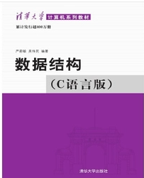 | 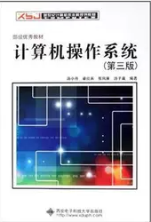 | 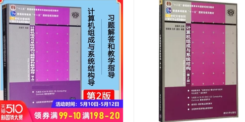 |

* **考纲指定教材**（数据来源：2020 考纲）

  * 计算机组成原理参考书

    袁春风《计算机组成与系统结构（第2版）》，清华大学出版社，2015年8月
    王党辉，康继昌，安建峰译《计算机组成与设计 硬件/软件接口(第5版)》，机械工业出版社，2015年7月

    主要看袁春风的书和配套的习题集，王党辉的书不需要买。

  * 操作系统参考书

    汤小丹，梁红兵，哲凤屏，汤子瀛，《计算机操作系统》（第三版），西安电子科技大学出版社，2007年5月

    （如果买不到第三版的书，用第四版也行）

  * 数据结构参考书

    严蔚敏、吴伟民 编著，《数据结构（C）语言版》 清华大学出版社，2007年

* **专业课复习资料**

  一套靠谱的专业课资料：[南航计算机考研复习资料](https://mobile.yangkeduo.com/goods2.html?goods_id=211087632444)

* **教材配套习题集**

  * 计算机组成与系统结构习题解答和教学指导-第二版 袁春风 （必买，出过原题）
  * 数据结构题集-严蔚敏
  * 计算机操作系统（第三版）学习指导与题解 汤小丹
  
* **习题集**

  王道或天勤，首选王道
  
* **其他可以买的书籍**

  * 《大话数据结构》 2020届学长推荐，跨考或者基础不好的同学可以看看
  * 《数学之美》
  * 《浪潮之巅》
  
* **辅助视频**

  * 袁春风 B 站视频：https://b23.tv/2soS9M  https://b23.tv/vPvD7i
  * 王道 B 站视频：
    * 操作系统：https://www.bilibili.com/video/BV1YE411D7nH
    * 数据结构：https://www.bilibili.com/video/BV1b7411N798
    * 计组：https://www.bilibili.com/video/BV1BE411D7ii

## B站南航计算机考研讲座视频

* [【南航计算机考研】全面了解南航计算机考研](https://www.bilibili.com/video/BV1zV411f7oc/) 

  <div align="left">
      <a href="https://www.bilibili.com/video/BV1zV411f7oc/">
      	
      </a>
  </div>

* [【南航计算机考研】答疑-录取结果分析](https://www.bilibili.com/video/BV1MK4y1N7Er) 

  <div align="left">
      <a href="https://www.bilibili.com/video/BV1MK4y1N7Er">
      	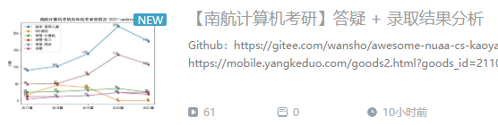
      </a>
  </div>

* [【南航计算机考研】2022-南航计算机考研-答疑](https://www.bilibili.com/video/BV1VK4y1U7Gz)

  <div align="left">
      <a href="https://www.bilibili.com/video/BV1VK4y1U7Gz/">
      	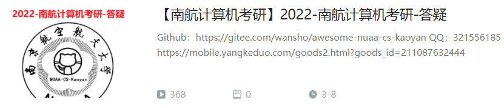
      </a>
  </div>

* [【考研真相】考研到底难不难？要不要报班？全程干货无尿点](https://www.bilibili.com/video/av91210812)

  <div align="left">
      <a href="https://www.bilibili.com/video/av91210812">
      	
      </a>
  </div>

* [南航计算机考研-直播录播讨论](https://www.bilibili.com/video/av90697748)

  <div align="left">
      <a href="https://www.bilibili.com/video/av90697748">
      	
      </a>
  </div>

* [17 年讲座直播录播](https://www.bilibili.com/video/av59012167)

  <div align="left">
      <a href="https://www.bilibili.com/video/av59012167">
      	
      </a>
  </div>

## 专业课真题和考纲

[专业课真题10—18](https://github.com/wansho/awesome-nuaa-cs-postgraduate-exam/tree/master/%E4%B8%93%E4%B8%9A%E8%AF%BE%E7%9C%9F%E9%A2%98) 包括 922 和 829 的真题。还有 2020 届的真题。

## 专业课资料

一共两本

| 第一本封皮                                                   | 第二本封皮                                                   |
| ------------------------------------------------------------ | ------------------------------------------------------------ |
| 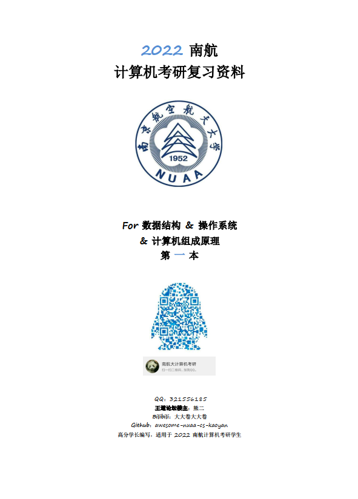 | 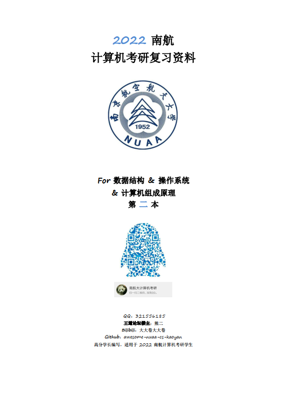 |


### 目录

| 第一本资料目录                                               | 第二本资料目录                                               |
| ------------------------------------------------------------ | ------------------------------------------------------------ |
| # 目录<br/><br/>* 南航计算机考研介绍<br/>* 资料说明<br/>* 考纲<br/>* 2020-829-真题<br/>* 2020-数据结构-解析<br/>* 2020-操作系统-解析<br/>* 2020-计组-解析<br/>* 2012-922-真题<br/>* 2012-数据结构-解析<br/>* 2012-操作系统-解析<br/>* 2013-922-真题<br/>* 2013-829-真题<br/>* 2013-数据结构-解析<br/>* 2013-操作系统-解析<br/>* 2013-计组-解析<br/>* 2014-922-真题<br/>* 2014-829-真题<br/>* 2014-数据结构-解析<br/>* 2014-操作系统-解析<br/>* 2014-计组-解析<br/>* 2015-922-真题<br/>* 2015-829-真题<br/>* 2015-数据结构-解析<br/>* 2015-操作系统-解析<br/>* 2015-计组-解析<br/>* 2016-922-真题<br/>* 2016-829-真题<br/>* 2016-数据结构-解析<br/>* 2016-操作系统-解析<br/>* 2016-计组-解析<br/>* 2017-922-真题<br/>* 2017-829-真题<br/>* 2017-数据结构-解析<br/>* 2017-操作系统-解析<br/>* 2017-计组-解析<br/>* 2018-922-真题<br/>* 2018-829-真题<br/>* 2018-数据结构-解析<br/>* 2018-操作系统-解析<br/>* 2018-计组-解析<br/>* 2019-真题回忆版<br/>* 2010 真题和解析<br/>* 2011 真题和解析 | # 目录<br/><br/>* 必背知识点<br/>* 熊二学长 VIP 辅导（417 分）<br/>* 如何复习专业课<br/>* 重难点分析<br/>  * 什么才是考场上的好代码<br/>  * B-树<br/>  * 链表、二叉树、PV 操作<br/>* 2010 年前-真题说明<br/>* 2010 年前-部分真题答案<br/>  * 2002 年数据结构与程序设计<br/>  * 2002 年操作系统<br/>  * 2003 年数据结构与操作系统<br/>  * 2004 年数据结构与程序设计<br/>  * 2004 年数据结构与操作系统<br/>  * 2006 年数据结构与操作系统<br/>* 2010 年前-真题<br/>* 3 套期末考试试卷和答案<br/>  * 2009-1010 数据结构考试试题及解析<br/>  * 2012-2013 数据结构考试试题及解析-A卷<br/>  * 2012-2013 数据结构考试试题及解析-B卷<br/>  * 解析补充<br/>* 经验贴<br/>  * VIP 经验贴<br/>  * 考研后期冲刺建议 <br/>  * 考研真相-关于考研的朴素道理 <br/>  * 考研之外的一些事情<br/>  * 那些考上的同学们 <br/>  * 南航计算机考研-答疑<br/>  * 公共课复习建议<br/>  * 考研初试讲座<br/>* 复试相关<br/>  * 复试考纲<br/>  * 初试后该干什么<br/>  * 我的复试经历和建议<br/>  * 编译原理如何复习<br/>  * 离散数学如何复习<br/>  * 离散数学-子群的证明<br/>  * 复试面试题举例<br/>  * 2019 届复试总结 |

### 资料样本

专业课资料样本: [12年专业课数据结构和操作系统真题解析，13年计组真题解析](https://github.com/wansho/awesome-nuaa-cs-postgraduate-exam/tree/master/%E4%B8%93%E4%B8%9A%E8%AF%BE%E8%BE%85%E5%AF%BC%E8%B5%84%E6%96%99%E6%A0%B7%E6%9C%AC)

### 资料适用对象

南航计算机考研学生。2020 届开始，南航计算机专业课统一考 829，不管学硕还是专硕，都考 829，学长已经在编计算机组成原理的解析，从 2021 届开始提供最完善的南航计算机考研辅导。

### 资料质量证明

[18级19级考生口碑](https://github.com/wansho/awesome-nuaa-cs-postgraduate-exam/tree/master/%E4%B8%93%E4%B8%9A%E8%AF%BE%E8%B5%84%E6%96%99%E8%B4%A8%E9%87%8F%E8%AF%81%E6%98%8E)

## 历届学长学姐考研笔记分享计划

[【详情请点击这里，有很多学长学姐在这里免费分享他们的学习笔记】](历届学长学姐共享的学习笔记/README.md)

## 信息汇总

* [南航计算机考研信息汇总](https://github.com/wansho/awesome-nuaa-cs-postgraduate-exam/tree/master/%E5%8D%97%E8%88%AA%E8%AE%A1%E7%AE%97%E6%9C%BA%E8%80%83%E7%A0%94%E4%BF%A1%E6%81%AF%E6%B1%87%E6%80%BB) 
* 其他
  * 王道论坛帖子：[2017南航计算机考研经验贴](http://www.cskaoyan.com/thread-642848-1-1.html) and others about NUAA
  * [南航研究生院官网](http://www.graduate.nuaa.edu.cn/)
  * [南航计算机学院官网](http://cs.nuaa.edu.cn/)
  * 南航计算机学院微信公众号
  * 南航研究生微信公众号
  * 知乎上关于南航计算机学院老师的讨论
  * Bilibili：[大大卷点点心](https://www.bilibili.com/read/cv4606513 )
  * QQ空间：321556185
  * others info from Internet

## 经验贴

独家整理，免费公开, [南航计算机考研经验贴](https://github.com/wansho/awesome-nuaa-cs-postgraduate-exam/tree/master/%E7%BB%8F%E9%AA%8C%E8%B4%B4)

包含：

* 公共课建议
* [初试讲座](经验贴/考研初试讲座.md)
* [B 站南航计算机考研讲座录屏](<https://www.bilibili.com/video/av59012167> )  
* 专业课答疑
* 学习方法和感悟
* 保研相关
* 考研总体规划和注意事项
* 专业课讲座整理
* 复试相关信息和经验总结
* 复试面试题汇总
* 非全日制相关信息
* Others

## 复试相关资料共享

[复试相关资料共享](复试相关资料共享)

复试的考核（300 分）：

* 离散数学 + 编译原理：100 分
* 英语听力：50 分
* 面试：150 分

包括：

* 收集到的复试真题
* 和南航本科生要到的期末考试例题
* 英语听力如何复习
* 编译原理和离散数学视频推荐
* 部分复试答疑，和经验贴有耦合

## 文件目录树

```
./
├── 表情包
│   ├── 震惊，考南航计算机竟然不知道这个.png
│   ├── 跟着我考南航计算机，清清爽爽.png
│   ├── 识别二维码，告诉你真理.jpg
│   ├── 扫描二维码，颠覆你的考研观.jpg
│   ├── 天天整这玩意.jpg
│   └── 你要的二维码，给.jpg
├── 经验贴
│   ├── 非全日制相关信息.md
│   ├── 计算机组成原理复习经验.jpg
│   ├── 自动回复内容备份.md
│   ├── 考研初试讲座.md
│   ├── 经验贴-阶段性答疑.png
│   ├── 经验贴-英语免修分数.png
│   ├── 经验贴-考研问答整理补充.pdf
│   ├── 经验贴-考研后期的建议.png
│   ├── 经验贴-给19同学的复习建议.png
│   ├── 经验贴-经验总结.png
│   ├── 经验贴-操作系统用什么书.png
│   ├── 经验贴-南航计算机考研问答4.jpg
│   ├── 经验贴-南航计算机考研问答3.jpg
│   ├── 经验贴-南航计算机考研问答2.jpg
│   ├── 经验贴-南航计算机考研问答1.jpg
│   ├── 经验贴-南航计算机考研问答.png
│   ├── 经验贴-南航计算机考研暑假后期问答总结.pdf
│   ├── 经验贴-南航计算机考研指南.pdf
│   ├── 经验贴-南航计算机学硕和专硕的区别.pdf
│   ├── 经验贴-南航复试较晚的回答.jpg
│   ├── 经验贴-保研材料准备技巧.png
│   ├── 经验贴-专业课资料避免踩坑.jpg
│   ├── 经验贴-5.png
│   ├── 经验贴-4.png
│   ├── 经验贴-3.png
│   ├── 经验贴-2.png
│   ├── 经验贴-19级第一次讲座内容二.pdf
│   ├── 经验贴-19级第一次讲座内容三.pdf
│   ├── 经验贴-19级第一次讲座内容一.pdf
│   ├── 经验贴-18级辅导总结.pdf
│   ├── 经验贴-1.png
│   ├── 科学的复习方法.jpg
│   ├── 神秘代码.md
│   ├── 报考网络安全的同学，只能跟网安的老师.png
│   ├── 报考了什么专业，就只能从相应专业的老师中选导师.png
│   ├── 战略问题-专硕还是学硕.jpg
│   ├── 怎样才能考上南航？细节有多重要.jpg
│   ├── 复试相关.jpg
│   ├── 南航计算机考研问题补充.md
│   ├── 到底什么方法最好？实践就是最好的方法.jpg
│   ├── 关于学习笔记.jpg
│   ├── 关于 Github 的说明.jpg
│   ├── 公共课复习建议.md
│   ├── 公共课-红色的书必买，张宇18讲强烈推荐.jpg
│   ├── 公共课-看视频的好处.png
│   ├── 公共课-公共课经验-初试经验.pdf
│   ├── 公共课-公共课报班的利弊.png
│   ├── 公共课-公共课复习建议.pdf
│   ├── 公共课-公共课初试老师推荐.pdf
│   ├── 保研相关-南航计算机学院夏令营.pdf
│   ├── 保研相关-1.png
│   ├── 专业课答疑-考学硕的好处.png
│   ├── 专业课答疑-操作系统用什么书.png
│   ├── 专业课答疑-不会写代码怎么办.jpg
│   ├── 专业课答疑-2018专业课考纲变动.pdf
│   ├── 专业课答疑-2.png
│   ├── 专业课答疑-1.png
│   ├── 专业课复习建议.jpg
│   ├── assets
│   │   ├── image-20200926083706684.png
│   │   ├── image-20200924212447300.png
│   │   ├── image-20200614184020530.png
│   │   ├── image-20200502092850752.png
│   │   ├── image-20200502085823652.png
│   │   ├── _A_C_F`%IP6P74Q9KE%$%5.gif
│   │   ├── 8LDO48C$8@[GWU0353$FOVS.png
│   │   ├── 1561111503996.png
│   │   └── 1560066680999.png
│   ├── 20届第二次考研讲座手稿.md
│   └── 20届后南航计算机考研变化.md
├── 推荐书籍
│   ├── 数学之美.pdf
│   ├── PV操作深入讲解.pdf
│   ├── Modern Operating Systems - 4th Edition.pdf
│   └── B-Tree-Wiki.pdf
├── 复试相关资料共享
│   ├── 复试相关资料共享.md
│   ├── 南航编译原理期末考试样卷.pdf
│   ├── 南航编译原理期末考试例题答案2.pdf
│   ├── 南航编译原理期末考试例题答案1.pdf
│   ├── 南航编译原理期末考试例题.pdf
│   ├── 南航编译原理期末考试例题-ppt.pdf
│   ├── 南航离散数学期末考试试卷.pdf
│   ├── 2014 南航复试真题.pdf
│   ├── 2010 南航复试真题.pdf
│   ├── 2009 南航复试真题.pdf
│   ├── 19南航计算机复试总结和面试题汇总.pdf
│   └── 18级复试面试题.png
├── 历届学长学姐共享的学习笔记
│   ├── 操作系统知识点-2020届一位热心学长的分享-已签名.pdf
│   ├── 复试面试题库-2020届一位热心学长的分享.pdf
│   ├── 一位2020学长的分享：南航专业课复习笔记免费共享.pdf
│   ├── assets
│   │   └── image-20200422173126955.png
│   ├── README.md
│   ├── 829复习攻略-2020届初试第四名跨专业学长编写-已签名.pdf
│   └── 2020届一位热心学长的分享
│       ├── 组成零碎知识点-已签名.pdf
│       ├── 组成原理背诵-已签名.pdf
│       ├── 数据结构背诵版-已签名.pdf
│       └── 操作系统背诵笔记-已签名.pdf
├── 南航计算机考研讲座
│   ├── 四：2020 届同学考研结果分析汇总.pdf
│   ├── 四：2020 届同学考研结果分析汇总.md
│   ├── 十：那些考上的同学们.md
│   ├── 十四：2020届复试分析.md
│   ├── 十六：2021届招生计划.md
│   ├── 十五：准研究生建议.md
│   ├── 十二：读研真相.md
│   ├── 十三：考研之外的一些事情.md
│   ├── 十一：疫情期间的考研.md
│   ├── 六：用经济学原理分析考研.md
│   ├── 八：关于南航计算机考研的谣言.md
│   ├── 五：考研真相-关于考研的朴素道理.md
│   ├── 二：考研真相.md
│   ├── 九：直播备稿.md
│   ├── 三：跨专业考研.md
│   ├── 七：为什么现在就要开始准备考研.pdf
│   ├── 七：为什么现在就要开始准备考研.md
│   ├── 一：考研之前该干什么.pdf
│   ├── 一：考研之前该干什么.md
│   ├── assets
│   │   ├── image-20200517105916519.png
│   │   ├── image-20200419094546560.png
│   │   ├── image-20200419093206523.png
│   │   ├── image-20200419090204443.png
│   │   ├── image-20200419084431485.png
│   │   ├── 1585297156945.png
│   │   ├── 1585203703558.png
│   │   ├── 1585199870949.png
│   │   ├── 1585199341600.png
│   │   ├── 1582449341880.png
│   │   ├── 1582419876093.png
│   │   ├── 1582419834449.png
│   │   ├── 1582419816902.png
│   │   └── 1582419743472.png
│   ├── README.pdf
│   ├── README.md
│   ├── 2021 届资料勘误.pdf
│   └── 2021 届资料勘误.md
├── 南航计算机考研信息汇总
│   ├── 计算机科学与技术学院2019年综合考核选拔优秀应届本科毕业生攻读硕士学位研究生办法1.pdf
│   ├── 计算机科学与技术学院2018年非全日制调剂拟录取名单2.pdf
│   ├── 计算机科学与技术学院2018年硕士生招生复试名单.pdf
│   ├── 计算机科学与技术学院2018年硕士生招生复试及录取细则.pdf
│   ├── 计算机科学与技术学院2018年招收硕士研究生拟录取名单6.pdf
│   ├── 计算机科学与技术学院2017年全日制硕士研究生招生拟录取名单-.xls
│   ├── 计算机科学与技术学院2016年硕士研究生复试名单公示1.pdf
│   ├── 计算机科学与技术学院 2018年硕士研究生招生接收优秀生源调剂复试及录取细则.pdf
│   ├── 南京航空航天大学研究生院-2018年拟录取推荐免试研究生名单公示.pdf
│   ├── 《南京航空航天大学2018年硕士研究生招生校内调剂复试申请表》（附1），.doc
│   ├── 2021年硕士研究生招生简章.pdf
│   ├── 2021南航计算机学院招生计划.pdf
│   ├── 2020年非全日制专业学位调剂复试考生须知.doc
│   ├── 2020年硕士研究生招生拟录取名单公示（第二批）.pdf
│   ├── 2020年硕士研究生招生复试及录取细则.pdf
│   ├── 2020年 硕士研究生复试名单.pdf
│   ├── 2020届拟录取名单.pdf
│   ├── 2020南航研究生新生大数据出炉！.pdf
│   ├── 2020南航研究生招生目录.pdf
│   ├── 2019年计算机科学与技术学院复试名单.pdf
│   ├── 2019年全日制校外调剂拟录取名单.pdf
│   ├── 2019 年硕士研究生招生接收优秀生源调剂复试及录取细则.pdf
│   ├── 2019 年硕士生招生复试及录取细则.pdf
│   ├── 2019 年 拟录取名单.pdf
│   ├── 2018级校外调剂录取名单.pdf
│   ├── 2018年校外优秀生源调剂拟录取名单（第一批）.pdf
│   ├── 2018 年硕士研究生招生接收优秀生源调剂复试及录取细则.pdf
│   ├── 2018 年硕士生招生调剂录取细则.pdf
│   ├── 2018 年全日制硕士研究生招生接收优秀生源调剂工作方案.pdf
│   ├── 2017年综合考核选拔优秀应届本科毕业生攻读硕士学位研究生办法.pdf
│   ├── 17年录取学校统计.png
│   └── 17年南航全校录取情况.PNG
├── 专业课辅导资料样本
│   ├── 资料发货和到手说明.md
│   ├── 打印-3.jpg
│   ├── 打印-2.jpg
│   ├── 打印-1.jpg
│   ├── 13 年计组真题解析.pdf
│   ├── 12年数据结构真题解析.pdf
│   └── 12年操作系统真题解析.pdf
├── 专业课资料质量证明
│   ├── 软工专硕第一名.jpg
│   ├── 计算机专硕第一名.jpg
│   ├── 压中真题-7.jpg
│   ├── 压中真题-6.jpg
│   ├── 压中真题-5.jpg
│   ├── 压中真题-4.jpg
│   ├── 压中真题-3.JPG
│   ├── 压中真题-2.jpg
│   ├── 压中真题-1.jpg
│   ├── awesome-9.jpg
│   ├── awesome-8.jpg
│   ├── awesome-7.jpg
│   ├── awesome-6.jpg
│   ├── awesome-5.jpg
│   ├── awesome-4.jpg
│   ├── awesome-3.jpg
│   ├── awesome-2.jpg
│   ├── awesome-1.jpg
│   ├── awe-10.jpg
│   ├── 2020考研专业课压中真题.png
│   ├── 2020届同学对学长的认可.jpg
│   ├── 2020届同学对于专业课必背考点的认可.jpg
│   ├── 2020届专硕第二名和学硕第一名都是跨考.jpg
│   ├── 20 届专硕前三名评价-1.png
│   ├── 20 届专硕前三名同学评价-2.jpg
│   ├── 19计算机专硕第一名感谢.jpg
│   ├── 19同学考研群中安利.jpg
│   └── 130+同学感谢.jpg
├── 专业课资料介绍.md
├── 专业课真题
│   ├── 计算机组成与系统结构课后答案全(清华大学出版社_袁春风主编).doc
│   ├── 操作系统 汤小丹 .pdf
│   ├── 复试考纲.txt
│   ├── 2020 真题.pdf
│   ├── 2020 最新考纲.txt
│   ├── 2020 南航计算机 829 真题.pdf
│   ├── 2019 真题回忆版.txt
│   ├── 2018-922.pdf
│   ├── 2018-829.pdf
│   ├── 2017-922.pdf
│   ├── 2017-829.pdf
│   ├── 2016-922.pdf
│   ├── 2015-922.pdf
│   ├── 2014-922.pdf
│   ├── 2014-829.pdf
│   ├── 2013-922.pdf
│   ├── 2013-829.pdf
│   ├── 2012-922.pdf
│   ├── 2011.pdf
│   └── 2010.pdf
├── assets
│   ├── 赞赏.jpg
│   ├── 考研真相-考研到底难不难.png
│   ├── 第四次直播-全面了解南航计算机考研.png
│   ├── 第二本目录.png
│   ├── 第一本目录.png
│   ├── 王道论坛.png
│   ├── 拼多多.png
│   ├── 微店.png
│   ├── 微信.jpg
│   ├── 大大卷点点心の二维码.png
│   ├── 南航计算机考研-直播录播.png
│   ├── 个人 ID.png
│   ├── 专业课资料重量.jpg
│   ├── 专业课资料-第二本封皮.png
│   ├── 专业课资料-第一本封皮.png
│   ├── nuaa-cs-kaoyan.jpg
│   ├── image-20200607165815801.png
│   ├── image-20200521182934165.png
│   ├── QQ群.jpg
│   ├── Github.png
│   ├── 321556185.jpg
│   ├── 21考研群.jpg
│   ├── 17年直播.png
│   ├── 1582426769700.png
│   ├── 1582425318381.png
│   ├── 1582425301703.png
│   ├── 1582425248505.png
│   ├── 1582425192445.png
│   ├── 1582425164412.png
│   └── 1582424010702.png
├── _config.yml
├── Surprise
│   ├── 汤家凤：在你这个年纪，你怎么睡得着？.mp3
│   └── 宇哥：还不起床？.mp3
├── README.md
├── LICENSE
└── 829介绍.pdf
```

## [为什么建议大家买专业课复习资料](南航计算机考研讲座/二十六：为什么建议买专业复习资料.md)

## Surprise

[Surprise](Surprise/汤家凤：在你这个年纪，你怎么睡得着？.mp3)

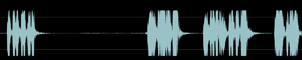

## LICENSE

[GPL v3.0](https://github.com/wansho/awesome-nuaa-cs-postgraduate-exam/blob/master/LICENSE)

## Organization

<div align="left">
    <a href="https://github.com/nuaa-cs-kaoyan">
    	
    </a>
</div>
