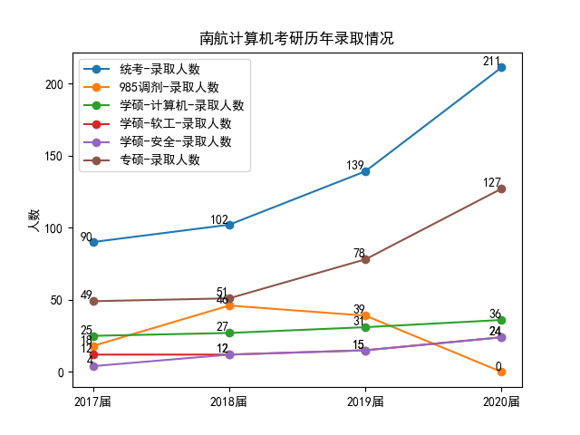
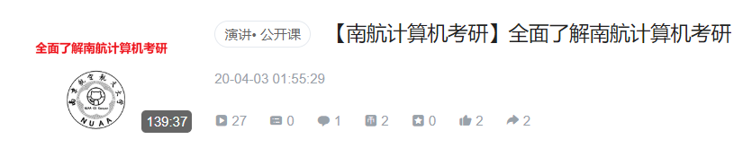
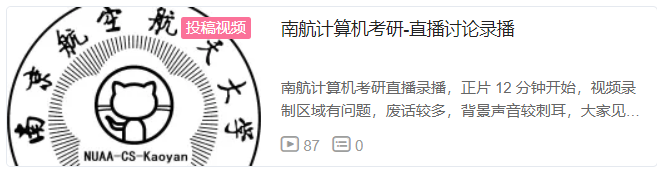
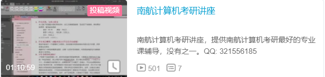

Awesome-NUAA-CS-Kaoyan
=================

 [](https://github.com/nuaa-cs-kaoyan/awesome-nuaa-cs-kaoyan) 

   * [<strong>Awesome-NUAA-CS-Kaoyan</strong>](#Awesome-NUAA-CS-Kaoyan)
      * [Inspiration](#inspiration)
      * [About me](#about-me)
      * [南航计算机招生情况/复录比](#南航计算机招生情况/复录比)
      * [专业课复习需要用到的书](#专业课复习需要用到的书)
      * [B站南航计算机考研讲座视频](#B站南航计算机考研讲座视频)
      * [专业课真题和考纲](#专业课真题和考纲)
      * [专业课资料](#专业课资料)
         * [目录](#目录)
         * [资料样本](#资料样本)
         * [资料适用对象](#资料适用对象)
         * [资料质量证明](#资料质量证明)
      * [历届学长学姐考研笔记分享计划](#历届学长学姐考研笔记分享计划)
      * [信息汇总](#信息汇总)
      * [经验贴](#经验贴)
      * [复试相关资料共享](#复试相关资料共享)
      * [文件目录](#文件目录)
      * [LICENSE](#license)
      * [Organization](#Organization)


南航计算机考研 **专业课资料** 和 **信息汇总**.

## <font color="red">21 届计算机考研最新通知 </font>

* [**20 届后南航计算机考研变化分析**](经验贴/20届后南航计算机考研变化.md)
* **2020 届南航计算机拟扩招 80 人**
* **熊二学长会继续做 2021届的南航计算机考研辅导！2021届的群号为：915819571**
* **829 计算机组成原理的解析已经编写完成，2021 届考研的同学，能从我这里买到 829 的资料了**

## Inspiration

* 提供南航计算机考研，top one 的专业课复习资料
* 提供南航计算机考研，最详尽的信息

## About me

<div align="left">
    
    
    
    
    
    
    
       
</div>


* **熊二学长(个人经营) / 17级南航计算机高分学长(417分) / QQ: 321556185** 
* **Bilibili 专栏 Up 主**：[【大大卷点点心】](https://www.bilibili.com/read/cv4606513 )
* **知乎专栏**：[【南航计算机考研】](https://zhuanlan.zhihu.com/c_1226188578315042816)
* **王道论坛博主：熊二**
  * [2017南航计算机考研经验贴](http://www.cskaoyan.com/thread-642848-1-1.html)
  * [南航计算机考研相关信息整理！免费公开！！](http://www.cskaoyan.com/thread-643825-1-1.html)
  * [南航18级计算机复试面试题和面试问答](http://www.cskaoyan.com/thread-649395-1-1.html)
  * [南航计算机考研真题答案!没错!是答案!答案!答案!](http://www.cskaoyan.com/thread-643443-1-1.html) 
  * Others
* **考研专业课资料地址**
  * 微店：https://k.weidian.com/a0lQclaM （[21届南航计算机考研资料](https://k.weidian.com/a0lQclaM )）
  * 拼多多: https://mobile.yangkeduo.com/goods2.html?goods_id=86968936251
* **南航计算机考研辅导历史**
  * 2017-02 考研出分，总分 400+，专业课成绩 135+
  * 2017-04 在[王道论坛](http://www.cskaoyan.com/thread-642848-1-1.html)分享考研经验，并开始编写南航计算机考研资料
  * 2017-05 [18级南航计算机考研辅导资料](https://weidian.com/item.html?itemID=2105222705&ifr=itemdetail&wfr=c) 编写完成，开始辅导 18 级南航计算机考研
  * 2017-12 18 考研学生反馈，专业课资料的必备考点，几乎全部命中了真题的简单题，好评如潮
  * 2018-03 [19级南航计算机考研辅导资料](https://weidian.com/item.html?itemID=2242029324&ifr=itemdetail&wfr=c) 编写完成，开始辅导 19 级南航计算机考研
  * 2018-12 19 考研学生反馈，专业课资料的必备考点，再次命中多道真题的简单题，再次好评如潮
  * 2019-02 [20级南航计算机考研辅导资料](https://k.weidian.com/a0lQclaM) 编写完成，开始辅导 20级南航计算机考研
  * 2019-10 开始编写 829 计算机组成原理的解析
  * 2020-02 面向 2021 届的 829 专业课资料编写完成，加入计算机组成原理解析

## 南航计算机招生情况/复录比



**2020 届统考数据**

| 专业          | 录取人数 | 进入复试人数 / 最低分 / 最高分 | 复录比  |
| ------------- | -------- | ------------------------------ | ------- |
| 学硕-计算机   | 36       | 52（318 / 387）                | 1.44: 1 |
| 学硕-软工     | 24       | 29（294 / 381）                | 1.2: 1  |
| 学硕-网安     | 24       | 32（292 / 368）                | 1.3: 1  |
| 专硕-电子信息 | 136      | 160 （290 / 414）              | 1.18: 1 |
| 汇总          | 220      | 273 （294 / 423）              | 1.24: 1 |

**2019 届统考数据**

| 专业        | 录取人数 | 进入复试人数 / 最低分 / 最高分 | 复录比 |
| ----------- | -------- | ------------------------------ | ------ |
| 学硕-计算机 | 31       | 43（324 / 393）                | 1.4: 1 |
| 学硕-软工   | 15       | 23（300 / 394）                | 1.5: 1 |
| 学硕-网安   | 15       | 18（294 / 357）                | 1.2: 1 |
| 专硕-计算机 | 41       | 70 （322 / 396）               | 1.7: 1 |
| 专硕-软工   | 37       | 75（346 / 423）                | 2: 1   |
| 汇总        | 139      | 229 （294 / 423）              | 1.6: 1 |

**2018 届统考数据**

| 专业        | 录取人数 | 进入复试人数 / 最低分 / 最高分 | 复录比  |
| ----------- | -------- | ------------------------------ | ------- |
| 学硕-计算机 | 27       | 37（301 / 367）                | 1.4: 1  |
| 学硕-软工   | 12       | 14（290 / 341）                | 1.2: 1  |
| 学硕-网安   | 12       | 9（260 / 340）                 | 1：1    |
| 专硕-计算机 | 18       | 28 （345 / 409）               | 1.56: 1 |
| 专硕-软工   | 33       | 48（303 / 380）                | 1.45: 1 |
| 汇总        | 102      | 143 （260 / 409）              | 1.4: 1  |

**2017 届统考数据**

| 专业        | 录取人数 | 进入复试人数 / 最低分 / 最高分 | 复录比 |
| ----------- | -------- | ------------------------------ | ------ |
| 学硕-计算机 | 25       | 缺失                           |        |
| 学硕-软工   | 12       |                                |        |
| 学硕-网安   | 4        |                                |        |
| 专硕-计算机 | 31       |                                |        |
| 专硕-软工   | 18       |                                |        |
| 汇总        | 90       |                                |        |

**统考录取人数与985调剂人数对比**

|      | 统考录取人数 | 985调剂录取人数 |
| ---- | ------------ | --------------- |
| 2017 | 90           | 18              |
| 2018 | 102          | 46+             |
| 2019 | 139          | 39              |
| 2020 | 220          | 0               |

## 专业课复习需要用到的书

* **考纲指定教材**（数据来源：2020 考纲）

  * 计算机组成原理参考书

    袁春风《计算机组成与系统结构（第2版）》，清华大学出版社，2015年8月
    王党辉，康继昌，安建峰译《计算机组成与设计 硬件/软件接口(第5版)》，机械工业出版社，2015年7月

    主要看袁春风的书和配套的习题集，王党辉的书不需要买。

  * 操作系统参考书

    汤小丹，梁红兵，哲凤屏，汤子瀛，《计算机操作系统》（第三版），西安电子科技大学出版社，2007年5月

  * 数据结构参考书

    严蔚敏、吴伟民 编著，《数据结构（C）语言版》 清华大学出版社，2007年

* **专业课复习资料**

  一套靠谱的专业课资料：[南航计算机考研复习资料](https://mobile.yangkeduo.com/goods2.html?goods_id=86968936251)

* **教材配套习题集**

  * 计算机组成与系统结构习题解答和教学指导-第二版 袁春风 （必买，出过原题）
  * 数据结构题集-严蔚敏
  * 计算机操作系统（第四版）学习指导与题解 汤小丹
  
* **习题集**

  王道或天勤，首选王道
  
* **其他可以买的书籍**

  * 《大话数据结构》 2020届学长推荐，跨考或者基础不好的同学可以看看
  * 《数学之美》
  * 《浪潮之巅》

## B站南航计算机考研讲座视频

* [【南航计算机考研】全面了解南航计算机考研](https://www.bilibili.com/video/BV1zV411f7oc/) 

  <div align="left">
      <a href="https://www.bilibili.com/video/BV1zV411f7oc/">
      	
      </a>
  </div>

* [【考研真相】考研到底难不难？要不要报班？全程干货无尿点](https://www.bilibili.com/video/av91210812)

  <div align="left">
      <a href="https://www.bilibili.com/video/av91210812">
      	
      </a>
  </div>

* [南航计算机考研-直播录播讨论](https://www.bilibili.com/video/av90697748)

  <div align="left">
      <a href="https://www.bilibili.com/video/av90697748">
      	
      </a>
  </div>

* [17 年讲座直播录播](https://www.bilibili.com/video/av59012167)

  <div align="left">
      <a href="https://www.bilibili.com/video/av59012167">
      	
      </a>
  </div>

## 专业课真题和考纲

[专业课真题10—18](https://github.com/wansho/awesome-nuaa-cs-postgraduate-exam/tree/master/%E4%B8%93%E4%B8%9A%E8%AF%BE%E7%9C%9F%E9%A2%98) 包括 922 和 829 的真题。还有 2020 届的真题。

## 专业课资料

一共两本

<div align="center">
    
    
</div>


### 目录


<div align="center">
    
    
</div>


### 资料样本

专业课资料样本: [12年专业课数据结构和操作系统真题解析，13年计组真题解析](https://github.com/wansho/awesome-nuaa-cs-postgraduate-exam/tree/master/%E4%B8%93%E4%B8%9A%E8%AF%BE%E8%BE%85%E5%AF%BC%E8%B5%84%E6%96%99%E6%A0%B7%E6%9C%AC)

### 资料适用对象

南航计算机考研学生。2020 届开始，南航计算机专业课统一考 829，不管学硕还是专硕，都考 829，学长已经在编计算机组成原理的解析，从 2021 届开始提供最完善的南航计算机考研辅导。

### 资料质量证明

[18级19级考生口碑](https://github.com/wansho/awesome-nuaa-cs-postgraduate-exam/tree/master/%E4%B8%93%E4%B8%9A%E8%AF%BE%E8%B5%84%E6%96%99%E8%B4%A8%E9%87%8F%E8%AF%81%E6%98%8E)

## 历届学长学姐考研笔记分享计划

[【详情请点击这里，有很多学长学姐在这里免费分享他们的学习笔记】](历届学长学姐共享的学习笔记/README.md)

## 信息汇总

* [南航计算机考研信息汇总](https://github.com/wansho/awesome-nuaa-cs-postgraduate-exam/tree/master/%E5%8D%97%E8%88%AA%E8%AE%A1%E7%AE%97%E6%9C%BA%E8%80%83%E7%A0%94%E4%BF%A1%E6%81%AF%E6%B1%87%E6%80%BB) 
* 其他
  * 王道论坛帖子：[2017南航计算机考研经验贴](http://www.cskaoyan.com/thread-642848-1-1.html) and others about NUAA
  * [南航研究生院官网](http://www.graduate.nuaa.edu.cn/)
  * [南航计算机学院官网](http://cs.nuaa.edu.cn/)
  * 南航计算机学院微信公众号
  * 南航研究生微信公众号
  * 知乎上关于南航计算机学院老师的讨论
  * Bilibili：[大大卷点点心](https://www.bilibili.com/read/cv4606513 )
  * QQ空间：321556185
  * others info from Internet

## 经验贴

独家整理，免费公开, [南航计算机考研经验贴](https://github.com/wansho/awesome-nuaa-cs-postgraduate-exam/tree/master/%E7%BB%8F%E9%AA%8C%E8%B4%B4)

包含：

* 公共课建议
* [初试讲座](经验贴/考研初试讲座.md)
* [B 站南航计算机考研讲座录屏](<https://www.bilibili.com/video/av59012167> )  
* 专业课答疑
* 学习方法和感悟
* 保研相关
* 考研总体规划和注意事项
* 专业课讲座整理
* 复试相关信息和经验总结
* 复试面试题汇总
* 非全日制相关信息
* Others

## 复试相关资料共享

[复试相关资料共享](复试相关资料共享)

包括：

* 收集到的复试真题
* 和南航本科生要到的期末考试例题
* 英语听力如何复习
* 编译原理和离散数学视频推荐
* 部分复试答疑，和经验贴有耦合

## 文件目录树

```
.
├── assets
│   ├── 1582424010702.png
│   ├── 1582425164412.png
│   ├── 1582425192445.png
│   ├── 1582425248505.png
│   ├── 1582425301703.png
│   ├── 1582425318381.png
│   ├── 1582426769700.png
│   ├── 1585198885090.png
│   ├── 17年直播.png
│   ├── 21考研群.jpg
│   ├── 321556185.jpg
│   ├── Github.png
│   ├── nuaa-cs-kaoyan.jpg
│   ├── QQ群.jpg
│   ├── 专业课资料-第一本封皮.png
│   ├── 专业课资料-第二本封皮.png
│   ├── 专业课资料重量.jpg
│   ├── 个人 ID.png
│   ├── 南航计算机考研-直播录播.png
│   ├── 大大卷点点心の二维码.png
│   ├── 微信.jpg
│   ├── 微店.png
│   ├── 拼多多.png
│   ├── 王道论坛.png
│   ├── 第一本目录.png
│   ├── 第二本目录.png
│   ├── 第四次直播-全面了解南航计算机考研.png
│   ├── 考研真相-考研到底难不难.png
│   └── 赞赏.jpg
├── _config.yml
├── LICENSE
├── README.md
├── 专业课真题
│   ├── 2010.pdf
│   ├── 2011.pdf
│   ├── 2012-922.pdf
│   ├── 2013-829.pdf
│   ├── 2013-922.pdf
│   ├── 2014-829.pdf
│   ├── 2014-922.pdf
│   ├── 2015-922.pdf
│   ├── 2016-922.pdf
│   ├── 2017-829.pdf
│   ├── 2017-922.pdf
│   ├── 2018-829.pdf
│   ├── 2018-922.pdf
│   ├── 2019 真题回忆版.txt
│   ├── 2020 最新考纲.txt
│   ├── 2020 真题.pdf
│   └── 复试考纲.txt
├── 专业课资料介绍.md
├── 专业课资料介绍.pdf
├── 专业课资料质量证明
│   ├── 130+同学感谢.jpg
│   ├── 19同学考研群中安利.jpg
│   ├── 19计算机专硕第一名感谢.jpg
│   ├── 2020考研专业课压中真题.png
│   ├── 20 届同学评价-1.png
│   ├── 20 届同学评价-2.jpg
│   ├── awe-10.jpg
│   ├── awesome-1.jpg
│   ├── awesome-2.jpg
│   ├── awesome-3.jpg
│   ├── awesome-4.jpg
│   ├── awesome-5.jpg
│   ├── awesome-6.jpg
│   ├── awesome-7.jpg
│   ├── awesome-8.jpg
│   ├── awesome-9.jpg
│   ├── 压中真题-1.jpg
│   ├── 压中真题-2.jpg
│   ├── 压中真题-3.JPG
│   ├── 压中真题-4.jpg
│   ├── 压中真题-5.jpg
│   ├── 压中真题-6.jpg
│   ├── 压中真题-7.jpg
│   ├── 计算机专硕第一名.jpg
│   └── 软工专硕第一名.jpg
├── 专业课辅导资料样本
│   ├── 12年操作系统真题解析.pdf
│   ├── 12年数据结构真题解析.pdf
│   ├── 13 年计组真题解析.pdf
│   ├── 打印-1.jpg
│   ├── 打印-2.jpg
│   ├── 打印-3.jpg
│   └── 资料发货和到手说明.md
├── 南航计算机考研信息汇总
│   ├── 17年南航全校录取情况.PNG
│   ├── 17年录取学校统计.png
│   ├── 2017年综合考核选拔优秀应届本科毕业生攻读硕士学位研究生办法.pdf
│   ├── 2018 年全日制硕士研究生招生接收优秀生源调剂工作方案.pdf
│   ├── 2018年校外优秀生源调剂拟录取名单（第一批）.pdf
│   ├── 2018 年硕士生招生调剂录取细则.pdf
│   ├── 2018 年硕士研究生招生接收优秀生源调剂复试及录取细则.pdf
│   ├── 2018级校外调剂录取名单.pdf
│   ├── 2019年全日制校外调剂拟录取名单.pdf
│   ├── 2019 年 拟录取名单.pdf
│   ├── 2019 年硕士生招生复试及录取细则.pdf
│   ├── 2019 年硕士研究生招生接收优秀生源调剂复试及录取细则.pdf
│   ├── 2019年计算机科学与技术学院复试名单.pdf
│   ├── 2020南航研究生招生目录.pdf
│   ├── 《南京航空航天大学2018年硕士研究生招生校内调剂复试申请表》（附1），.doc
│   ├── 南京航空航天大学研究生院-2018年拟录取推荐免试研究生名单公示.pdf
│   ├── 计算机科学与技术学院2016年硕士研究生复试名单公示1.pdf
│   ├── 计算机科学与技术学院2017年全日制硕士研究生招生拟录取名单-.xls
│   ├── 计算机科学与技术学院2018年招收硕士研究生拟录取名单6.pdf
│   ├── 计算机科学与技术学院2018年硕士生招生复试及录取细则.pdf
│   ├── 计算机科学与技术学院2018年硕士生招生复试名单.pdf
│   ├── 计算机科学与技术学院 2018年硕士研究生招生接收优秀生源调剂复试及录取细则.pdf
│   ├── 计算机科学与技术学院2018年非全日制调剂拟录取名单2.pdf
│   └── 计算机科学与技术学院2019年综合考核选拔优秀应届本科毕业生攻读硕士学位研究生办法1.pdf
├── 南航计算机考研讲座
│   ├── 2021 届资料勘误.md
│   ├── 2021 届资料勘误.pdf
│   ├── assets
│   │   ├── 1582419743472.png
│   │   ├── 1582419816902.png
│   │   ├── 1582419834449.png
│   │   ├── 1582419876093.png
│   │   ├── 1582449341880.png
│   │   ├── 1585199341600.png
│   │   ├── 1585199870949.png
│   │   ├── 1585203703558.png
│   │   ├── 1585297156945.png
│   │   ├── image-20200419084431485.png
│   │   ├── image-20200419090204443.png
│   │   ├── image-20200419093206523.png
│   │   └── image-20200419094546560.png
│   ├── README.md
│   ├── README.pdf
│   ├── 一：考研之前该干什么.md
│   ├── 一：考研之前该干什么.pdf
│   ├── 七：为什么现在就要开始准备考研.md
│   ├── 三：跨专业考研.md
│   ├── 九：直播备稿.md
│   ├── 二：考研真相.md
│   ├── 五：考研真相-关于考研的朴素道理.md
│   ├── 八：关于南航计算机考研的谣言.md
│   ├── 六：用经济学原理分析考研.md
│   ├── 十一：疫情期间的考研.md
│   ├── 十二：读研真相.md
│   ├── 十：那些考上的同学们.md
│   ├── 四：2020 届同学考研结果分析汇总.md
│   └── 四：2020 届同学考研结果分析汇总.pdf
├── 历届学长学姐共享的学习笔记
│   ├── 2020届一位热心学长的分享
│   │   ├── 操作系统背诵笔记-已签名.pdf
│   │   ├── 数据结构背诵版-已签名.pdf
│   │   ├── 组成原理背诵-已签名.pdf
│   │   └── 组成零碎知识点-已签名.pdf
│   ├── 829复习攻略-2020届初试第四名跨专业学长编写-已签名.pdf
│   ├── assets
│   │   └── image-20200422173126955.png
│   ├── README.md
│   └── 操作系统知识点-2020届一位热心学长的分享-已签名.pdf
├── 复试相关资料共享
│   ├── 19南航计算机复试总结和面试题汇总.pdf
│   ├── 2009 南航复试真题.pdf
│   ├── 2010 南航复试真题.pdf
│   ├── 2014 南航复试真题.pdf
│   ├── 南航离散数学期末考试试卷.pdf
│   ├── 南航编译原理期末考试例题.pdf
│   ├── 南航编译原理期末考试例题-ppt.pdf
│   ├── 南航编译原理期末考试例题答案1.pdf
│   ├── 南航编译原理期末考试例题答案2.pdf
│   ├── 南航编译原理期末考试样卷.pdf
│   └── 复试相关资料共享.md
└── 经验贴
    ├── 20届后南航计算机考研变化.md
    ├── 20届第二次考研讲座手稿.md
    ├── assets
    │   ├── 1560066680999.png
    │   ├── 1561111503996.png
    │   ├── image-20200502085823652.png
    │   └── image-20200502092850752.png
    ├── 专业课复习建议.jpg
    ├── 专业课答疑-1.png
    ├── 专业课答疑-2018专业课考纲变动.pdf
    ├── 专业课答疑-2.png
    ├── 专业课答疑-不会写代码怎么办.jpg
    ├── 专业课答疑-操作系统用什么书.png
    ├── 专业课答疑-考学硕的好处.png
    ├── 保研相关-1.png
    ├── 保研相关-南航计算机学院夏令营.pdf
    ├── 公共课-公共课初试老师推荐.pdf
    ├── 公共课-公共课复习建议.pdf
    ├── 公共课-公共课报班的利弊.png
    ├── 公共课-公共课经验-初试经验.pdf
    ├── 公共课复习建议.md
    ├── 公共课-看视频的好处.png
    ├── 公共课-红色的书必买，张宇18讲强烈推荐.jpg
    ├── 关于 Github 的说明.jpg
    ├── 南航计算机考研问题补充.md
    ├── 复试相关.jpg
    ├── 战略问题-专硕还是学硕.jpg
    ├── 经验贴-18级复试面试题.png
    ├── 经验贴-18级辅导总结.pdf
    ├── 经验贴-19级第一次讲座内容一.pdf
    ├── 经验贴-19级第一次讲座内容三.pdf
    ├── 经验贴-19级第一次讲座内容二.pdf
    ├── 经验贴-1.png
    ├── 经验贴-2.png
    ├── 经验贴-3.png
    ├── 经验贴-4.png
    ├── 经验贴-5.png
    ├── 经验贴-专业课资料避免踩坑.jpg
    ├── 经验贴-保研材料准备技巧.png
    ├── 经验贴-南航复试较晚的回答.jpg
    ├── 经验贴-南航计算机学硕和专硕的区别.pdf
    ├── 经验贴-南航计算机考研指南.pdf
    ├── 经验贴-南航计算机考研暑假后期问答总结.pdf
    ├── 经验贴-南航计算机考研问答1.jpg
    ├── 经验贴-南航计算机考研问答2.jpg
    ├── 经验贴-南航计算机考研问答3.jpg
    ├── 经验贴-南航计算机考研问答4.jpg
    ├── 经验贴-南航计算机考研问答.png
    ├── 经验贴-操作系统用什么书.png
    ├── 经验贴-经验总结.png
    ├── 经验贴-给19同学的复习建议.png
    ├── 经验贴-考研后期的建议.png
    ├── 经验贴-考研问答整理补充.pdf
    ├── 经验贴-英语免修分数.png
    ├── 经验贴-阶段性答疑.png
    ├── 考研初试讲座.md
    ├── 自动回复内容备份.md
    ├── 计算机组成原理复习经验.jpg
    └── 非全日制相关信息.md
```

## LICENSE

[GPL v3.0](https://github.com/wansho/awesome-nuaa-cs-postgraduate-exam/blob/master/LICENSE)

## Organization

<div align="left">
    <a href="https://github.com/nuaa-cs-kaoyan">
    	
    </a>
</div>
