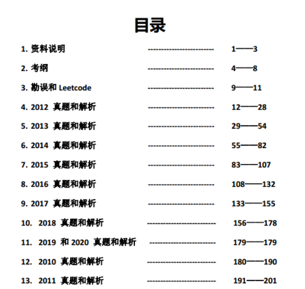
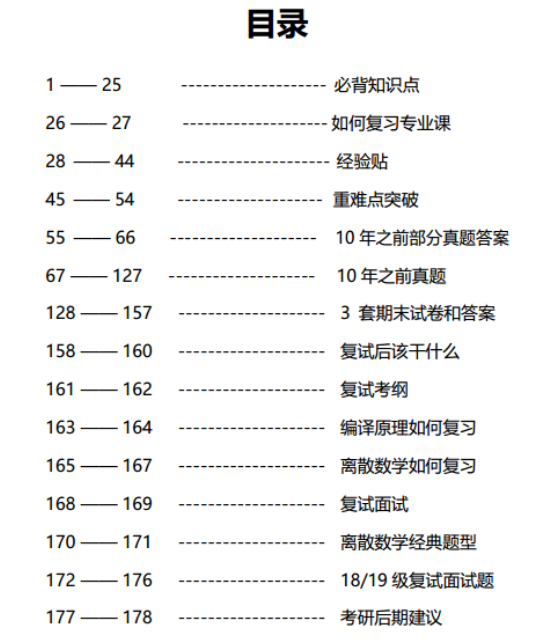
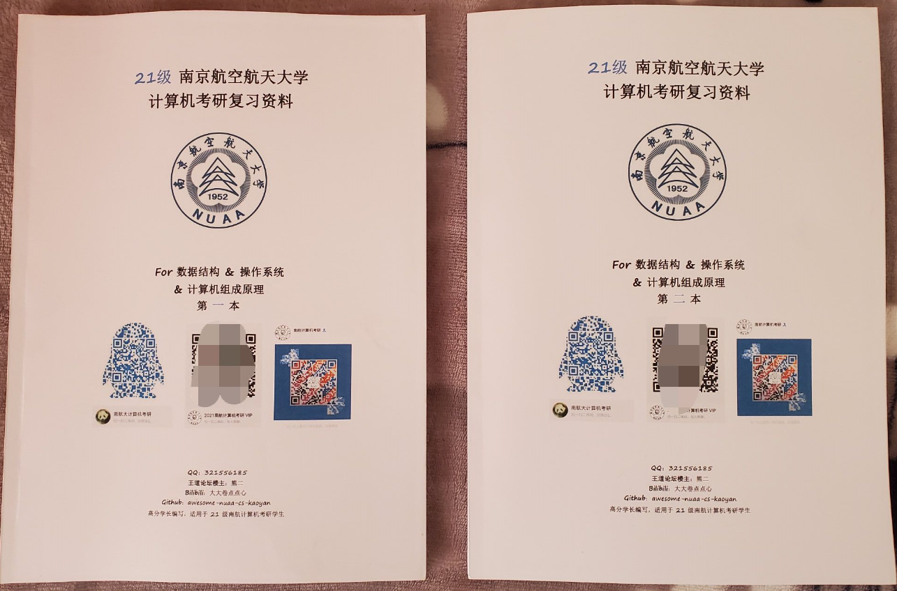
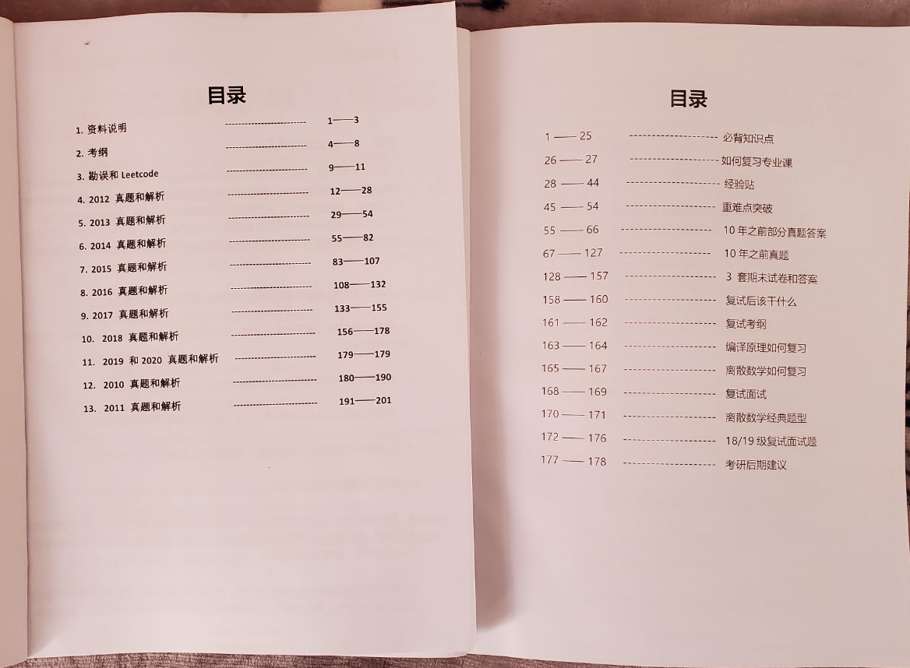
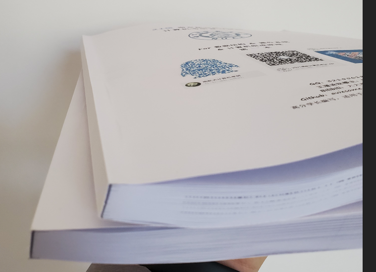
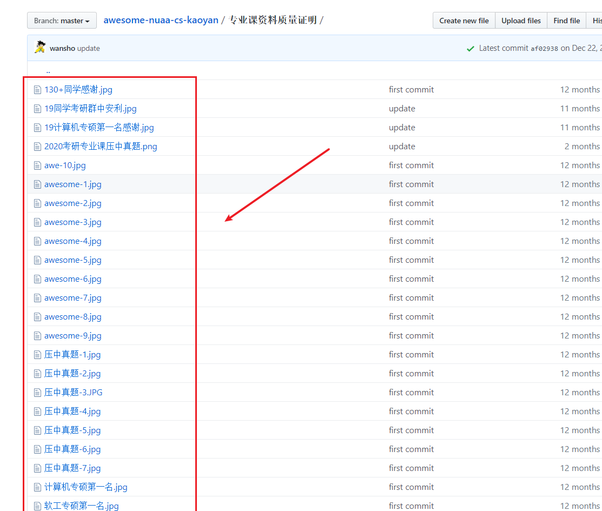
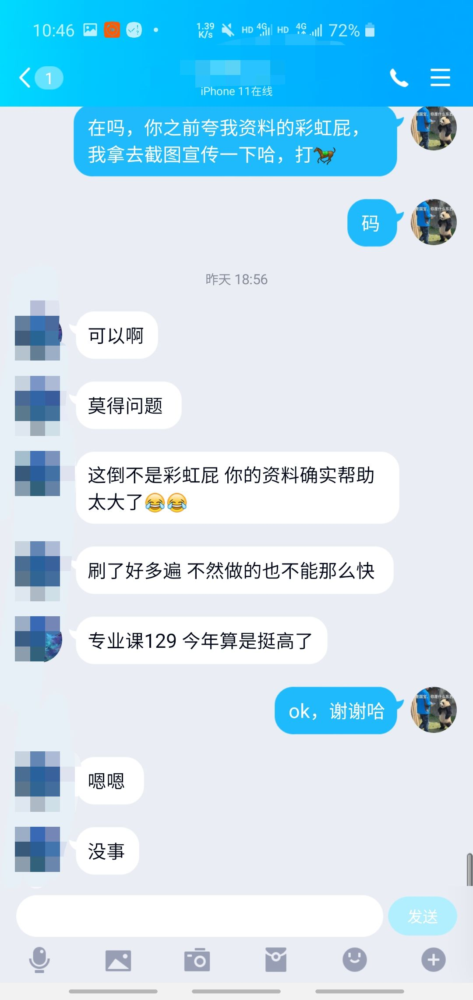

# 专业课资料介绍

## 我是谁

熊二学长是南航计算机考研 17 届考生，总分 417 分。

从 17 年开始，我已经连续辅导了 18，19，20 三届的南航计算机考研，2020 届同学是第四届。我编写的专业课资料曾经压中过多道南航计算机考研真题，每一届考生的第一名都用过我的资料，并给予很高的评价。

## 资料实拍图和内容

资料和去年一年，仍然是两本，没有废话，都是干货，两本加在一起，有将近 400 页，一斤半重，沉甸甸的知识！

## 适用于南航计算机考研 829 科目的复习

20届之前，我编写的资料是 922 的资料，只包含数据结构和操作系统的解析，从 20 届开始，南航计算机专业课统一考 829，加入了计算机组成原理，所以我在今年的资料中加入了计算机组成原理的解析。

## 历届资料评价

20 届最新评价，已经确认 20 届的专硕第一名也是用的我的资料。放太多评价显得太刻意，大家不放心可以去 Github 仓库中看。

## 资料价格

20 届资料的价格拼团价是：200，21届的资料虽然又加入了计组的解析，我仍然保持原价，毕竟我今年要毕业了，做辅导也只是我的一个副业和爱好。

## 资料购买途径

- 微店：https://k.weidian.com/a0lQclaM （[21届南航计算机考研资料](https://k.weidian.com/a0lQclaM )）
- 拼多多: https://mobile.yangkeduo.com/goods2.html?goods_id=86968936251

