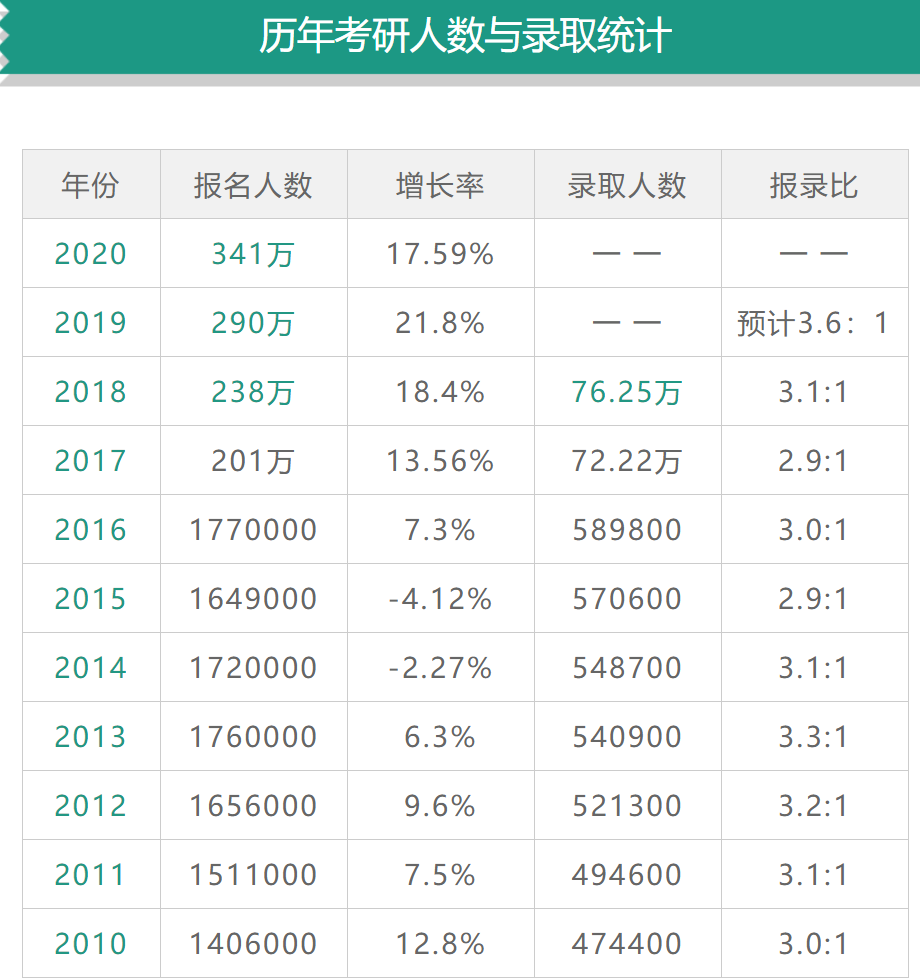

# 为什么现在就要开始准备考研

[TOC]

##大环境越来越严峻

### 报考人数逐年增多

2017 年到2020年，研究生报考人数将近翻了一番，我大胆的估计一下，2021 届的报考人数，可能会达到 400 万，是 2017 年的 double。

至于报录比 3：1，大家看看就行了，但是千万别拿这个数字安慰自己。3：1是统计数据，包含了所有高校，包括大量双非院校的研究生录取数据，东部沿海 211，985 的高校的计算机专业，估计能达到 8：1。

### 计算机是最热门的专业

知乎上除了计算机专业，所有专业都在劝退。现在工科专业人均计算机，计算机专业人均机器学习，所有的功课专业都在跨考计算机，难度可想而知。并不只有南航计算机难考，而是所有 211 院校的计算机专业都难考。

### 全球经济

中国经济增速放缓，全球经济也不景气，企业为了节约成本，自然就不会招那么多的人。大环境不好，会有越来越多的本科生选择考研。经济不景气，国家往往会通过研究生扩招来缓冲大学生的失业问题，这也是一个机会。

### 疫情影响

疫情使得原本不景气的经济学上加霜，经济增长越慢，找工作越不好找，考研的就越多。

当然，疫情也是一块试金石，对于那些在家里能坐的住学习的同学可能是一件好事，在家里沉得住气学习，能把那些疫情时间不学习的考生甩得很远。

## 考研特点

考研能够考上，和智力关系不大，考研的难度远远低于高考。考研可以比作一场**小马拉松**，其很大程度上，拼的是毅力。拿南航计算机学硕举例，考生需要学习：

数学：高数 + 线代 + 概率论

英语：单词 + 阅读理解 + 作文 + 其他题型

专业课：数据结构 + 操作系统 + 计算机组成原理

政治：马原 + 史纲 + 毛中特 + 近代史 + 形式与政策 + 思修

这里列举的每一项，不仅要复习得全面，而且要复习得好。

考生需要付出大量的精力，去复习上面列举的每一项，哪怕是非常聪明的人，也很难在基础不好的情况下，在两三个月内突击好。

## 每门功课建议开始的复习时间

从上面的分析我们也可以看出，考研的竞争激烈程度，比起2017年，几乎是翻了一番，考生如果还是盲目听从以前的陈旧观点，暑假才开始复习的话，对于正常人来说，绝对是已经晚了。暑假才开始复习，进复试容易，但是很难取得高分。

**稳妥的复习计划**：

三月开始复习英语+数学

六月开始复习专业课，跨考的学生，建议五月就开始复习。

八月底或九月初开始复习政治

