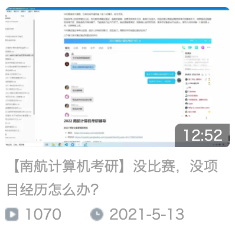

# 复试面试

[TOC]

## 线上还是线下

2022 开年的疫情还是挺严重的，很多疫情区的大学已经封校了，如果线下复试的话，不一定出的来，所以很可能是线上复试，但是也不排除线下的可能，所以要都准备好。

## 线上面试要注意什么

注意如下细节：

流畅的线上视频体验，需要流畅的网络，高清的摄像头（可以用手机的前置摄像头，找个手机支架，视频过程中手机要固定，不摇晃），注意，要找光线好的地方，让老师看清楚你的脸，取景框内不要有杂物，给老师一个良好的视频体验，一定要提前模拟视频面试，布置好取景框内的内容，如果家里有书房，去书房里面，可以把书橱放入取景框内。大家可以去总书记每年的新春祝福视频，视频体验就非常好。

## 线上怎么考察编译原理和离散数学

2020 年的复试面试，是线上，那一年的编译原理和离散数学，是线上考察，就是比如说离散元离散离散数学出三道题，然后编译原理抽三道题，然后现场作答，一般都是一些比较简单的题，线上作答，口述。

## 老师问问题不会咋办

关于老师问问题，可以有不会的，但是都不会就不太合适了吧，我之前说过，即使碰到不会的，也可以想想相关的知识点，往这些点扯一扯，老师不止考察你对知识的掌握情况，也看你的态度，如果一问三不知，那么你是老师的话，你会不会生气呢？

## 不要说什么

没把握的东西不要说，尤其机器学习啥的，别说，遇到懂得老师，拼命问你，遇到不懂的老师，更怼你浮躁追热点，说点 web 开发什么的，踏踏实实的，比较合适，除非对自己做的东西有很大的把握，否则别乱说，现在经济形势不好，疫情又很严重，大概率还是要扩招的。再提醒一下，不要拿机器学习给自己贴金，面试的时候，不建议提机器学习，提到必被怼。

## 没有项目经历怎么办

复试，态度很重要，要准备充分，要有真情实感，像本科学校不好，四六级分数不高，挂过科什么的，都不如你现场发挥的态度重要。换句话说，即使一个比较优秀的同学，有比较多的奖项，但是面试的时候，拿这些东西炫耀标榜自己，有点飘了，那么这样的同学，可能得分会比那些「平庸」的同学要低的。

| 二维码                                                       | 视频截图                                                     |
| ------------------------------------------------------------ | ------------------------------------------------------------ |
|  |  |

## 会不会扩招

2022 年，看经济形式和疫情的严重程度，我个人猜测，可能要扩招，但是应该不会扩太多。

## 面试会不会考察口语

往年有的环节，都要准备，像：

* 自我介绍（可能用英文自我介绍）
* 英语口语考察，英语翻译（2021）
* 抽提问答环节

都要准备

## 复试后多久出结果

三四天就出拟录取名单了，也有可能后面出补录名单，2021 就补录了很多。