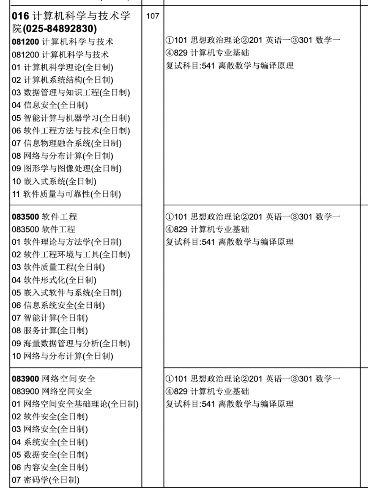
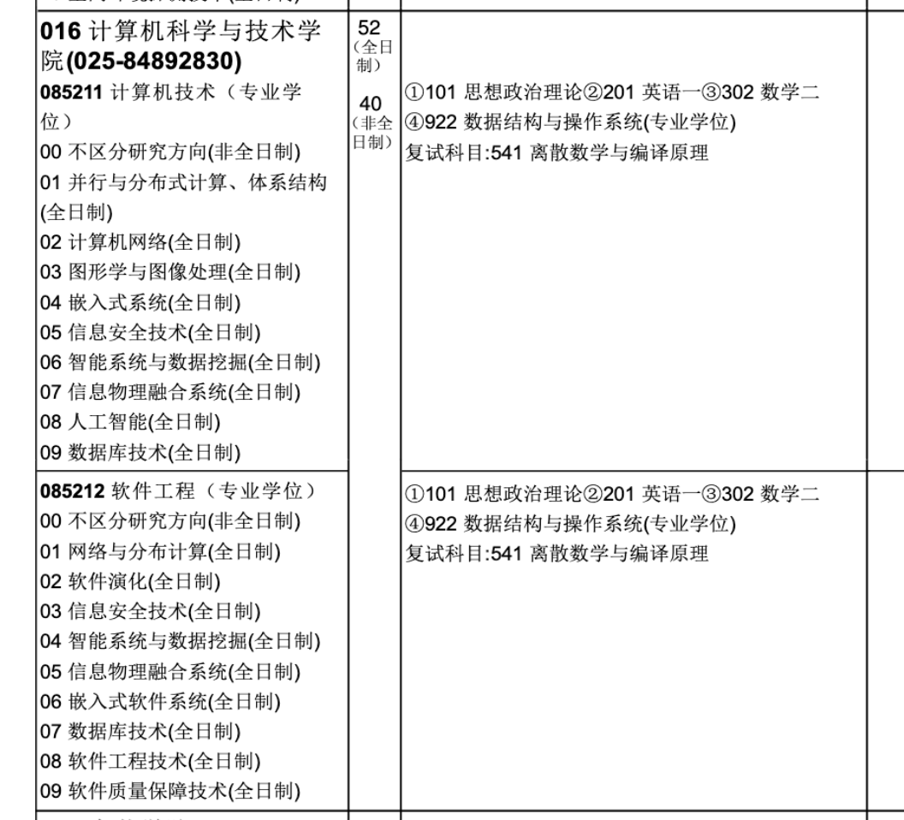
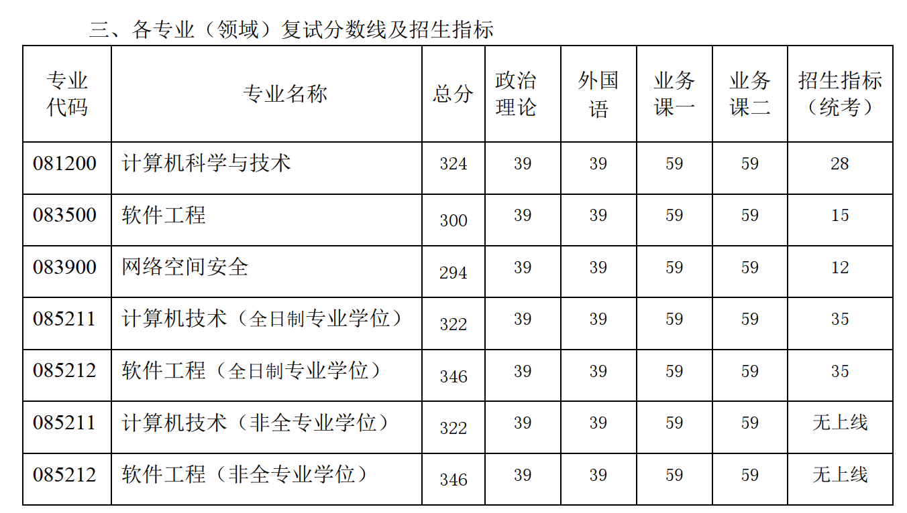

# 关于研招网和官网的招生信息

## 招生简章的迷惑

对于南航计算机考研的同学来说，每年在这几个时间节点，都会有不必要的心理波动：

* 南航研究生院官网出招生简章的时候
* 研招网出招生简章的时候
* 保研名单公布的时候
* 985 调剂名单出来的时候（现在没有 985 调剂了）
* 准备择校的时候，考虑南航会不会改考 408

很多人看到招生简章出来后，看到保研名单出来后，会惊慌，完蛋了，没有统考名额了，某某专业基本上全部给保研了，或者某某专业缩招了。

还有很多同学在择校的时候，也会看这些官方数据。

但是，很多人不知道，对于南航计算机考研来说，官方招生简章上的招生计划，和最后实际的统考（是统考）录取人数，通常是对不上的，基本上没有什么参考价值。既然南航研究生院公布的招生计划，参考价值不大，那就更不用提研招网上的信息了，那都是各个学校自己上传的信息，更不能算数了，所以没有必要去研招网上查招生计划。

## 2019 年招生计划和最终统考录取人数

下面我举个例子：

以 2019 考研（2019 年还没大规模扩招）为例，点击 [2019 招生简章](https://gitee.com/wansho/awesome-nuaa-cs-kaoyan/blob/master/%E5%8D%97%E8%88%AA%E8%AE%A1%E7%AE%97%E6%9C%BA%E8%80%83%E7%A0%94%E4%BF%A1%E6%81%AF%E6%B1%87%E6%80%BB/2019%E5%B9%B4%E6%8B%9B%E6%94%B6%E6%94%BB%E8%AF%BB%E7%A1%95%E5%A3%AB%E5%AD%A6%E4%BD%8D%E7%A0%94%E7%A9%B6%E7%94%9F%E6%8B%9B%E7%94%9F%E4%B8%93%E4%B8%9A%E7%9B%AE%E5%BD%95.pdf) 可以下载到 2019 的招生计划，这是 2018 年 9 月发布的，学硕一共招 107 人(包含保研)

专硕全日制一共招 52 人

我们再看看那一年 985 调剂过来多少人，从[2019调剂名额官方文件](https://gitee.com/wansho/awesome-nuaa-cs-kaoyan/blob/master/%E5%8D%97%E8%88%AA%E8%AE%A1%E7%AE%97%E6%9C%BA%E8%80%83%E7%A0%94%E4%BF%A1%E6%81%AF%E6%B1%87%E6%80%BB/2019%E5%B9%B4%E5%85%A8%E6%97%A5%E5%88%B6%E6%A0%A1%E5%A4%96%E8%B0%83%E5%89%82%E6%8B%9F%E5%BD%95%E5%8F%96%E5%90%8D%E5%8D%95.pdf)中可以看到，2019 调剂过来 39 人：

我们再看一看复试名单出来的时候，[2019 年硕士生招生复试及录取细则.pdf](https://gitee.com/wansho/awesome-nuaa-cs-kaoyan/blob/master/%E5%8D%97%E8%88%AA%E8%AE%A1%E7%AE%97%E6%9C%BA%E8%80%83%E7%A0%94%E4%BF%A1%E6%81%AF%E6%B1%87%E6%80%BB/2019%20%E5%B9%B4%E7%A1%95%E5%A3%AB%E7%A0%94%E7%A9%B6%E7%94%9F%E6%8B%9B%E7%94%9F%E6%8E%A5%E6%94%B6%E4%BC%98%E7%A7%80%E7%94%9F%E6%BA%90%E8%B0%83%E5%89%82%E5%A4%8D%E8%AF%95%E5%8F%8A%E5%BD%95%E5%8F%96%E7%BB%86%E5%88%99.pdf) 上面的招生计划，统考一共招 125 个人，其中学硕 55 人，专硕 70 人，直到这个时候，还不是出最终名单的时候，只是给了一个各个专业的统考招生计划：

而我们再看看最终的统考录取名单 [2019 年 拟录取名单.pdf](https://gitee.com/wansho/awesome-nuaa-cs-kaoyan/blob/master/%E5%8D%97%E8%88%AA%E8%AE%A1%E7%AE%97%E6%9C%BA%E8%80%83%E7%A0%94%E4%BF%A1%E6%81%AF%E6%B1%87%E6%80%BB/2019%20%E5%B9%B4%20%E6%8B%9F%E5%BD%95%E5%8F%96%E5%90%8D%E5%8D%95.pdf)，最后一共录取了 139 人，其中专硕 78 人，学硕录取了 61 人。

最后我们复盘一下整个过程：

| 专业 | 9 月研究生院公开的招生计划 | 复试公开的统考招生计划 | 最终统考录取名单 |      |
| ---- | -------------------------- | ---------------------- | ---------------- | ---- |
| 学硕 | 107（包含保研）            | 55                     | 61               |      |
| 专硕 | 52                         | 70                     | 78               |      |
| 汇总 | 179（包含保研）            | 125                    | 139              |      |

从上面我们可以看出，每次公开的招生计划，和最终统考录取名单的人数都不一样，而且最终统考录取人数，是要比招生计划多的。

我特地统计了一下历年的招生计划，和实际统考录取人数

|      | 招生简章招生计划 | 实际统考录取人数 | 保研人数 | 实际招生人数 |
| ---- | ---------------- | ---------------- | -------- | ------------ |
| 2022 | **263**          | 151              | 178      | 329          |
| 2021 | **235**          | **176**          | 140      | 316          |
| 2020 | **160**          | **220**          |          |              |
| 2019 | **125**          | **139**          |          |              |

大家可以看到，2021 年，保研人数达到了 140 人，而招生计划只有 235 人，那年很多人看到保研名单后，一下子慌了，完蛋了，南航要缩招了，计划招生 235 人，保研 140 人，还剩 95 个统考名额，彻底完蛋了，直接弃考南航。

结果呢， 2021 年统考最终录取了 176 人！不是 95 人！（2020 开始没有 985 调剂了，很多调剂名额直接给了保研）

## 这一届到底招多少人？

所以，关于南航计算机的所有招生计划，其实都不靠谱。最靠谱的，还是历年统考录取名单，想要知道这一届到底招多少人，只能等到最终录取名单出来后才能知道。

对于准备报考南航计算机的同学来说，想要知道今年的一个趋势，看历史的统考录取人数就 ok 了，就是下面这张图！根据历史的趋势，来预判今年可能统考招多少人，别无他法。关于 2020 届之后，南航计算机考研的一个趋势，我在这里也有提到过，大家可以参考。

## 会不会改考 408？

关于南航计算机会不会改考 408，这也是很多人担心的问题，我在这里有讲过：

[ 改考 408？](https://gitee.com/wansho/awesome-nuaa-cs-kaoyan/blob/master/%E5%8D%97%E8%88%AA%E8%AE%A1%E7%AE%97%E6%9C%BA%E8%80%83%E7%A0%94%E8%AE%B2%E5%BA%A7/%E4%BA%8C%E5%8D%81%E4%BA%8C%EF%BC%9A%E6%94%B9%E8%80%83%20408%EF%BC%9F.md)

这个对于每一个考计算机非 408 的同学，改考 408 都是悬在头上的达摩克里斯之剑。要么直接冲 408 的学校，要么就得承担这个风险。

只能早点复习专业课，做好充分准备，才能在变化到来之时从容应对。

改考 408，其实把自己学校的学生也坑了，如果改考了，老师应该会提前把消息放出来的，提醒本校的考生。现在还没有听到风声的话，大家还是安心好好复习吧。

## 关于我

**扫码关注🐻熊二🐻学长，不止考研：**

**这里有你想要知道的，几乎所有的，关于南航计算机考研的信息：**

## 往期文章

* [考研真相](https://mp.weixin.qq.com/s?__biz=MzUxMzQ4NjI3MA==&mid=2247483696&idx=1&sn=cf2b331f96ad90c656ea2ad2ae9d430e&chksm=f9553de1ce22b4f768b676b883dc7c867ae05afb6309f1c2f031be67f9bdff3a1e19977cae92&token=286354321&lang=zh_CN#rd)
* [hello 熊二](https://mp.weixin.qq.com/s?__biz=MzUxMzQ4NjI3MA==&mid=2247483657&idx=1&sn=0db1e7740910787cc903690811b0b683&chksm=f9553dd8ce22b4ced45a8b30a6163d3cf83e828edf532e1201e63d0dc7e1ed1f73ece87cec8e&token=2112781229&lang=zh_CN#rd)
* [南航计算机考研 - 复试攻略](https://mp.weixin.qq.com/s?__biz=MzUxMzQ4NjI3MA==&mid=2247483668&idx=1&sn=b8eaae81b7902eef2dd5f76db6f7f7e8&chksm=f9553dc5ce22b4d3efd0139ba6935d06833fd84f603df1c68a5a9c50e09e4805bf58adaedbc3&token=2112781229&lang=zh_CN#rd)
* [2023 考研前聊聊](https://mp.weixin.qq.com/s?__biz=MzUxMzQ4NjI3MA==&mid=2247483678&idx=1&sn=8efe7a6f62a67baa1999ceddd9605d71&chksm=f9553dcfce22b4d915f6651c9871525e8fb234c9acc1fc00265157c3a108a83f8a5bf4fb897a&token=816898692&lang=zh_CN#rd)

