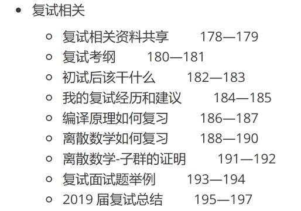
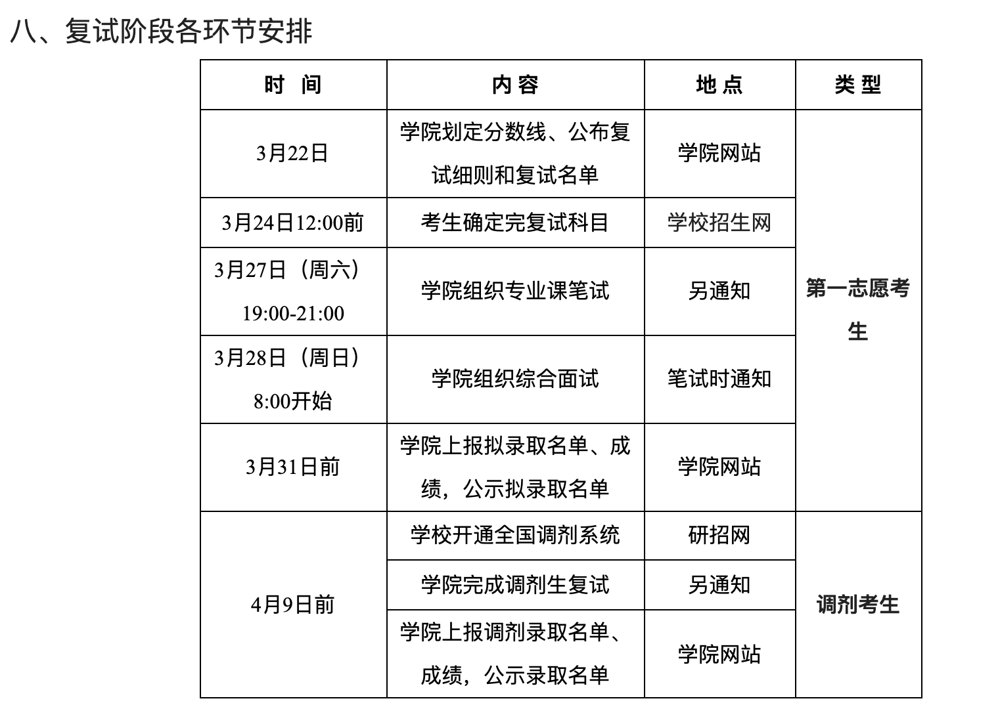

# 南航计算机考研 - 初试后该干什么

可以休息两周，这两周，可以通宵打游戏，可以把养了半年的番肝完，可以天天逛吃逛吃。但是，建议只放松两周，因为我已经反复强调过了，南航计算机考研，复试和初试同等重要，去年就有一个初试高分落榜的，复试很公平，如果初试高分最后没上岸，岂不是很可惜！

再提醒一下大家，年后再开始准备复试，是有点晚了的，建议 1 月 15 号之后，必须全面进入复习状态，在家里好好复习，管住自己。

考完后的两周，还有几个任务：

* 把熊二学长考研仓库中，和复试相关的信息，再看至少一遍

  我保证，再认真看一遍这个仓库，对大家的复试，肯定有很大的帮助 https://gitee.com/wansho/awesome-nuaa-cs-kaoyan

* 了解最新的 [复试规则](https://gitee.com/wansho/awesome-nuaa-cs-kaoyan#2021-%E6%9C%80%E6%96%B0%E5%A4%8D%E8%AF%95%E8%A7%84%E5%88%99)，该买的书和资料，这两周要买好

* 看复试考纲，准备复试要用到的书籍材料，购买了我的初试考研资料的同学，请记得翻看一下第二本资料，第二本资料上，有很多复试相关的信息：

  

是否要开始联系导师了？如果你觉得考的很好，或者你本身很优秀，或者你的本科学校很好，那么可以尝试联系一下心仪的导师，否则，不用纠结太多，先把上岸放在第一位。当然，准备复试的这段时间，也要开始物色适合自己的导师了，等到出成绩了，再开始找导师，也有点晚了。

南航啥时候出复试名单？大家可以看一下这个官方通知：https://cs.nuaa.edu.cn/2021/0322/c10851a238958/page.htm

复试名单出得比较晚，而且出完后，下一周马上就来南航复试，所以，等到出名单再准备，绝对是晚了……

南航计算机复试有没有黑幕？请看这里：关于南航计算机考研的谣言 https://zhuanlan.zhihu.com/p/117368385

最后，重要的事情，再说三遍，复试和初试一样重要！复试和初试一样重要！复试和初试一样重要！请大家一定要重视复试！