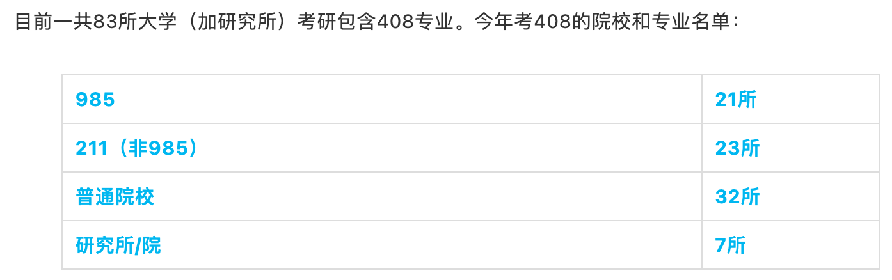
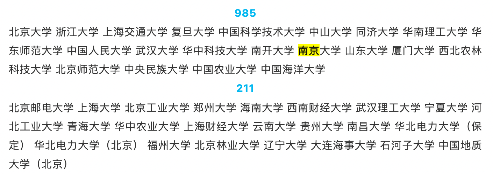

# 改考 408？

[TOC]

last modified：2022-01-18

关于是否该考 408，很多人都担心这个。这个担心也能理解。但是目前还没听到要改的消息。

这里有一份目前考 408 的学校的名单：https://mp.weixin.qq.com/s/GDuZ5AB8zKo9mM3RxEnlOg

211 学校里面，考 408 的有 44 所，南京好像只有南京大学考 408。

211 学校里面，考 408 的学校，也并不全是特别顶尖的 211。

## 现状

南航计算机在 2020 届考研刚改了专业课，从专硕考 922，学硕考 829，改为统一考 829。

据我了解，南京的高校里面，除了南大有一个专业改考 408（注意，南大并不是全部改考 408），其他 211，985 学校好像没有改考 408 的。东南，南理工，河海，苏大，南邮都没有改考 408（应该都没改考吧，我没具体统计过）。要是改考 408 的话，南理工和南航大概率同时改考 408。而且如果改考 408，本校的学生应该能听到风声的，现在南京的高校圈，好像还没有传出来要改 408 的消息吧。南京的高校向来是比较保守的，和其政治地位一样，十分稳健，不会轻易变动的。

目前改考 408 的学校，要么是 top 985，要么是一些希望收割 985 调剂生的普通本科。大家改考 408 都是为了更好的生源。top 985 学校不缺好生源，改考 408 可能大概率是为了响应改考 408 的政策。改考 408 这个政策真的有没有，我也不知道，也许根本就没有官方文件，只是民间一直在传谣，可能大家看到很多普通本科改考 408 了，就开始慌了，其实他们改考 408 只是为了更好的生源而已。我觉得不可能所有的学校都改考 408 的，至少南京的大多数学校都还没变，大多数的 211 学校也没有改考 408，对于南航南理工这个 level 的学校来说，同样也是不缺好的生源地。

## 怎么做

这个对于每一个考计算机非 408 的同学，改考 408 都是悬在头上的达摩克里斯之剑。要么直接冲 408 的学校，要么就得承担这个风险。

只能早点复习专业课，做好充分准备，才能在变化到来之时从容应对。

改考 408，其实把自己学校的学生也坑了，如果改考了，老师应该会提前把消息放出来的，提醒本校的考生。现在还没有听到风声的话，大家还是安心好好复习吧。

## 是谁在放大改考 408 的信号

大家之所以听到那么多要改考 408 的消息，我感觉是被很多机构故意放大信号的，统考 408 的话，受益的都有谁？是谁在天天宣传改考 408？大家好好想一想。

