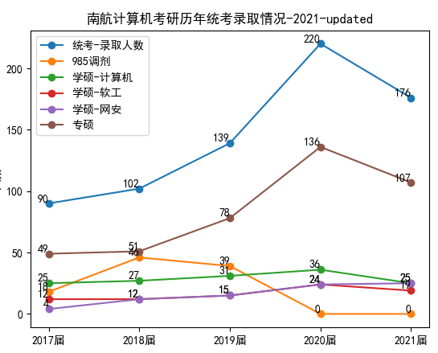

# 南航计算机考研-招生计划与实际录取人数

每一年南航计算机考研的同学，会有两次心理波动，一次是招生计划出来的时候，一次是保研名单出来的时候，其实认真看过这个仓库 https://gitee.com/wansho/awesome-nuaa-cs-kaoyan 的人，根本不慌的，因为保研名单和招生计划都没有多少参考价值的，每一年都得看最后录取结果出来的时候，才能知道统考多少人，各个专业招多少人。

今天我特地统计了一下历年的招生计划，和实际统考录取人数，大家看数据说话，应该可以放心了

|      | 招生计划 | 实际统考录取人数 | 保研人数 | 实际招生人数 |
| ---- | -------- | ---------------- | -------- | ------------ |
| 2022 | **263**  |                  | 178      |              |
| 2021 | **235**  | **176**          | 140      | 316          |
| 2020 | **160**  | **220**          |          |              |
| 2019 | **125**  | **139**          |          |              |

从上面的数据可以看出，历年的招生计划，参考价值都不大，还是得看实际统考录取人数。请参考下图！

