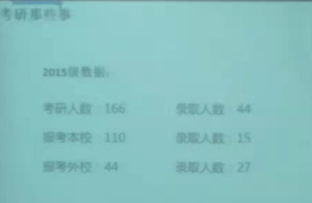

# 考研真相

今天和大家分享一下我总结的考研真相。

## 南航计算机各报考专业

有哪些专业，一共报考多少人？每年有多少人报考南航计算机

一个老师可以接收哪些专业的学生？

2019 届数据

| 专业        | 录取人数 | 进入复试人数 / 最低分 / 最高分 | 复录比 |
| ----------- | -------- | ------------------------------ | ------ |
| 学硕-计算机 | 31       | 43（324 / 393）                | 1.4: 1 |
| 学硕-软工   | 15       | 23（300 / 394）                | 1.5: 1 |
| 学硕-网安   | 15       | 18（294 / 357）                | 1.2: 1 |
| 专硕-计算机 | 41       | 70 （322 / 396）               | 1.7: 1 |
| 专硕-软工   | 37       | 75（346 / 423）                | 2: 1   |
| 汇总        | 139      | 229 （294 / 423）              | 1.6: 1 |

2018 届数据

| 专业        | 录取人数 | 进入复试人数 / 最低分 / 最高分 | 复录比  |
| ----------- | -------- | ------------------------------ | ------- |
| 学硕-计算机 | 27       | 37（301 / 367）                | 1.4: 1  |
| 学硕-软工   | 12       | 14（290 / 341）                | 1.2: 1  |
| 学硕-网安   | 12       | 9（260 / 340）                 | 1：1    |
| 专硕-计算机 | 18       | 28 （345 / 409）               | 1.56: 1 |
| 专硕-软工   | 33       | 48（303 / 380）                | 1.45: 1 |
| 汇总        | 102      | 143 （260 / 409）              | 1.4: 1  |

## 考研到底难不难

考普通学校的研不难。211，985 学校难，计算机考研更难。考研分数段密集程度统计。

## 最大的智商税

考研最大的智商税是报班。作为一名报考计算机专业的学生，应该有能力自己从网络上找到或者买到全程更新的各大考研机构所有名师的视频（在闲yu话几十块钱就可以买到）。报班费用少的几千，多则上万，而且绝大多数不是该领域最有名的老师上课，而我们只需要花不到一百块钱，就可以倍速看遍所有名师的视频。

专业课复习智商税：

* 押题试卷，报培训班，不够专业的专业课资料

## 鸡蛋不要全放在一个篮子里

## 学完不复习

## 三天不练肯定手生

## 时间分配

按照各科权重将每天的时间均匀分配。

## 学校后期再定

## 单词背多遍

## 计组如何复习，难度如何？

没学过数据结构，操作系统或者计组怎么办

## 本校考生是否有优势？南航是否歧视外校考生？

