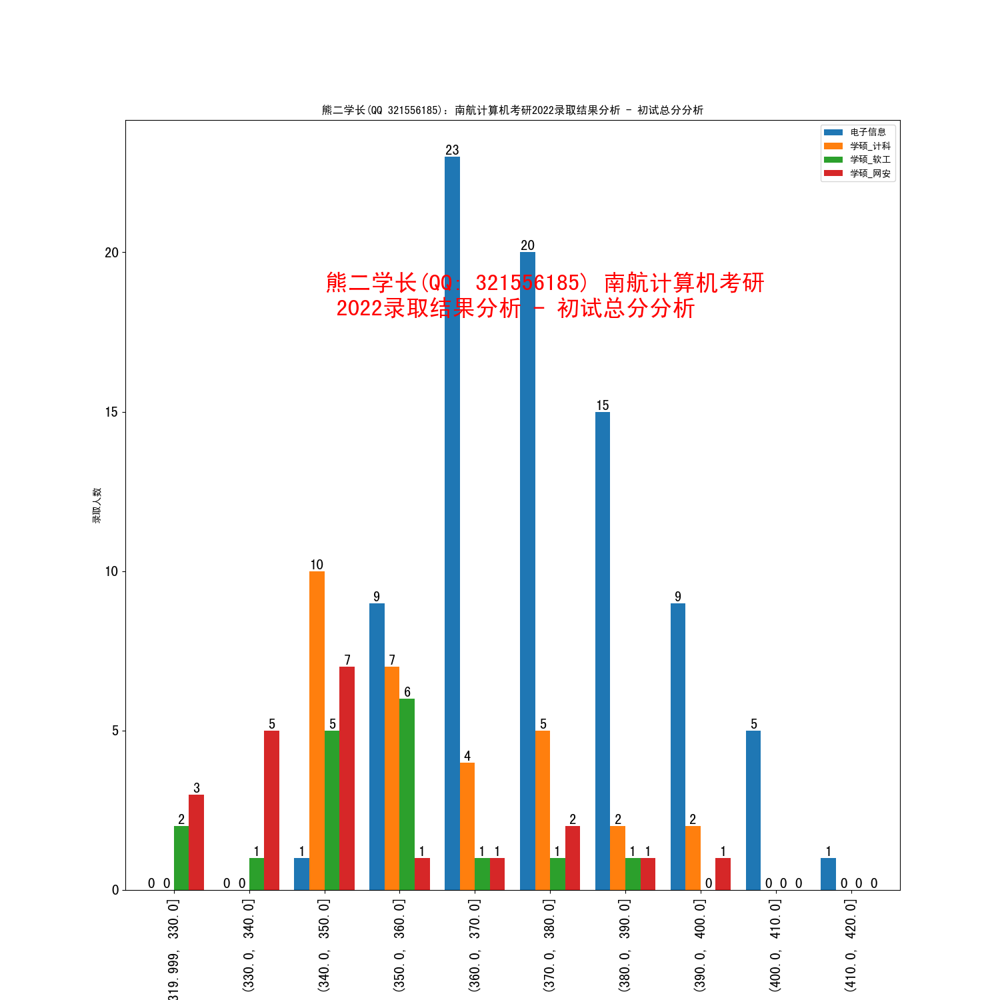

# 2022 上岸名单成绩分析

## 历年统考录取人数趋势

## 初试成绩分析

## 复试成绩分析

## 2022 统考拟录取 - 详细信息

|               | 初试  | 初试        | 初试        | 初试 | 初试  | 初试 | 初试   | 初试 | 复试  | 复试        | 复试        | 复试   | 复试     | 复试   | 复试    | 复试   | 总分  | 总分        | 总分        | 总分  | 总分    | 总分   | 总分    | 总分  |
| ------------- | ----- | ----------- | ----------- | ---- | ----- | ---- | ------ | ---- | ----- | ----------- | ----------- | ------ | -------- | ------ | ------- | ------ | ----- | ----------- | ----------- | ----- | ------- | ------ | ------- | ----- |
|               | count | mean        | std         | min  | 25%   | 50%  | 75%    | max  | count | mean        | std         | min    | 25%      | 50%    | 75%     | max    | count | mean        | std         | min   | 25%     | 50%    | 75%     | max   |
| 专业          |       |             |             |      |       |      |        |      |       |             |             |        |          |        |         |        |       |             |             |       |         |        |         |       |
| 专硕-电子信息 | 83    | 376.3975904 | 15.45010834 | 346  | 364   | 375  | 386    | 412  | 83    | 258.1003614 | 10.79748429 | 228.09 | 251.265  | 258.67 | 265.235 | 288.66 | 83    | 78.51433735 | 2.542343931 | 75    | 76.615  | 77.93  | 80.155  | 84.83 |
| 学硕-网安     | 21    | 348         | 19.08664455 | 326  | 336   | 343  | 351    | 391  | 21    | 250.5338095 | 10.82258679 | 226.56 | 245.23   | 252.38 | 259.4   | 269.25 | 21    | 73.77428571 | 3.076507064 | 68.72 | 72      | 73.21  | 74.31   | 81.11 |
| 学硕-计科     | 30    | 361.2666667 | 15.64902406 | 341  | 348.5 | 356  | 373.75 | 393  | 30    | 260.1683333 | 8.835140685 | 243.31 | 254.0125 | 261.75 | 266.195 | 274.92 | 30    | 76.59433333 | 2.616906153 | 73.49 | 74.6975 | 75.815 | 78.0575 | 82.23 |
| 学硕-软工     | 17    | 350.8823529 | 15.14877203 | 327  | 343   | 352  | 358    | 382  | 17    | 251.1617647 | 8.66811992  | 236.74 | 247.38   | 250.27 | 255.8   | 271.67 | 17    | 74.24       | 2.755172408 | 69.91 | 72.55   | 74.03  | 75.23   | 80.23 |

## 2022 统考拟录取 - 关键信息

| 专业          | 统考录取人数 | 初试最低分 | 初试中位数分数 / 2021中位数 | 初试平均分 / 2021平均分 | 初试最高分 |
| ------------- | ------------ | ---------- | --------------------------- | ----------------------- | ---------- |
| 学硕-计科     | 30           | 341        | 356 / 355                   | 361 / 357               | 393        |
| 学硕-软工     | 17           | 327        | 352 / 357                   | 350 / 355               | 382        |
| 学硕-网安     | 21           | 326        | 343 / 356                   | 348/ 356                | 391        |
| 专硕-电子信息 | 83           | 346        | 375 / 373                   | 376 / 373               | 412        |
| 汇总          | 151          | 326        |                             |                         | 412        |

## 2022 复录比

| 专业          | 最终录取人数 | 复试招生指标 | 进入复试人数 / 最低分 / 最高分 | 最终录取初试最低/高分 | 复录比   |
| ------------- | ------------ | ------------ | ------------------------------ | --------------------- | -------- |
| 学硕-计科     | 30           | 30           | 37（341 / 393）                | 341 / 393             | 1.23 : 1 |
| 学硕-软工     | 17           | 17           | 21（326 / 382）                | 327 / 382             | 1.24 : 1 |
| 学硕-网安     | 21           | 18           | 22（326/ 391）                 | 326 / 391             | 1.05 : 1 |
| 专硕-电子信息 | 83           | 80           | 150（345/ 412）                | 346 / 412             | 1.8 : 1  |
| 汇总          | 151          | 145          | 231（326/ 412）                |                       |          |

## 熊二 分析

* 南航计算机没有炸，分数仍然稳定增长，符合预期（计算机考研越来越火，考研人数越来越多，竞争越来越激烈）
* 今年复试的招生指标，和最终录取的人数，一模一样，没有像往年一样，最终录取名单的人数比复试的招生指标多一点
* 2022 相对 2021 年，统考录取人数少了 25 人，主要少在了专硕上
* 与 2021 比较的话，专硕平均分涨了 2 分，学硕-计科的平均分涨了 4 分，学硕-软工的平均分降了 5 分，学硕-网安的平均分降了 8 分
* 初试没考好，仍然是可以逆袭的，每一个专业，都存在进入复试倒数的同学，最终上岸
* 专硕复录比高，是为了招非全日制，从往年来看，只要进了复试，并且过了复试的及格分，就可以读南航计算机的非全，不需要再二次面试
* 个人觉得复录比高没什么，没什么可惊讶的，没有必要单纯为了黑而黑。进复试的人多了，也给初试没考好的同学带来逆袭的机会（上面说了，能逆袭），对调剂的影响也有限，现在国家调剂系统还没开呢
* 关于南航计算机的非全信息，请看这篇文章：[南航计算机非全日制信息汇总](https://gitee.com/wansho/awesome-nuaa-cs-kaoyan/blob/master/%E7%BB%8F%E9%AA%8C%E8%B4%B4/%E9%9D%9E%E5%85%A8%E6%97%A5%E5%88%B6%E7%9B%B8%E5%85%B3%E4%BF%A1%E6%81%AF.md)

## 附录：历年统考录取分析

### 2021

| 专业          | 录取人数 | 进入复试人数 / 最低分 / 最高分 | 录取初试最低/高分 | 中位数分数 | 复录比  |
| ------------- | -------- | ------------------------------ | ----------------- | ---------- | ------- |
| 学硕-计算机   | 25       | 32（329 / 416）                | 329 / 416         | 355        | 1.28: 1 |
| 学硕-软工     | 19       | 25（327 / 394）                | 327 / 394         | 357        | 1.32: 1 |
| 学硕-网安     | 25       | 27（327/ 399）                 | 327 / 399         | 356        | 1.08: 1 |
| 专硕-电子信息 | 107      | 174（337/ 414）                | 337 / 414         | 373        | 1.63: 1 |
| 汇总          | 176      | 258（327/ 416）                | 327 / 416         |            | 1.47: 1 |

### 2020

| 专业          | 录取人数 | 进入复试人数 / 最低分 / 最高分 | 复录比  |
| ------------- | -------- | ------------------------------ | ------- |
| 学硕-计算机   | 36       | 52（318 / 387）                | 1.44: 1 |
| 学硕-软工     | 24       | 29（294 / 381）                | 1.2: 1  |
| 学硕-网安     | 24       | 32（292 / 368）                | 1.3: 1  |
| 专硕-电子信息 | 136      | 160 （290 / 414）              | 1.18: 1 |
| 汇总          | 220      | 273 （294 / 423）              | 1.24: 1 |

### 2019 届统考数据

| 专业        | 录取人数 | 进入复试人数 / 最低分 / 最高分 | 复录比 |
| ----------- | -------- | ------------------------------ | ------ |
| 学硕-计算机 | 31       | 43（324 / 393）                | 1.4: 1 |
| 学硕-软工   | 15       | 23（300 / 394）                | 1.5: 1 |
| 学硕-网安   | 15       | 18（294 / 357）                | 1.2: 1 |
| 专硕-计算机 | 41       | 70 （322 / 396）               | 1.7: 1 |
| 专硕-软工   | 37       | 75（346 / 423）                | 2: 1   |
| 汇总        | 139      | 229 （294 / 423）              | 1.6: 1 |

### 2018 届统考数据

| 专业        | 录取人数 | 进入复试人数 / 最低分 / 最高分 | 复录比  |
| ----------- | -------- | ------------------------------ | ------- |
| 学硕-计算机 | 27       | 37（301 / 367）                | 1.4: 1  |
| 学硕-软工   | 12       | 14（290 / 341）                | 1.2: 1  |
| 学硕-网安   | 12       | 9（260 / 340）                 | 1：1    |
| 专硕-计算机 | 18       | 28 （345 / 409）               | 1.56: 1 |
| 专硕-软工   | 33       | 48（303 / 380）                | 1.45: 1 |
| 汇总        | 102      | 143 （260 / 409）              | 1.4: 1  |

