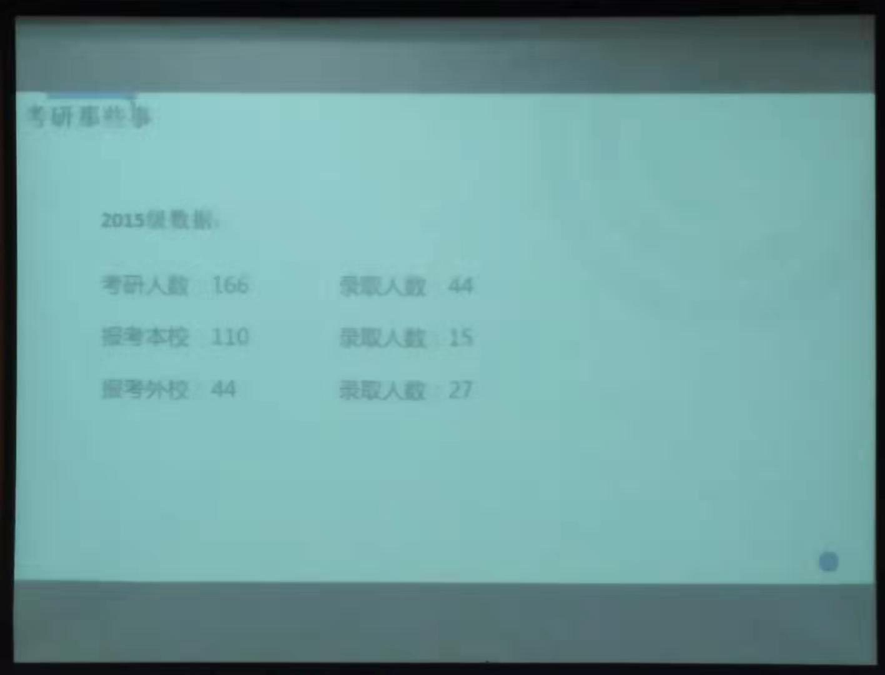

# 关于南航计算机考研的谣言

[TOC]

## 南航计算机护犊子，开小灶？

先抛结论：**没有一所高校是绝对公平的，南航是相对公平的。**

清华公平吗？奶茶妹妹章泽天是怎么上清华的？哪怕是什么斯坦福、哈佛，黑幕也多了去了。**有人的地方，就有江湖。公平是相对的。换位思考，如果你是本校的老师，你对自己的学生没有感情吗？**

为什么南航是相对公平的？

1. **用数据说话**

   

   这是南航计算机学院2015级学生（2019年毕业生）的考研结果统计，是一个本科生拍下来共享给我的，大家可以看到，2019届考研，南航计算机学院有 110 人报考本院，但是最终只录取了 15 个人，成功率 13.7%。这么低的成功率，哪来的黑幕？哪里来的护犊子？

2. **我师姐的口述**

   我师姐也是南航计算机本校的学生，她说她那年考研的时候，她有一个朋友，最终成绩排名倒数，和几个外校的学生分数比较靠近，最终学院并没有因为本校的原因而优先录取本校的学生，而是录取了外校的学生。

## 南航计算机优先录取 985 的调剂生？

南航计算机每年的调剂生复试，要早于统考生复试，这是事实。但这并不代表南航计算机是优先录取 985 的调剂生，然后剩下的名额再分给统考的学生，因为 985 调剂和统考的名额是分开的。

从上图可以看出，985 调剂生的人数一直都比较固定，甚至 2019 年的调剂生数量不增反降。与此同时，南航计算机学院分配给统考学生的名额却逐年增多，而且统考名额是远远多于 985 调剂名额的，所以南航计算机优先录取 985 调剂生的结论根本不成立。

之所以会出现这样的谣言，我认为大概率是来源于那些没考上南航计算机同学的抱怨。南航本身就很难考，计算机就更难考，愿赌就要服输，在考研之前考生就应该清楚南航的这些政策，考不上大概率也只是自身的问题，不要什么锅都丢给南航计算机。

## 南航计算机研究生没有假期，天天刷 Paper？

有没有假期，需要发几篇论文，完全看自己导师的要求。如果导师放养，那么你去实习，去旅游，甚至回家结婚都没人管你。但是南航计算机有毕业学术分要求，必须凑够学术分才能毕业。

我本人导师就比较开明，大二上个学期就去北京实习了半年，然后回来写写论文，开始找工作。南航计算机对科研还是比较看重的，大多数老师也对学术抓的比较紧，尤其是学硕，导师允许出去实习的可能性很低。专硕还好，学院会要求专硕在研二出去实习，但是大多数老师还是不准专硕出去实习，把专硕当成学硕一样培养发论文。

## 导师不喜欢带外校的学生？

这个问题，不止是南航的问题，放到任何一个 211 学校，都是如此，哪个学校的老师不护犊子，哪个学校的老师，不喜欢带自己学校的学生？所有学校都存在的问题，就不是南航的问题。

少数的老师，只喜欢带本校的学生。毕竟招本校的学生更保险，这个无可厚非。但是学院每年招收的外校的学生比本校的学生多了去了，难道就没有人带了？全部放养吗？双非学校的同学就不是人了吗？

## 导师复试注重实战经历和比赛奖项？

哪个导师不注重代码能力和比赛奖项？哪个学校的导师不注重代码能力和比赛奖项？

项目经验，就是你大学里，有没有真正自己花了很长时间，自己做了点计算机相关的东西，哪怕是花了一个月做了一个漂亮的C语言课设，到了面试的时候，你能和老师娓娓道来，老师问了任何问题你都能回答上来，这就算项目经验。

相反，如果你的简历很漂亮，ACM、挑战杯各种比赛奖项拿到手软，面试的时候老师让你在黑板上手撸一个冒泡排序，你撸不出来，照样翻车。

项目经历在面试中并不起决定作用。我之前说了，如果你分考的高，就算面试有点失常，也照样能考上，而且老师也不只看你的项目经历。  

## 歧视双非？

你是 211 学校的老师，你歧视双非吗？难道有歧视就没人考了吗？哪个学校不会照顾自己的亲儿子？南航计算机已经相对公平了，每年留出大量的名额给统考生，大家可以去 《南航计算机考研信息汇总-17年录取学校计.png》看看 2017 届的中有多少是 211 考过来的，那些 211 的为啥不去考个985呢，其实大多数都是双非考过来的。我再强调一下，大部分都是双非考过来的，你考不上，能怪谁？

