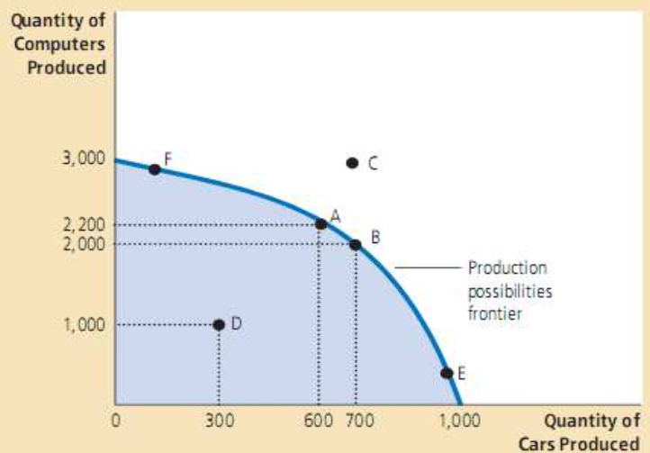

# 用经济学原理分析考研

[TOC]

## Inspiration

因为疫情的原因呆在家里无事可做，近来逛 B 站，对金融经济的科普很感兴趣，所以想入门一下经济学。

我选择了清华大学钱颖一教授的[经济学原理](https://www.bilibili.com/video/BV1gt411g7RU )课程，今天刚看完第一节课，发现经济学其实并不是想象中的那么高深，很多都是朴素得不能再朴素的生活道理。

我之前对考研的一些分析，实际上都可以用经济学进行解释，下面联系经济学的前四大原理，对考研进行进一步的解释。

## Tradeoff

原理一：人们面临得失交换（**权衡取舍**） People face **tradeoff**.

大学生面临着选择，是否考研，考哪个学校，什么时候开始复习，复习跟哪个老师，这都需要权衡得失。

## Opportunity Cost

原理二：某物的成本是为此所放弃的东西（**机会成本**） The **cost** of something is what you give up to get it. 

我们做的每一个选择，是否都是最优解？

如果选择就业，那么放弃的可能是考研和考公，如果选择考研，那么放弃的可能是工作三年，当上总经理，出任 CEO，走上人生巅峰的机会；

如果选择考研，那么放弃的是什么？选择这个学校，机会成本多大，有没有更适合自己的学校？不切实际选择考竞争激烈的985高校，那么就失去了考中 211 的机会，机会成本就会很高；

考研复习跟这个老师的机会成本有多高？这门课讲的最好的老师是谁？考研数学线性代数选择跟张宇，那么机会成本就比较高，如果跟李永乐，机会成本就很小；政治押题背多个老师的押题卷，机会成本较小；

在做题目的时候，有没有想到有更好的复习资料，更好的题目可以做？

对于准备复试的同学，疫情期间选择虚度光阴，那么放弃的可能就是考研成功、改变现状的机会；

复习专业课选择购买专业课复习资料，有没有考虑选择这本资料的机会成本是多大，有没有更好的选择？

南航计算机专业课有哪些靠谱的辅导资料？选择加入一个考研 QQ 群，还有没有更靠谱的 QQ 群？选择了一个考研机构的资料，那么放弃的是什么？建议看看这个 Github 仓库：<https://github.com/nuaa-cs-kaoyan/awesome-nuaa-cs-kaoyan> ，如果没有看过这个仓库，那么机会成本有多大？

## Marginal Cost

原理三：理性人思考边际量（**边际成本**） Rational people think at the **margin**.

边际成本是对已有行动计划的小的、增量微调。

考研计划并非一尘不变，而需要按照自己的具体复习情况随时做出微调。

1800 题按照计划做不完了，那可以不做了，抓紧做历年的真题；

复试的复习计划因为疫情影响了，那么应该调整计划，或者重新指定计划；

今天身体不舒服，不想按照计划复习那么难的数学和专业课了，那么可以看看政治的视频放松放松；

边际成本也强调积累和细节的重要性，考研每天已经花费大量的时间来复习了，为什么不能每天从中抽出 20 分钟复习前段时间的复习成果呢，很小的边际成本，就会带来很好的学习效果。 

## Incentive

原理四：人们会对激励做出反应（**激励**） People respond to **incentives**.

激励机制无处不在：消费券，奖学金，拼多多拼团优惠等。考研也最好设置一个适合自己的激励机制，多设立短期易达成的目标，并且在完成目标的时候奖励自己，例如来几局王者荣耀，去逛逛商场。学习要劳逸结合，考研也是这样。不要因为考研而分手，也不要因为考研而累垮了身体，这样机会成本太高。适当的娱乐和运动对考研是很有好处的。

## 其他知识点

### 边际受益递减

**假设**，假设一个公司只生产汽车和电脑，并且只有有限的生产要素。（**一个简单的假设**）

那么该公司的生产组合只能是**边界**（边界效率最高）或者边界内部的组合。**汽车和电脑互为彼此的机会成本**。如果公司想要多生产几辆汽车，就要少生产几台电脑。关键在于，如果调配生产组合，形成生产利益的最大化。

假设所有的生产资源都用来生产汽车，那么最多能生产 1000 量汽车，但是这并不一定能**最大化地利用资源**，此处曲线的斜率越大，x 轴汽车生产数量的一点减少，能够带来 y 轴电脑生产数量的快速增长。这就是**边际效益递减**。同样的道理，一门科目，在及格线处想要提高一分很容易，但是如果 90 分再多考一份，就可能需要耗费比 60 分多得多的精力，这也是边际效益递减。考研也是如此，我们的精力是有限的，面对那么多的科目需要复习，没有必要在单科上追求完美，而是应该追求总分的最大化。