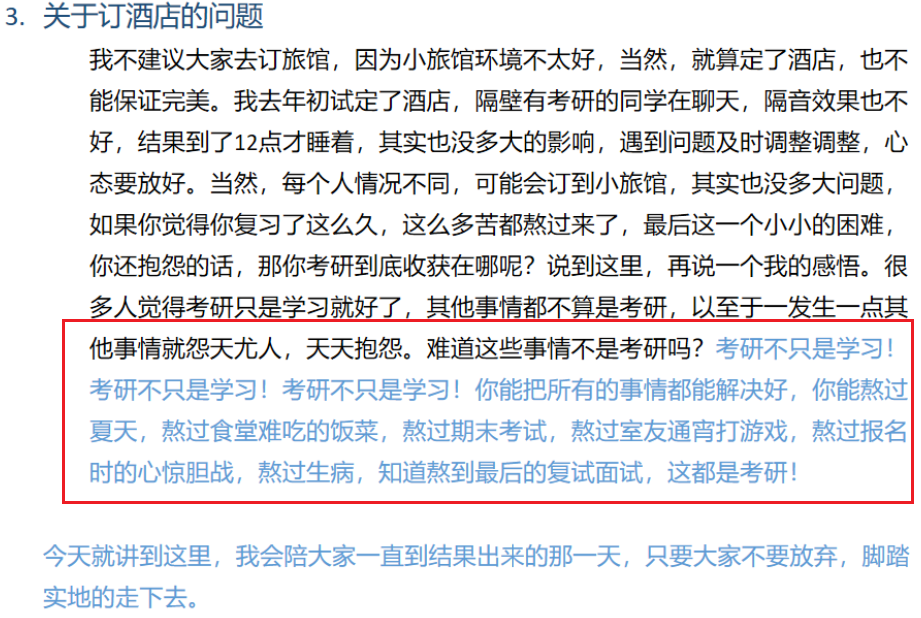

# 疫情期间的考研

## 现状

截至到 2020-04-19，全国开学的大学屈指可数，南京很多高校甚至建议学生不要返校。南航的学生，可以一直放到暑假。但是如果等到六七月才能返校的话，再开始认真复习就有点晚了。

大多数 2021 考研的同学，要**做好长期在家里复习考研的准备**了。你在家里静不下心来，学不进去，但是有的人能够学的进去啊……毕竟最后能考上的，也只是少数。

## 不能返校的复习方案

如果不能返校的话，建议不要呆在家里复习。可以看看县城或者市里的图书馆有没有开门，去那里复习，环境要好一点。或者找一个开放图书馆的省会城市，或者去你们读大学的城市，在那里租个房子，然后去图书馆学习。

在家里学习，效率确实很低。当然能在家里静下心来最好。

不要怕麻烦，也不要怕花钱，这是对自己的投资。那点钱，以后都是九牛一毛。

做好复习计划。

## 考研不止是学习

考研不止是学习那么简单，考研是最自身素质能力的一次综合考察。

这是我 18 级专业课辅导发过的一个帖子，在这里和大家共勉：

