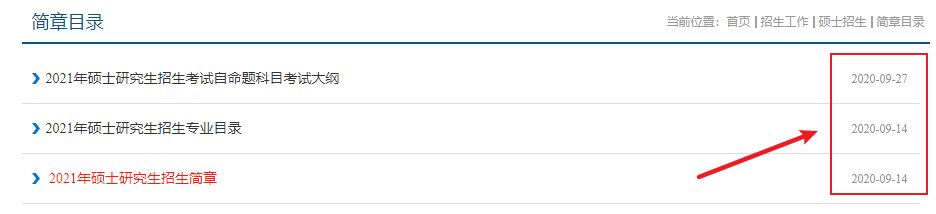

# 2022 南航计算机考研分析

[TOC]

## 选择南航有风险

南航计算机从 2020 届开始，学硕和专硕统一考 829（自主命题 数据结构 + 操作系统 + 计组），2021 届也是考的 829。但是这两年，计算机考研有一个趋势，就是统考 408，关注计算机考研的同学，应该知道，2021 考研，有很多院校的计算机改为统考 408 了。

在南京的高校中，南京大学计算机学院，也将 2021 计算机考研的考试科目改为 408 了。目前除了南京大学，我还不知道有其他高校改考 408。（南京大学软件学院还是自主命题 842，考 4 门）。

南航计算机到底改不改 408，我也不确定，我只知道，对于 2021 届考生来说，南航是在 9 月中下旬公布的招生专业目录。如下：

所以，选择考南航有风险，要冒着突然改考 408 的风险。

## 选择南航有机会

这个 topic 接上一个，假设 2022 届南航计算机突然改考 408，那么会有相当多的人，心态会崩，不考南航计算机了。

然而实际是，如果南航改考 408，那么所有考南航计算机的考生都考 408，大家都是考一样的试卷，没啥区别。就跟考研数学改考纲一样，有的人慌的一批，有啥好慌的，大家都考一样的试卷，最后都是按照分数从高到低录取，又不是你比别人多复习一门。

所以，这么看的话，南航计算机改考 408，对很多踏踏实实复习的考生来说，是利大于弊的。