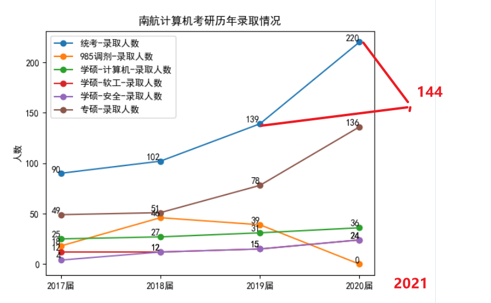

# 2021 复试名单分析

去年因为专硕扩招，今年大家都报专硕，结果专硕竞争特别激烈。

从复试名单来看，学硕专硕都考同样的 829 试卷，考 380 的，专硕排名 42，学硕排名第三，软工排名第二，网安排名第二。

今年专硕缩招了，很多名额给了保研，不过排除去年的特殊情况的话，2021 还是比 2019 的名额多了四五个的（最后录取名单应该不止 144 个，还要再多几个）

**2021 届南航计算机复试名单统计数据**

| 专业          | 复试拟录取人数 | 进入复试人数 / 最低分 / 最高分 | 复录比  |
| ------------- | -------------- | ------------------------------ | ------- |
| 学硕-计算机   | 23             | 32（329 / 416）                | 1.4: 1  |
| 学硕-软工     | 19             | 25（327 / 394）                | 1.3: 1  |
| 学硕-网安     | 20             | 27（327/ 399）                 | 1.35: 1 |
| 专硕-电子信息 | 82             | 174（337/ 414）                | 2.1: 1  |
| 汇总          | 144            | 258（327/ 416）                | 1.79: 1 |

专硕复录比特别高，有利有弊。初试考得高的想复试少放点人进来，降低复试带来的不确定性，初试考得低的想复试多放点人进来逆袭。看你屁股坐在哪里了。学校的屁股，坐在了那些真正有实力的学生那里，既想筛掉初试分偏高但是没实力的，又想把那些初试偏低但有实力的捞上来；那些初试分数虚高，有分数，没能力的，又有几个呢？能考 380 的，应该不止会做题。不过这不是主要矛盾，主要矛盾在于自己是否真的努力学习。