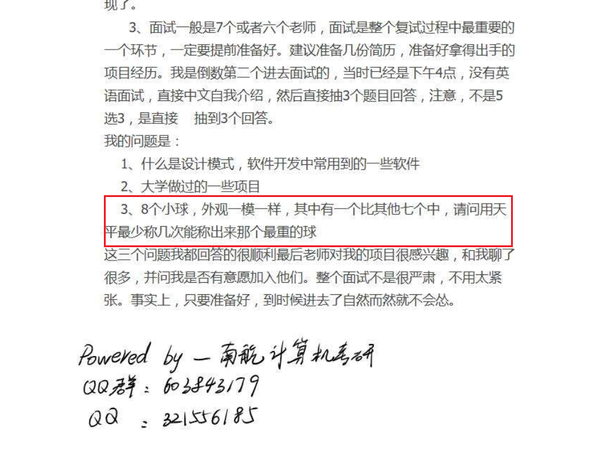
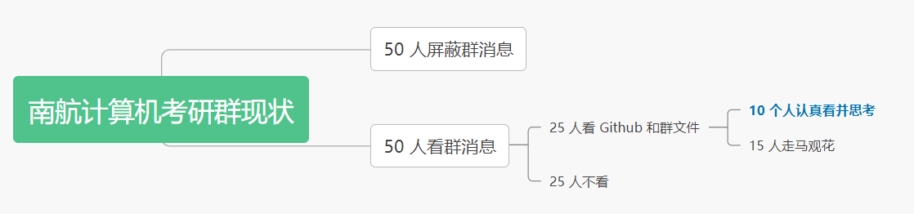
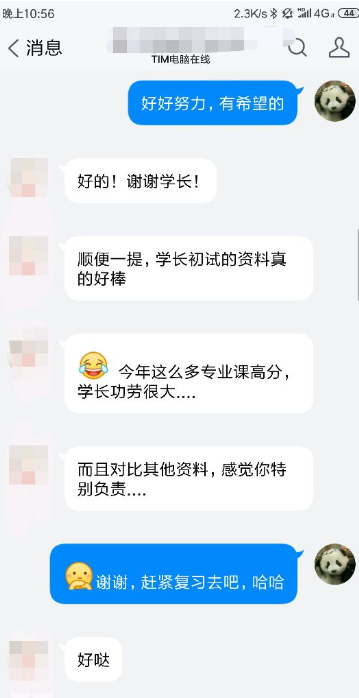

# 那些考上的同学们

[TOC]

## 18 级的一位学长

给大家讲一个真实的故事， 18级计算机专硕复试名单排名倒数第一的同学。

他用过我的资料，平时也经常问我问题，和我互动，考上后也加了微信，所以我对他的印象最深刻。他虽然进了复试，但是成绩是最后一名。

复试面试的时候，他抽到这样一个问题：

>  20 个外观一模一样的小球，其中有一个小球比其余 19 个都要重，请问用天平最少称几次才可以称出这个小球

我和他挺有缘的，我 17 年面试的时候，抽到的问题是：

> 8 个外观一模一样的小球，其中有一个小球比其余 7 个都要重，请问用天平最少称几次才可以称出这个小球

17 年我遇到这个问题的时候，我只想到了用二分法、称 3 次称出最终的小球。后来做考研辅导的时候，我将这个问题分享给了大家：

这个同学复试面试完后，私聊我说，他认真的看过我写过的经验贴，并且认真研究过这个问题。所以当被问到这个问题的升级版问题时，他马上想到了我说的那个 8 个小球的问题，并且在 5 分钟内想到了最优答案，而且把解题过程和老师娓娓道来。

他和我说完这个事情后，我暗暗觉得这位同学是有希望的，毕竟这个问题的最优解，90% 的同学估计都想不出来。而他能答出来，那么老师对他的印象肯定会非常好。而且从这位同学平时和我交流的问题来看，这个同学的学习还是蛮踏实的。

这件事情，还有这样一种可能。假设这位同学，当初没有注意群文件，没有注意我在群里说的话，他可能就答不出这个难题，也可能就考不上南航了，毕竟他是复试名单中的最后一名。更进一步的，我又想了想，18 级我卖出 120 套的资料，辅导了100多位学生，每个人都可以公平的看到群文件中我分享的经验贴，每个人都有专业课必背考点，为什么有的人会认真的看这些经验贴，而有的人到了9月10月的时候还在问我一些有关南航考研的很基础的信息。

我个人觉得还是**考研态度**的问题。我在群里强调过一次8个小球的问题，也和大家讨论过这个问题。如果群里有100人，那么可能有一半的人已经把群屏蔽掉了，消息看都不看，这样的人，要么是大佬，肯定会考上的那种，但是有多少人是大佬呢？这50个人大多数都是在闭门造车吧，听别人说只要把专业课书刷一遍，把王道做一做，就能考到高分，然后就开心的按照这个简单的计划执行了。剩下的50人呢，可能再有一半的人不以为然，这么简单的问题，明年肯定不会考了，连看不不看一眼。再剩下的25个人，才会听群主的公告，去看一下 Github：https://github.com/nuaa-cs-kaoyan/awesome-nuaa-cs-kaoyan 和群文件。最后的这 25 人中，能认真看完 Github 、做好笔记、并认真思考 8 个小球问题的，不会超过 10 个人，大多数人都是走马观花地看一看。

所以，这么一看，南航计算机考研其实也并不难，大多数人态度都是不端正的，能够认真复习的，只有那一小撮人。

也许有的同学会羡慕那位学长运气好，抽到了以前出过的类似的题目。但是，**幸运只会眷顾那些做好了充分准备的人**。

## 18 级专硕第一名

18年数学很难，但是，我认识那年考专硕第一名的姑娘，人家考了400+的总分，她买过我的资料，但平时和我聊的不过，但是只要一问问题，就是那种比较难，或者是方向和方法的问题，我当时就觉得这个姑娘和其他人不一样。

我在17年的考研考了 417 分，这其实没什么， 17年的所有试卷都很简单，但是18年那么难，人家照样能考那么高的分数，这就是差距啊，到底有没有人家那么努力，有没有将劲用对地方，方法到底有没有问题，有没有人家的自控能力？

考研就像是在一个黑屋子里洗衣服，你不知道衣服到底有没有洗干净，你只能不停的洗，不停的洗，做好完全的准备，把分数考的高高的，你后面才有回旋的余地。不过考研也是有偶然性的，我也不能说努力了，就一定会考上。还是那句话，种瓜得瓜，种豆得豆，好运只会眷顾那些有心人，做好万全准备的
人。  

## 18 级另一位学姐

这位同学，18 年初试成绩也并不好。18 级是我辅导的第一届学生，我对这届学生也最用心。

第一年编写的资料，有很多错误。我对你们这位学姐印象深刻的原因在于：我资料上 70% 的错误，都是这位同学帮忙找出来的。

我觉得她初试没考好是偶然的，能考上是必然的。这是我那年和她的聊天记录，我和她说，好好努力，有希望的：

做考研辅导有三年多了，除了帮助我获得经济上的暂时独立，更多的是心灵上的满足。我觉得做考研辅导是一件很有意义的事情，帮助他人，快乐自己。每每收到大家这样的留言，我都会非常开心。

最后，你们这位学姐，复试高分逆袭成功。果然，努力的人，运气都不会太差。

## 我考研时候，身边的故事

### 朋友A

朋友A在考研之前是一个比较上进的人，但是他可能对计算机专业不感兴趣，所以考研之前一直没有花太多时间在学习上，专业课基本上是零基础。直到大三寒假，他发了一条朋友圈，那时的他站在华南理工的校门口，下定决心要考进这所名校。

接下来就是按部就班的复习。他每天准时早上八点到自习室，晚上准时九点半去操场跑步，锻炼身体。他很努力，我只是觉得他以一所985名校要求自己，有点悬，毕竟他的基础很差。果然，到了暑假后期，他和我说，再这样下去复习不完了，华南理工专业课要考四门！他经历了一番挣扎后，把梦想从华南理工转到了南理工。

到了大四，班上很多同学都开始了找工作，他也开始了找工作。和其他同学一起去体检，一起去面试，最后拿到了一份海康威视的Offer。可能他在想，就算考不上，也不至于失了业。在接下来的考研冲刺中，这哥们还是每天照常 8:30到自习室，9:30去健身。结果大家应该也猜到了，他考上了南理工，专业课零基础，而且排名前三！

这哥们还有一件事让我印象很深刻，他是那一年逃课最多的人，是唯一一个挂了Android课设（很水）  的人。  

### 朋友B

朋友B一直是一位很努力的人，在实验室做过很多项目，也拿过多次专业第一。我觉得他本可以保研的，可是他最后没有去申请保研的资格。
他应该是我认识的考研同学中，最勤奋的。每天早上八点到图书馆，然后学到闭馆。一些逃不掉的课，他也会带着习题去上课。当我知道他的目标是中山大学的时候，我就知道，他能成！

结果不出意料，他和班上的另一位同学考上了中山大学。 他是我们学院的考研第一人。之所以那么佩服朋友B，是我偶然发现了他的手机，竟然是一款直板诺基亚，也就是说他为了专心考研，竟然只随身带了一部功能机！对我这种上厕所都要扣手机的人来说，只用功能机是万万做不到的，这需要多大的毅力！  

### 朋友C

朋友C是我的挚友兼室友，我对他的了解多一些。

这位朋友也是大三寒假想要考研的，他和朋友B一样，非常认真，早上八点到图书馆，晚上闭馆才回去休息。他在实验室也做过很多项目，参加过很多比赛。但不同的是，他不像朋友B那么洒脱，可以只带着功能机就OK了。他是实验室的负责人，还有一个可爱的女朋友（他的女朋友也考研）。

朋友C的成绩很好，他以为他可以保研的。他后来和我说，他已经参加了西电和南理工的夏令营并且都顺利通过了，连西电的导师都已经联系好了，他花了大量的精力在保研上，就差校内的一张保研资格。然而，他最终还是没有保上研。我记得那几天他精神不振，回到宿舍一句话也不说。

好在他一直都有很努力的复习，所以我对他还是很有信心的。他经常和我抱怨，说他的事特别多，考个研真TM不容易。实验室偶尔有一些杂事需要处理，女朋友生活学习上他要照顾。考研过程中，有好几次，我发现他一连躺床上两三天，让我带饭给他吃。考完研后他才告诉我，那个时候他和女朋友分手了，很崩溃。没想到这么坚强的一个人， 在面对感情的时候却那么脆弱。后来他们又和好了。

大概在考前一个月，他和我说，他再也坚持不下去了，他得了焦虑症，晚上翻来覆去睡不着，导致白天没有精力看书，恶心循环。他和我说，他想买票回家，下午就回去，他说他一路走来太苦了，太不顺了，他说他保研没保上，他说他暑假热的像条狗，他说他英语作文没背好，政治背不完，数学也没有感觉了。他觉得没希望了。

我和他说，别学了，休息几天吧，想那么多干嘛，休息几天，剩下的一个月，再搏一把。这哥们最后还是坚持了下来。最后，他考上了南理工！

朋友C是非常优秀的，只是他这一路走来确实比较坎坷。不过还好，努力的孩子， 运气都不会太差。

### 朋友D

最后分享的是朋友D。朋友D的考研经历可以算是一场屌丝逆袭的过程。在考研之前，他左手女朋友，右手LOL，英语四级没过，班级排名垫底。可是就是这样一位不靠谱的同学，在决定考研之后，也开始认真起来，每天八点半到图书馆，晚上闭馆了还要去其他地方学习。最后他出人意料的考上了太原理工（211），而且竟然是前三名。这让我想起了网络上的一个段子：真正的学霸，不是那些刻苦学习并拿到第一的同学，而是那些逃了一学期的课，最后花几天时间就能不挂科的同学。  

