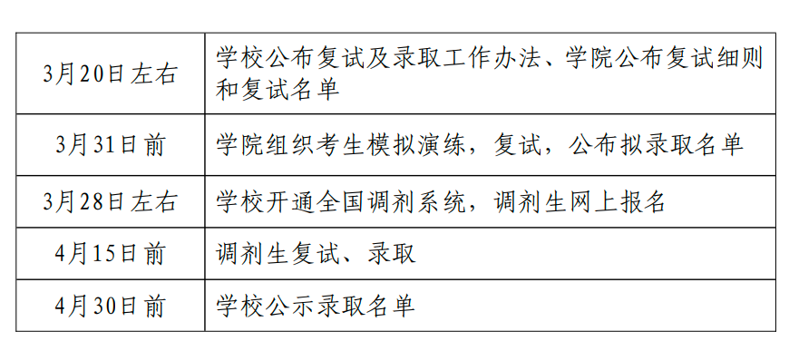
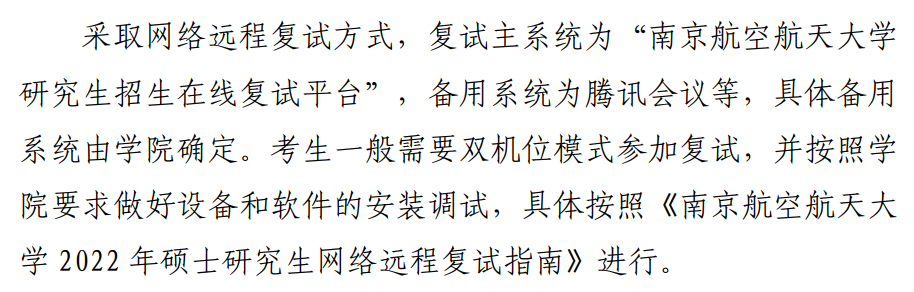
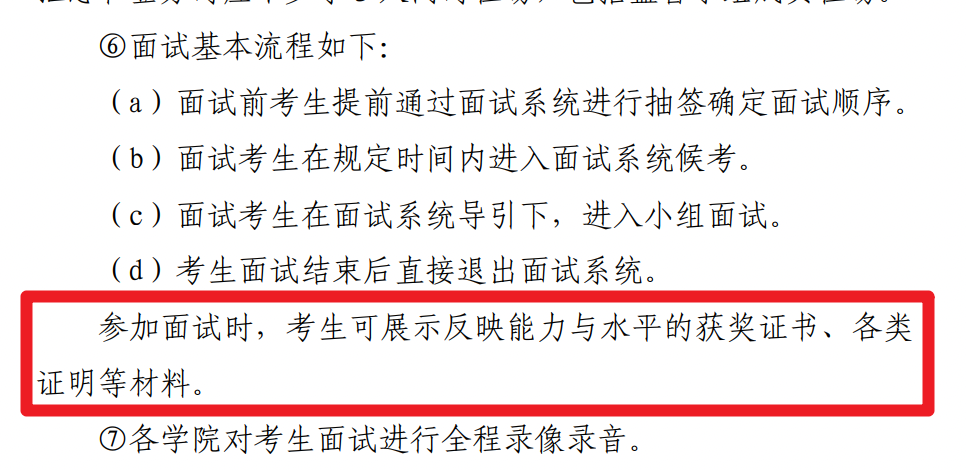

## 消息来源

官方通知地址：http://www.graduate.nuaa.edu.cn/2022/0318/c13494a277837/page.htm

注意，这是校级的官方通知，不是计算机学院的。

## 消息摘要

1. 线上复试
2. 复录比不能小于 1.2: 1
3. 资格审查：需要准备成绩单、学历证书和毕业证书、应届生交验学生证
4. 复试内容
   1. 英语 50 分 （翻译，听说）
   2. 专业知识及综合能力 250 分 （面试问答，计算书写，绘图等形式，具体看招生学院的通知，以前的线下笔试，放入面试考察）
5. 总成绩 = 初试成绩（ 百分化）×70%+复试成绩（ 百分化）×30%，总成绩保留小数点后两位。 调剂考生复试成绩占总成绩的权重一
   般不低于 30%， 由调剂学院确定。

## 时间安排

## 面试流程

