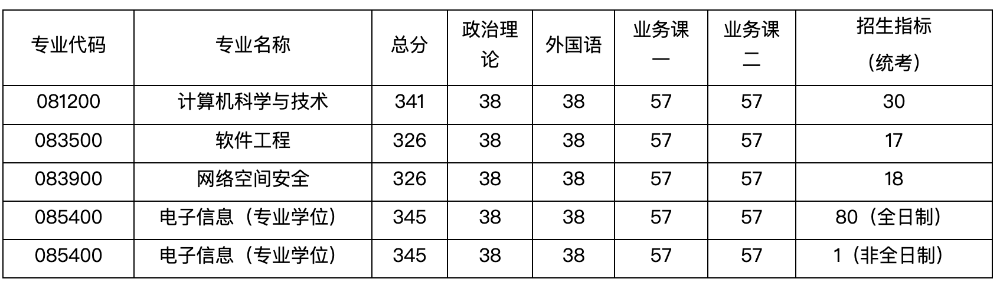
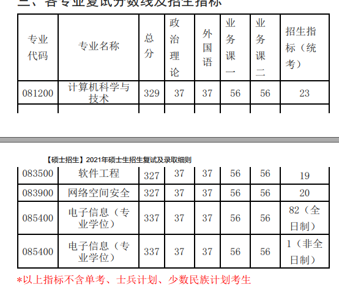

# 2022 复试名单和招生计划

## 2022 复试招生计划

2022 复试公布的招生指标（不是最终录取人数）

计划一共招 30 + 17 + 18 + 80 = 145 人

进复试的人数：231 人

最后一共招多少人：未知

| 专业          | 最终录取人数 | 复试招生指标 | 进入复试人数 / 最低分 / 最高分 | 最终录取初试最低/高分 | 中位数分数 | 复录比 |
| ------------- | ------------ | ------------ | ------------------------------ | --------------------- | ---------- | ------ |
| 学硕-计算机   |              | 30           | 37（341 / 393）                |                       |            |        |
| 学硕-软工     |              | 17           | 21（326 / 382）                |                       |            |        |
| 学硕-网安     |              | 18           | 22（326/ 391）                 |                       |            |        |
| 专硕-电子信息 |              | 80           | 150（345/ 412）                |                       |            |        |
| 汇总          |              |              | 231（326/ 412）                |                       |            |        |

## 2021 复试招生计划

计划一共招 23 + 19 + 20 + 82 = 144 人

进复试的人数：258 人

最后一共招多少人：176 人（包括两次补录，多了 32 人）

| 专业          | 录取人数 | 进入复试人数 / 最低分 / 最高分 | 录取初试最低/高分 | 中位数分数 | 复录比  |
| ------------- | -------- | ------------------------------ | ----------------- | ---------- | ------- |
| 学硕-计算机   | 25       | 32（329 / 416）                | 329 / 416         | 355        | 1.28: 1 |
| 学硕-软工     | 19       | 25（327 / 394）                | 327 / 394         | 357        | 1.32: 1 |
| 学硕-网安     | 25       | 27（327/ 399）                 | 327 / 399         | 356        | 1.08: 1 |
| 专硕-电子信息 | 107      | 174（337/ 414）                | 337 / 414         | 373        | 1.63: 1 |
| 汇总          | 176      | 258（327/ 416）                | 327 / 416         |            | 1.47: 1 |