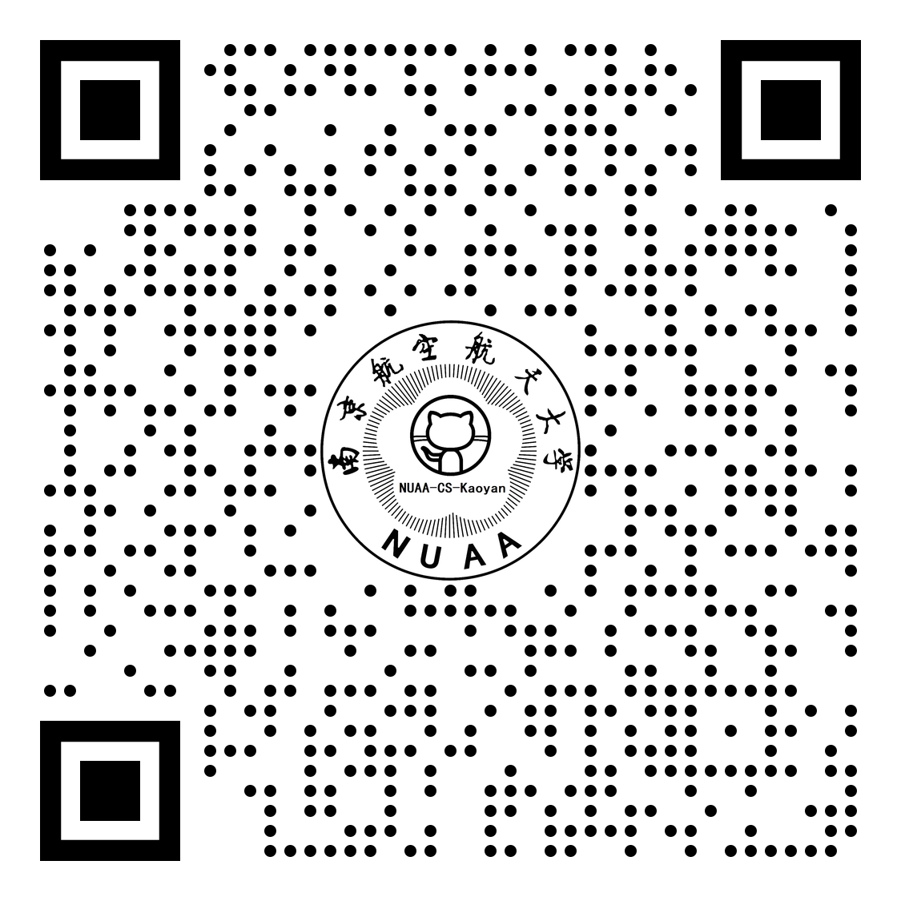
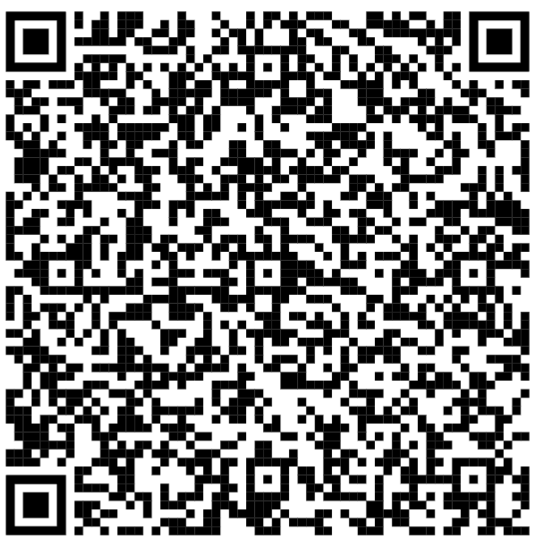

# 疫情期间的考研

大家好，我是熊二学长。

最近有很多同学和我反馈，说学校所在城市有疫情，快递送不进来，在网上买的专业课相关的书，都拿不到，耽误专业课复习。对于所在城市没有疫情的同学，也要做好出现突发情况的准备，可以提前准备好复习资料，防止出现疫情，不能收快递。

## pdf 资料

我这里特地在网上找了一下专业课相关的书籍，大家可以拿去先用一用：

链接: https://pan.baidu.com/s/1ttfdNLru0hdJNFecQQuZ0g 提取码: ambt

包含有以下书籍的电子版：

* wangdao 4本书
* 数据结构 pdf
* 操作系统 pdf
* 计组 pdf
* 计组学习指导 pdf
* 计组课后答案 word

## 早做打算

现在疫情这么凶猛，大学都管控得很严，一旦大学所在城市出现疫情，连快递都送不进来（买的复习资料都送不到）。

对于所在城市有疫情的同学，大家可以先下载上面我提供的资料，先用一用，然后看一下熊二学长的考研仓库，疫情应该很快就能控制住的，连云港的疫情，一个月就控制住了，可以收发快递了。

对于所在城市没有疫情的同学，也要做好出现突发情况的准备，可以提前准备好复习资料，防止出现疫情，不能收快递。

## 之前的文章

之前还写过另一篇，疫情期间的考研，大家可以可以看一下：

## 复习资料

