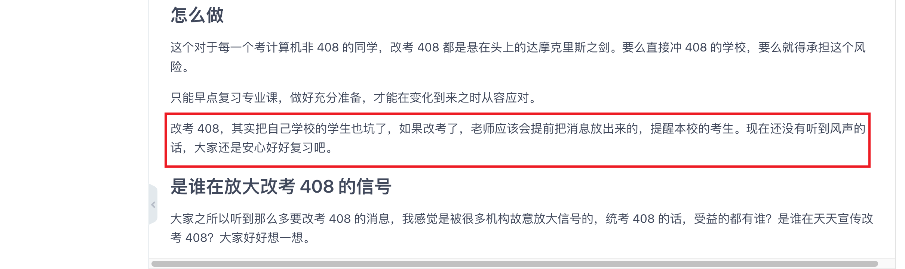
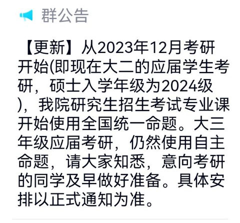

# 南航计算机 2024 开始改考 408

之前我在这篇文章说过[改考 408](https://gitee.com/wansho/awesome-nuaa-cs-kaoyan/blob/master/%E5%8D%97%E8%88%AA%E8%AE%A1%E7%AE%97%E6%9C%BA%E8%80%83%E7%A0%94%E8%AE%B2%E5%BA%A7/%E4%BA%8C%E5%8D%81%E4%BA%8C%EF%BC%9A%E6%94%B9%E8%80%83%20408%EF%BC%9F.md)，南航就算要改考 408，也会提前通知的，不然把自己学校的考生也坑了。

没想到，这次南航计算机这么厚道，提前一年半通知大家要改考了：

对 2023 考研的同学影响不大，还是考 829。南航计算机还是很厚道的，这个时候通知，就算是 2023 改考 829，时间也很充裕。