# 看看知名大学的计算机考研复试线

之前，我们统计了今年计算机考研的国家线和34所自主划线的分数线，有很多大学的计算机考研校线出现了上涨情况。随后，很多大学又公布了计算机考研的院线和复试分数线。

其中，中国科学技术大学的分数线之前已经介绍过了，软件学院大幅下降，先研院软专却大幅上升：[科软分数线狂降53分！凡是隔壁却。。。](http://mp.weixin.qq.com/s?__biz=MzU2ODAzNTMyMg==&mid=2247546024&idx=1&sn=c2088cee06e4d2fd4abad33810965586&chksm=fc96663dcbe1ef2b4e5ad4236d266f2d2048c6d92f30d4facd6da7afa89fb7f62487017eb514&scene=21#wechat_redirect)

那么今天，我们来看一下其他学校的复试分数线情况。

**北京大学**

软件与微电子学院

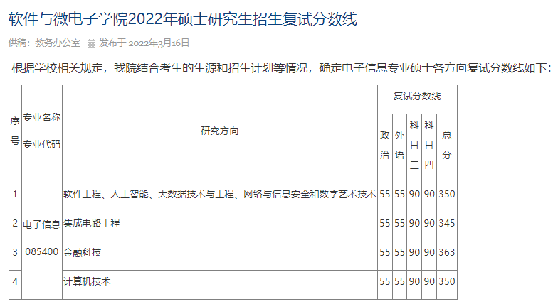

http://www.ss.pku.edu.cn/index.php/admission/admnotice/4311-软件与微电子学院2022年硕士研究生招生复试分数线

**西安交通大学**

#### 电子与信息学部计算机科学与技术学院

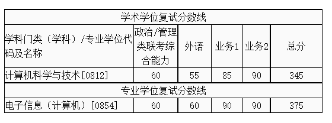

http://www.cs.xjtu.edu.cn/info/1233/2811.htm

**华中科技大学**

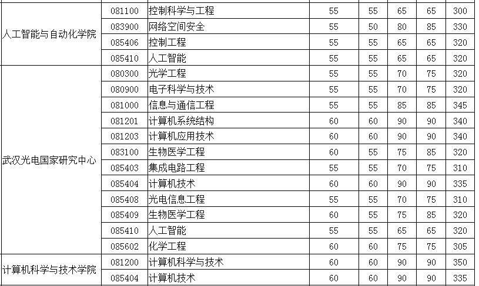

http://gszs.hust.edu.cn/info/1106/3391.htm

**四川大学**

## 计算机学院（软件学院）

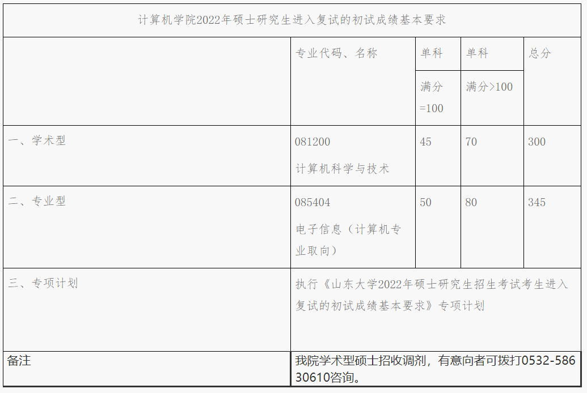

https://cs.scu.edu.cn/info/1247/16812.htm

**山东大学**

计算机学院

https://www.cs.sdu.edu.cn/info/1068/5364.htm

软件学院

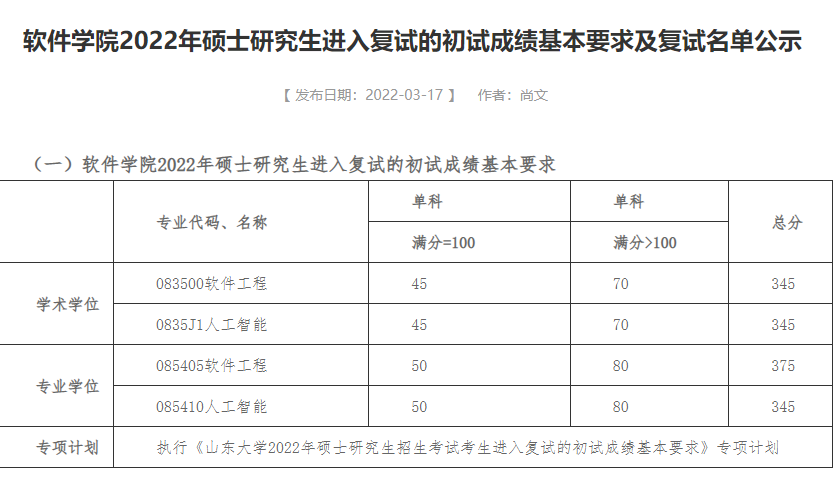

https://www.sc.sdu.edu.cn/info/1019/3132.htm

**吉林大学**

**软件学院**

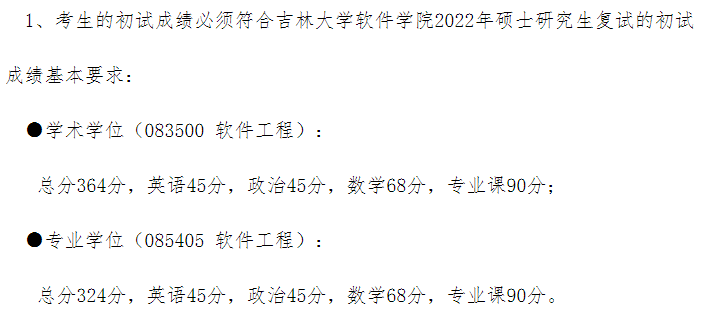

https://csw.jlu.edu.cn/info/1156/5521.htm

**郑州大学**

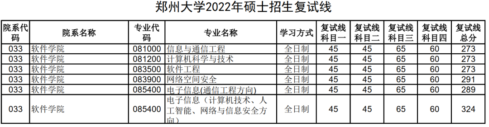

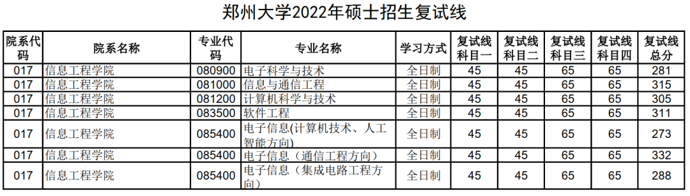

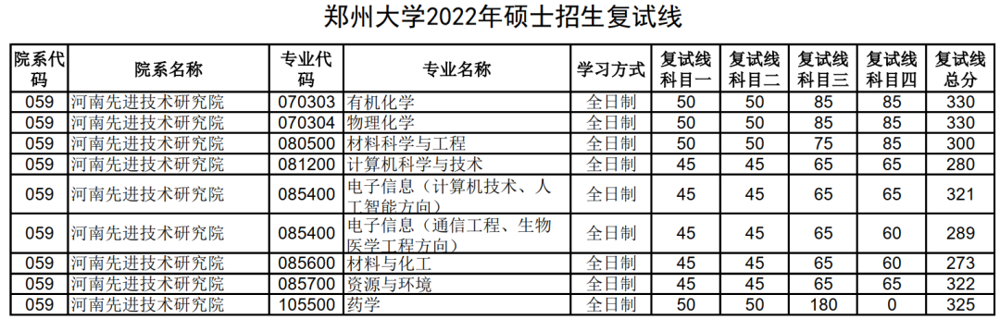

http://gs.zzu.edu.cn/info/1023/11649.htm

**北京科技大学**

计算机与通信工程学院

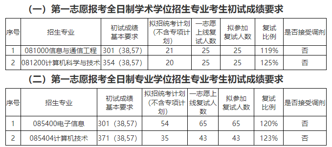

http://scce.ustb.edu.cn/xinwentongzhi/tongzhigonggao/2022-03-18/1882.html

**哈尔滨工业大学**

计算学部

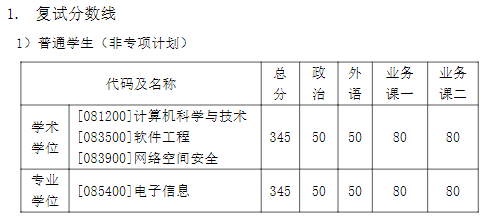

http://cs.hit.edu.cn/2022/0321/c11271a269990/page.htm

**华东师范大学**

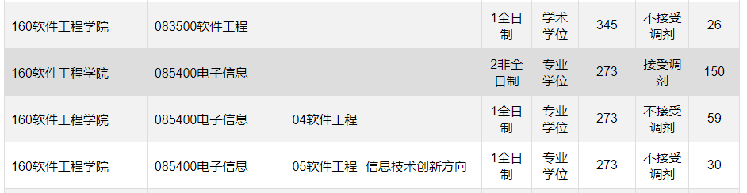

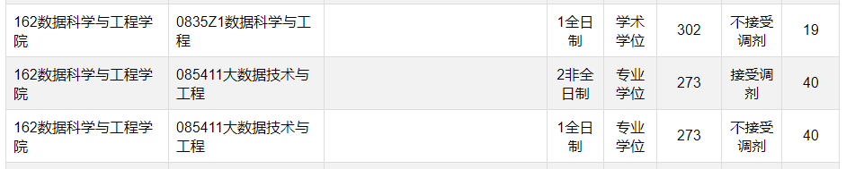

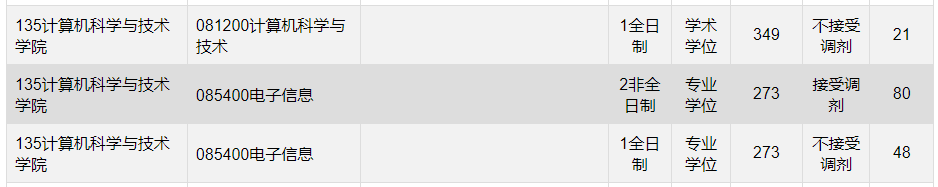

https://yjszs.ecnu.edu.cn/system/ssfsfsx_list_yxs_detail_global.asp?zsnf=2022

**
**

**
**

**北京航空航天大学**

计算机学院

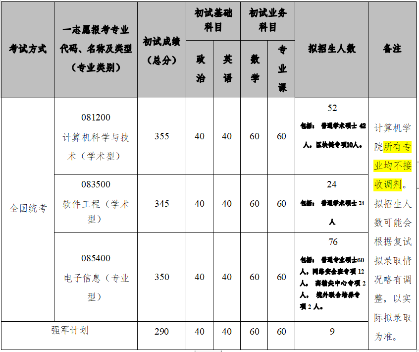

http://scse.buaa.edu.cn/nry_new.jsp?urltype=news.NewsContentUrl&wbtreeid=1299&wbnewsid=8722

软件学院

http://soft.buaa.edu.cn/info/1123/6991.htm

**华南理工大学**

计算机科学与工程学院

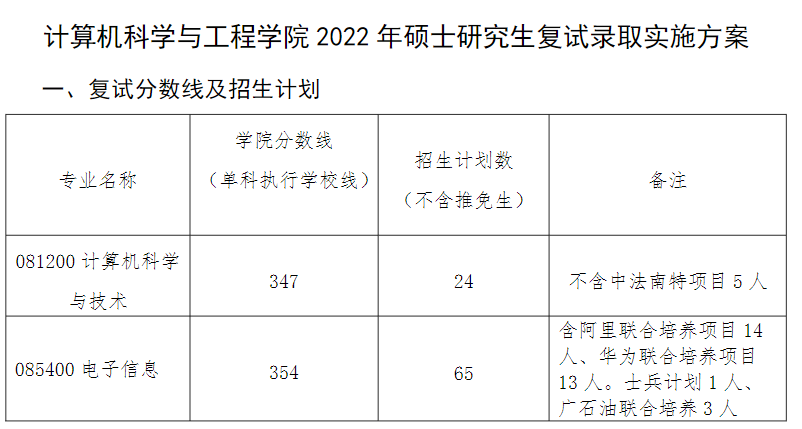

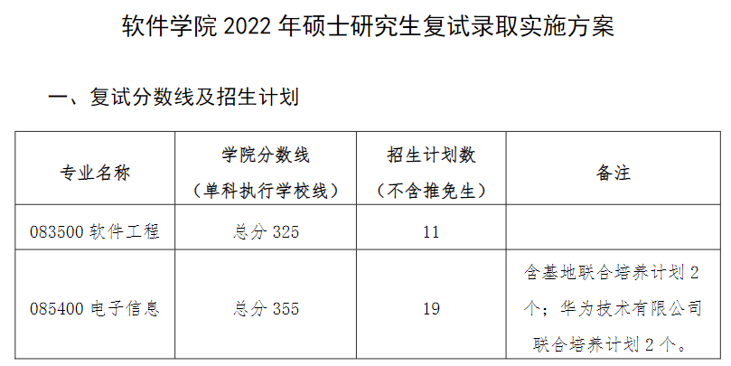

https://yanzhao.scut.edu.cn/open/master/Fsfa.aspx

**武汉理工大学
**

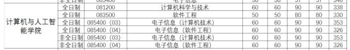

http://gd.whut.edu.cn/zs/tzgg/202203/t20220318_522953.shtml

**中国海洋大学**

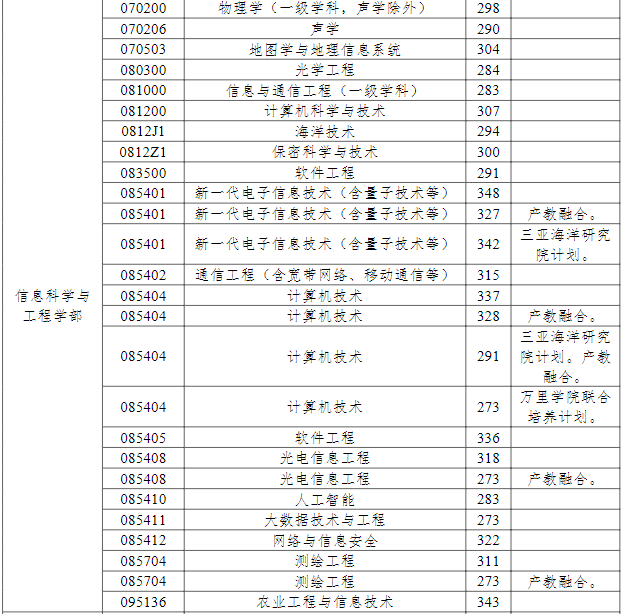

http://yz.ouc.edu.cn/2022/0318/c5926a365093/page.htm

从上面的分数线可以看到，很多大学的计算机考研分数线还是很高的，我看到了很多专业都是350分以上，甚至有370+，甚至385分的超高分数线。

今年计算机考研还是很难的。