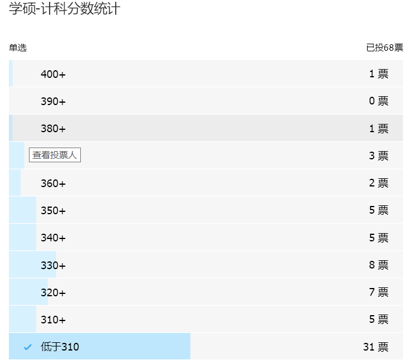
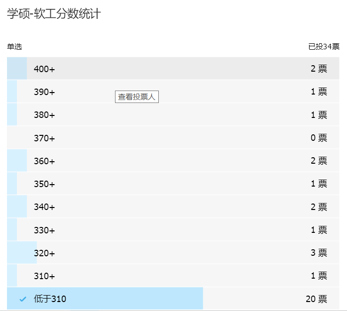
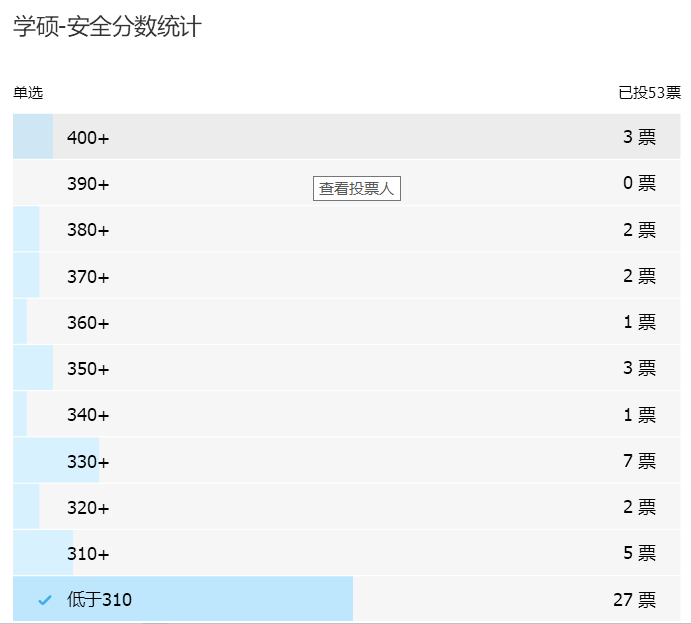

# 2020 届南航计算机考研结果汇总

## 分数段密集程度统计

统计数据来源于群成员的投票，有不少人瞎投票（例如，学硕-安全的最高分没记错的话是 380+，结果有三个人投票 400+），但是总体投票结果还是有一定参考价值的。

## 投票结果分析

从以上投票结果来看，基本上每一个方向，320 以下的同学人数都占比过半。所以这么来看，虽然报考南航计算机的同学每年都有很多（18 年有一位老师说报考南航计算机的人数达到 800+），但是大多数人都是炮灰。真正认真复习的同学也就 200 多个人，这 200 多个人里，能更认真学习并考上的同学，就更少了。

另一个密集的分数段是 320 — 350 之间，这分数之间的同学，也不能说复习不认真，也可能是由于各种各样的原因，分数没有再上一个台阶。这个分数段是南航考研竞争最激烈的分数段。一旦分数上了 360（各专业略有不同），竞争的人数就减少了很多。

专硕报考的人数还是很多，20 届开始专硕不再分计算机和软工，而且专硕名额较多，考数二，所以报考的人数较多，竞争最激烈，分数线相对于其他专业都高很多。专硕历年都是竞争最激烈的专业。每年都有 400+ 的大佬，20 届也有。

报考网安的同学从统计来看最不诚实。报考专硕的同学从统计来看比较诚实。

