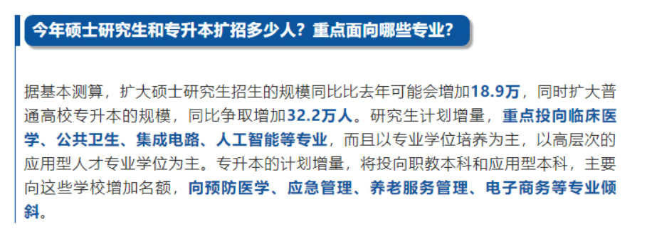
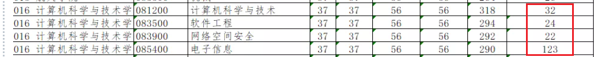

# 20 届后南航计算机考研变化

## 20 届南航计算机学院扩招情况

根据官方文件: https://mp.weixin.qq.com/s/rQ51e9-ktlG4Hrz3P3-exQ 复试拟计划招生人数统计，计算机学硕扩招 1 个人，软工学硕扩招 9 个人，网安扩招 7 个人，专硕扩招 45 人。**一共拟扩招 62 人**。**统考拟招生人数 201 人，是 19 届的 1.45 倍**。

注意：

1. 这就是统考的招生人数，不包括调剂和非全
2. 这只是拟计划招生的人数，最终录取人数可能会有变化

## 20 届其他学校的扩招情况

今年各大学校的计算机学院主要扩招了专硕，例如：

* 南航专硕名额扩招到 123
* [合肥工业大学](https://mp.weixin.qq.com/s/aWXPIjcD6N3nyWqKCUEV0A)计算机专硕名额扩招到 150

## 2021 届南航计算机考研趋势分析

**2021 届的南航计算机考研，总体上应该是利好的。**

### 政策解读

**划重点：人工智能、专业学位，高层次的应用型人才专业学位。**

说白了，就是经济不行了，大学生就业率下降，所以多给出一点考研的名额。还特别强调了专业学位，意思是社会亟需高级劳动力。而且是长期亟需高级劳动力，因为中国的现状就是如此，互联网公司最缺的是懂算法的高级工程师，而不是只会算法的科研人员。

今年南航计算机专硕拟计划扩招到 123 人，正是响应了国家亟需高级劳动力的政策。除了专硕，统考名额也是 19 届的 1.45 倍，有的人可能会问，作为一个东部学校，为什么南航计算机学院能够分到这么多的名额，我觉得有两个原因：

1. **南航计算机学院有越办越大的趋势**。南航计算机学院在南航一直是一个小学院，本科生和研究生的人数都不多。相比较于南理工，南理工的计算机学院就是一个大院。南航计算机学院的师资一直很强，尤其是人工智能方向，有很多大佬。这几年人工智能越来越火，而且学院每年的研究生招生人数都在增加，我个人觉得学院有办大的趋势。南航江宁校区这两年新盖了好几栋楼，如果计算机学院想扩大的话，可能会和学校申请空间。
2. 南航计算机学院在 2019 年挂牌人工智能学院，而且从 2020 年开始，本科生新开了人工智能专业，这正好响应了**人工智能**的政策，所以学院才能要到这么多扩招名额。

### 2021届的趋势

**影响因素：经济、新冠疫情、人工智能**

* **2021 届还会扩招吗？**

  这个我不敢随便乱说。刚才我已经解读了政策，我个人觉得南航计算机学院**从长远来看**，会不断进行扩招。另外，扩不扩招，也受经济影响，如果到了明年，新冠肺炎还没有彻底控制住，那么受全球经济的影响，明年的经济依然会不景气，失业率依然会很高。

  这次新冠疫情的**影响会比较久远**，个人感觉未来几年经济下行是一个大趋势。

  国家仍然会重视信息技术的发展，人工智能、集成电路等专业仍然会是热门专业。

* **2021 届选哪个专业？**

  

  刚才说过，国家亟需的还是高级劳动力，所以专硕是有政策加持的。2021 届的专硕名额肯定还会有很多，竞争也会很激烈。从考试来看，南航计算机专硕和学硕唯一区别就是数一数二的区别。而且也不存在反压题，从历年情况来看，只要上一年哪个专业好考了，那么下一年大家肯定都去考。

综上，我感觉南航计算机考研 2021 届总体还是利好的，计算机仍然是风口。

## 取消 922

从 20 届开始，南航取消了 922，从此专硕和学硕统一考 829：数据结构 + 操作系统 + 计组。大家都考同一张试卷，就很公平。改革的原因并不完全是为了公平，根本原因是教育部的一场专硕改革，然后大部分院校的专硕考试科目都进行了改革， 倒逼南航也进行改革。南航也是图省事，改了和没改没啥区别。

注意，不是南航的专硕变难了，而是几乎所有学校的专硕都进行改革了，都变难了。

## 真题不再公开

从 19 级开始，真题不再公开了，听人说是封题了，不清楚 20 届考研，真题题型会不会有较大的变动。但是我觉得应该不会有大的变化，毕竟要照顾到本校本学院的考生，举个例子，本科生的数据结构课程不会讲字符串匹配算法，如果考了，那么把本校的学生也坑了。

## 是否会改成考 408

短期内应该没有可能，南航考829和922已经考了七八年了，又刚在 2020 年改成统一考 829，短期内应该不会再变了。就算有一天变了，那么南航南理会一起变的，大家可以关注一下南理的趋势。

