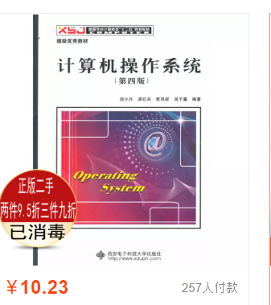

# 南航计算机考研问题补充

[TOC]

## 选择比努力更重要？

这只是失败者的借口，考研还没到什么拼智力、拼运气那种程度，考研就是种瓜得瓜、种豆得豆。
我考不上，能怪谁？怪没选对学校？
为什么选学校的时候，不去好好调研呢？非得选一个不适合自己的学校？非得想捡漏？非捷径不走？
有努力调研自己适合考哪些学校吗？还是道听途说，随便选择了一个不适合自己的学校？
换言之，我在考研之前，有努力择校吗？
连努力都没努力，自己骗自己，假复习，还在说选择比努力更重要？

为什么都在说，选择比努力更重要？
1. 因为考研失败的，总比上岸的多，选择比努力更重要，只是失败者的遮羞布
2. 考研机构洗脑，散播焦虑：选择比努力更重要，所以大家都得买我的书，报我的班，听我讲的课，要是跟错人了，就考不上了

## 什么复习方法最好？

最好的复习方法，不是别人告诉你的，是你自己亲自实践总结出来的，最适合自己的复习方法。
建议：不要问我，要不要怎么样？为什么不亲自去试试呢？这本书好不好，几十块钱，少喝两倍奶茶，买来做做题不就知道了吗

考研没有圣经，复习方法也不是一成不变的，而是需要动态调整的，任何企图找到考研圣经的行为，都是虚假复习的表现

## 优秀生源调剂的名额会不会和统考的名额有冲突

每年的统考名额，很早就已经定下来了，并且在研究生院官网公布，怎么会和统考的有冲突？？

## 学硕能否调剂专硕

不能，调剂只限于双 985 计算机相关的专业

## 学长有复试资料吗

没有，我只有初试的资料，复试的资料，我只知道红果研和一个叫葫芦学姐的人在卖

## 学长有学硕的资料吗

没有，我只有复习数据结构和操作系统的资料，学硕也可以用，学硕的数据结构和操作系统的题目，是专硕的子集。但是计组我帮不到。

2021 届更新：

已经编写了计算机组成原理的解析，从 2021 届开始提供 829 的复习资料。

## 专硕能找到机器学习和人工智能方向的老师吗

能，很多老师都有专硕的名额，每年专硕录取的名额都要占到总录取人数的一半还多。关键看你找哪个老师。几乎所有的老师，都有专硕的名额的。

## 所有报考专业，研究生课程是否一样

研究生课程都是一样的，随便里选，另外，研究生课程大多很水的，不用指望能学到什么东西。

## 所有报考专业的研究方向是否一样，关于找导师

看你跟哪个老师，这个老师研究什么，你就做什么，和你是什么专业无关，我再强调以下，考学硕也好，专硕也罢，计算机也好，软工也好，只是考研的一个途径，只要你考上了，到了南航，那么所有的专业，没有任何区别。你研究什么，不会受到你的专业影响，是受到你的导师影响。所有的专业，到了南航计算机学院，培养方案都是一样的。你报考了信息安全，跟了一个研究机器学习的老师，那么你还是搞机器学习。并且所有的专业，毕业后找工作，没有任何区别，还是看个人能力。

你报考什么专业，只会影响到你毕业生上填的是什么专业，其他的影响真的不大。

类似有的老师只挑某些专业的学生，这只是个例，不要以偏概全，你找导师也不用在一棵树上吊死。绝大多数老师对学生的专业是不挑的，看的还是学生的分数和能力。

我觉得大家应该要研究的，是哪一个专业好考，然后顺利的考上，考上才是最重要的，等你考上了，再去想别的事情。其他的事情都是不重要的，包括导师，除非你非常优秀。所以在考研之前，我不会回答导师相关的问题，就算你考了第一名，也不一定能找到心仪的导师

## 南航报录比

南航的报录比不公布，不过我了解到，18考研，报考南航计算机的人数为 800+

## 985调剂会不会占用统考的名额

不会，名额都是之前定好的，两者不冲突，而且南航近几年的统考名额都在增加

## 南航本校的考研，优势会不会很大

这是南航计算机学院 19 级考研的结果，110 人考本校，15 人最终录取，大家看，其实本校的优势也不大，和统考的没啥区别。虽然南航计算机学院的老师，会做一次考研辅导，但是其实并没有什么用，重点都在考纲上，都在历年真题上，你看，就算 110 个人都去看了本校的辅导，结果呢，只有 15 个人最终考上了。

## 关于其他考研机构贩卖焦虑的声明

每年都会有考研机构，为了赚钱，为了卖视频课，编造出各种借口，例如南航本校划重点等，来贩卖焦虑，从而达到他们售卖劣质资料的目的。对于这种情况，我是非常讨厌的，因为这误导了大家的学习方向，也浪费了大把大把的钱，我觉得都是做生意，至少得对得起自己的良心，所以我卖资料，会把我知道的所有南航计算机考研的情况，都免费公开到 Github 上，但是很可惜，这份价值千金的免费资料，关注的人并不多。我觉得是可悲的，当人陷入焦虑的时候，大多数人都是企图通过外力来缓解焦虑，很少有人会自己想办法去解决问题，考研能否考上，只取决于你，和某考研机构没有关系，和我也没有关系。希望大家在遇到问题的时候，能冷静下来思考问题，主动去解决问题，而不是去寻找什么灵丹妙药来解决。

## 王道上的选择题做不做

建议做，用来巩固复习，不要问我做不做，问我的同学，其实都不想做。

## 20南航计算机到底改不改专业课

这一个月以来，已经有太多人问我专业课改不改的问题了。关于专业课到底改不改的问题，我觉得这不是一个大问题，就算改了，大家都改了，大家最后考的科目都一样，还是谁行谁上，难道就你一个人多考一门科目吗？这和数学英语改考纲没有啥本质的区别。还有专业课资料的问题，就算考纲改了，那之前的真题就不做了？我的资料就不管用了？那要是真题不做了，你复习啥呢？好好复习就行了，提前复习专业课，后期留出充足的时间应对变化，这才是现在考南航计算机专业的考生应该有的想法。

最后，还是改了，从 2020 届考研开始，专业课统一考 829，而且专硕不再分计算机和软件。

## 关于找导师和找研究方向

很多人找老师有一个误区啊，就是你老师的方向，包括你研究生期间的研究方向和你找工作的时候关系并不是很大，当然，除非你特别厉害，你很擅长某个方向，那么你毕业以后工作可能就会做这个方向，例如你擅长做继续学习，那么你毕业以后可能会去找算法方面的工作，大多数人找工作的时候，其实和自己的研究方向是不相关的，如果你想去互联网公司工作的话，有很多岗位可以选，测试，算法，运维，后台开发，， 

## 考研官方指定教材的课后习题和习题集

我最近在很多地方看到上岸的同学强调教材习题的重要性。

以前我没有重视，现在在这里提醒一下大家。重视一下教材的习题集，在复习的时候适量的做一做，有可能真题就出自这些习题集中。

## 南航会不会排斥非江苏省的学生

不会，原因有二：

1. 2020年受疫情影响，南航是南京地区开学最晚的一批高校，原因是南航有很多武汉的学生。
2. 我所在的实验室，有安徽人、山东人、陕西人、山西人，江西人，基本上各个省的人都碰到过

所以我感觉南航不会排斥外省的考生

## 初试考多少分数保险？

南航的各个专业竞争激烈程度有所不同，同一专业的每一年的竞争激烈程度也不同，所以不好用分数来判断。但是可以用排名来衡量。如果一个专业录取 10 个人，那么我建议你初试排名第五，比较稳，这是我保守的看法。

## 数据结构编程题是否需要在电脑上练习

没有必要，能看懂代码，然后会写伪代码就可以了。

当然，去电脑上敲一遍更好。如果你想写代码验证一下的话，在 leetcode 上练就行了，南航 829 真题的很多编程题，在 Leetcode 上都能找到原型，去 Leetcode 上把 Array、Linkelist 和 Tree 的 Easy 题目练练，就可以了。

## 报考专业会影响考公务员吗

有的公务员招聘限制专业，但是具体怎么限制的，我也不清楚，担心报考专业会影响考公务员的，最好自己去调研调研

## 南航夏令营开始时间

暑假或者9月；形式：电话面试（往届是这样的）；需要什么条件？在仓库中能找到。

## 专业课问题

### 慕课上袁春风的课有必要看吗

不用看，其上课的教材是黑书，和考纲指定的书不匹配，看 B 站老版的袁春风视频就 OK 了

### 计组课本第九章，和操作系统第十章及以后都不考吗

不考

### IBM370标准和IEEE754标准考哪个？

ieee754 2020 届是第一次考，但考的都是皮毛 最基本的那种

### 操作系统参考书第四版能用么淘宝都是第四版

买不到第三版，第四版也可以，他们本学院的学生，很多也用的第四版，第三版很难买到了

### 专业课需要看视频吗

个人感觉会做题就不用看视频了吧，看视频是被动接受知识，做题是主动获取知识，复习效果差别很大

### 专业课复习，切忌闭门造车

考研，切忌闭门造车，脱离真题和考纲去复习，尤其是专业课，典型的错误思维有：

1. 先把教材过一遍，再看真题
2. 先慢慢把基础打好，后期再发力

专业课复习，在我看来，只有一轮，在第一轮的时候，就要对应着真题，把所有的真题体型全部 KO，包括编程题，这些难题不解决，难道等到 10 月 11 月焦头烂额的时候再去复习吗

考研并不难，大多数人都是假复习，只看视频不做题。就跟健身一样，各种健身教程，收藏了，就等于练过了。动手去练的，最终都考上了。

把这个认真看完的人，都考上了：https://gitee.com/wansho/awesome-nuaa-cs-kaoyan

100 个人，看到这条消息，最后估计也只有 五六个人会去认真地看，

永远也叫不醒，一个在装睡的人的。

### KMP 算法考吗

不考，他们南航计算机本科的同学，上课都不教 KMP，所以不可能考的，历年真题也没考过

### 操作系统用哪本书

第三版第四版都可以，第三版基本上买不到了，可以买第四版的

### 王道和天勤比，怎么样

我没用过天勤，我只知道王道碰到过好多真题，不差钱的话，可以买天勤来看看，实践出真知

### 计组校验码考不考

不考，考纲上没有

### 计组大小端考不考

要掌握，最基础的知识点

### 数据结构线性表要不要复习

要复习，最基础的知识点，数组最基础的算法都不会，复习什么数据结构，而且 17 年考过线性表的算法题（数据结构最后一题）。

### 教育部网站上南航的招生简章上写的指标人数很少

你看南航计算机每年多少统考名额，是看教育部的数据，还是看历年的统考录取人数？

### GitHub 上打不开 pdf 文件

打不开正常，得挂梯子才能打开，建议把整个仓库都下载下来，再看

## 考研方法论

考研复习，单一极端的复习方法，都是有问题的。例如：

* 只看书，不做题
* 只看视频，不做题
* 只看王道，不看真题
* 只背单词，不做真题
* 一天只复习一门
* 只学习新课，不复习学过的内容，狗熊掰棒子
* 只做题，不总结思考
* 只做参考书上的题目，不做真题
* 只……，不……

任何 "只……，不……"的行为，都是虚假的复习。真正的复习，拿专业课举例，应该是：王道 + 书本 + 真题 + 考纲 + 其他（例如课后习题，专业课资料）相结合，同步进行，而不是其中某一项的单一复习行为。

单一简单的复习方法，往往是一种潜在的懒惰行为。

【考研真相】关于考研的朴素道理 - 大大卷的文章 - 知乎 https://zhuanlan.zhihu.com/p/116740530

## 专业课考一门好，还是考多门好

很多人会觉得南邮 / 北理专业课考一门，更简单，举个极端的例子，如果清华大学的计算机只考一门，那清华大学也简单吗？

我报考了北理，又不是我一个人只考一门，其他报考北理的人也只考一门啊

类似的问题，今年数学变难了，英语变难了，就我一个人变难了吗，大家都变难了，我考得不好难道要怪今年的试卷吗

专业课考察的科目单一，有很多弊端：

* 有大量跨专业的涌进来，和大家竞争
* 容错性太低，可能一题没答上来，就完蛋，举个例子，高考给你满分 100 分的考卷，和满分 200 分的考卷，最后都标准化到 100 分，你选哪个考卷？考察科目多，保证了大家专业课的容错性（江苏的同学，想想江苏高考的总分，和全国卷总分比起来，是不是少很多，是不是容错性很差，是不是分数段很密集？）

所以，南航计算机，增加了一门计组，到底是好事，还是坏事？

## 操作系统 PV 操作如何攻克

说个正事，很多人，对操作系统的 PV 操作一知半解，我推荐大家去看一下 Modern OS 上面对于进程通信的讲解，119 - 149 页，30 页的内容，清清爽爽，只要认真看了并思考了，保证不丢分

王道操作系统上的 PV 操作题目，我觉得质量不是很高，答案风格都不统一，每个人都有每个人的做法，王道的题目仅作参考，我还是建议找来权威的书籍，然后彻底搞懂这个知识点，这也是操作系统考题唯一的难点了

## 录取后的问题

### 南航需要政审吗

不需要

### 需要登陆某个网站确认录取吗

不需要

### 拟录取是什么意思

拟录取就是录取了

### 官网如果访问不了导师介绍，哪里还有导师的介绍

* http://yz.kaoyan.com/nuaa/daoshi/
* https://www.mysupervisor.org/Forum/View/5154

### 体检

南航开学统一到校医院体检，主要做胸透和抽血，检查是否有传染性疾病。

南航游泳馆游泳需要有校医院的健康证明（就是体检），如果想要去游泳，可以在体检过后抓紧办理健康证明，一定时间后（好像是一个学期），如果再去办理的话，就需要重新体检。

