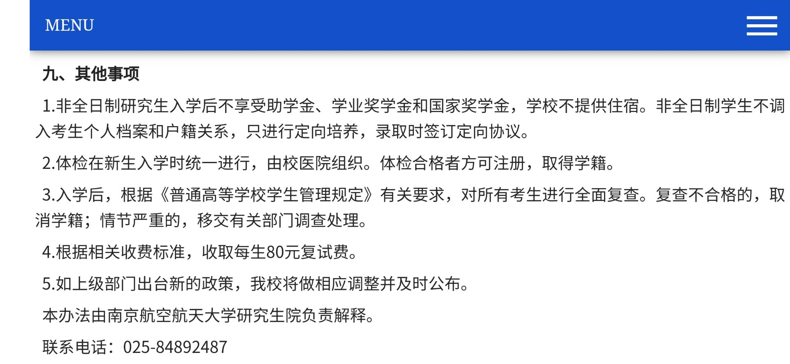

# 南航非全日制

* 学费一共四万五
* 毕业没有派遣证
* 研一培养方式和全日制一样，上课一起上，研二学院会安排出去实习，学院和很多单位签署了协议，强制让非全的学生选择，当然有很多非全的同学最后也没有听学院的，自己找，有的同学自己找的实习还不错，我认识的一个同学去了百度实习，实习找的咋样，还是看自己实力的。毕业找工作学校不再统一分配。目前研二的这批非全出去实习的同学，学校还会给安排宿舍在学校住，但是不知道下一届会怎么安排。
* 没有奖学金
* 没有每个月发的 500 助学金
* 非全在在研一的时候，培养方式和全日制相同，需要在上课，到了研二出去实习
* 非全找导师也和全日制一样，都是自己联系
* 非全没有宿舍，基本都是在外面租房子住，或者住在正德学院的宿舍
* 复试面试 19 届规定 20 分钟，实际会少于 20 分钟，面试和全日制复试面试一样，按照全日制面试准备即可，也要抽题目，回答问题
* 非全复试只有面试，没有笔试
* 非全的招生通常有两批次，第一批是复试面试被刷下来的同学，第二批次是全国的考生都可以报名
* 非全日制毕业找工作的时候，会受到用人单位歧视的，通常很难进好的研究所
* 读非全，就得接受自己出身比别人低的现实，并且在读研期间考奋斗来改变这一切，我认识很多优秀的非全的同学，有的非全的同学甚至靠自己的努力还拿到了学院公费出国的机会，有的同学研二自己拿到了去百度实习的 Offer，有的同学毕业去了海康研发，有的同学去了华为拿 30W，有的同学已经在研二通过实习已经能够养活自己。

读非全，有没有价值，完全取决于你自己。

## 2021 最新非全通知

## 2022最新通知

http://www.graduate.nuaa.edu.cn/2021/0915/c13494a262260/page.htm